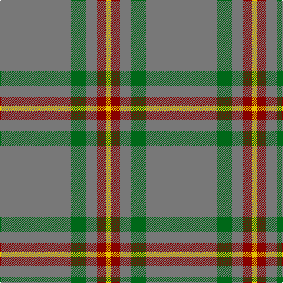

In pattern [GGGRY](/patterns/gggry/).

This was sourced from register-of-tartans.  It is a [5 stripes tartan](/stripes/stripes5/).

Original link https://www.tartanregister.gov.uk/tartanDetails.aspx?ref=5589

## Thread count
N/120 Ga26 N18 DRa16 Y/8

## Palette
Each colour and its ΔE from the base-6 reference it is a variant of.

| Colour | Shade | Base | ΔE (OKLab) |
|---|---|---|---|
| DR | <code style="background-color:#8C1C28;">#8C1C28</code> `#8C1C28` | R <code style="background-color:#C80000;">#C80000</code> | 0.12 |
| DRa | <code style="background-color:#880000;">#880000</code> `#880000` | R <code style="background-color:#C80000;">#C80000</code> | 0.14 |
| G | <code style="background-color:#245024;">#245024</code> `#245024` | G <code style="background-color:#006400;">#006400</code> | 0.08 |
| Ga | <code style="background-color:#006818;">#006818</code> `#006818` | G <code style="background-color:#006400;">#006400</code> | 0.02 |
| N | <code style="background-color:#787878;">#787878</code> `#787878` | G <code style="background-color:#006400;">#006400</code> | 0.20 |
| O | <code style="background-color:#C8A438;">#C8A438</code> `#C8A438` | Y <code style="background-color:#E8C000;">#E8C000</code> | 0.10 |
| Y | <code style="background-color:#E8C000;">#E8C000</code> `#E8C000` | Y <code style="background-color:#E8C000;">#E8C000</code> | 0.00 |

# Sample pattern

ID: /setts/s5/g120ga26g18r16y8-g787878-ga006818-r880000-ye8c000/
