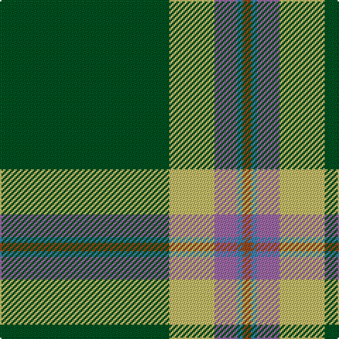

In pattern [GYRBR](/patterns/gyrbr/).

This was sourced from register-of-tartans.  It is a [5 stripes tartan](/stripes/stripes5/).

Original link https://www.tartanregister.gov.uk/tartanDetails.aspx?ref=11594

## Thread count
G/120 LG32 LP16 B4 T/6

## Palette
Each colour and its ΔE from the base-6 reference it is a variant of.

| Colour | Shade | Base | ΔE (OKLab) |
|---|---|---|---|
| B | <code style="background-color:#3C82AF;">#3C82AF</code> `#3C82AF` | B <code style="background-color:#2C4084;">#2C4084</code> | 0.20 |
| G | <code style="background-color:#005020;">#005020</code> `#005020` | G <code style="background-color:#006400;">#006400</code> | 0.08 |
| LG | <code style="background-color:#C4BC68;">#C4BC68</code> `#C4BC68` | Y <code style="background-color:#E8C000;">#E8C000</code> | 0.07 |
| LP | <code style="background-color:#9C68A4;">#9C68A4</code> `#9C68A4` | R <code style="background-color:#C80000;">#C80000</code> | 0.21 |
| T | <code style="background-color:#98481C;">#98481C</code> `#98481C` | R <code style="background-color:#C80000;">#C80000</code> | 0.11 |

# Sample pattern

## Nearest tartans

The nearest existing variants by ΔTartan distance.

1. [Military Medical Memorial (USA)(Corp](/setts/s6/b24w12r12g220k40r12-b2c2c80-g006818-k101010-rc80000-we0e0e0/) — ΔT 1.03
1. [Military Medical Memorial (USA)](/setts/s6/b24w12r12g220k40r12-b292e7f-g016819-k101010-rec1a1b-wffffff/) — ΔT 1.04
1. [Selvon-Bruce (Personal)](/setts/s7/k12g8k12g72r8b8y4-b1c1c50-g288028-k101010-r880000-ybc8c00/) — ΔT 1.20
1. [Aviemore Highland (Corporate)](/setts/s7/g80k6w2k10r2k4ra20-g285800-k101010-rc80000-rae87878-we0e0e0/) — ΔT 1.28
1. [Celtic Pride](/setts/s8/g20y6w4k4g16k44g86ya8-g006818-k101010-wfcfcfc-ybc8c00-yaec8048/) — ΔT 1.34
1. [McGuinness, Tam (Personal)](/setts/s5/y4b8g120ba60w2-b2c2c80-ba780078-g006818-we0e0e0-yfcb464/) — ΔT 1.38
1. [St Andrews Hotel, Golf Resort, and SPA](/setts/s6/g100b40k6b4r4b10-b304080-g008000-k000000-r806050/) — ΔT 1.39
1. [Tough (Personal)](/setts/s6/b8y2k8g64k8r4-b646464-g004c00-k000000-r8c0000-ydcbc00/) — ΔT 1.43
1. [Marshall Fields Corporate Tartan Tartan Number: 747. Earliest known date: 1986 Long established and famous mail order company based in Chicago. For use in their production launch for the opening of the British production, Augst 1986 - Christmas 1986. See products available Copyright © Blair Urquhart, Comrie, 2015](/setts/s8/g80b4w4b4y4b46g64r4-b202060-g006818-rc80000-we0e0e0-ye8c000/) — ΔT 1.46
1. [Sarros (Personal) XX](/setts/s8/k4w4b16k8g66r4g32w4-b2c2c80-g006818-k101010-rc8002c-wfcfcfc/) — ΔT 1.49

## Neighbour map

Every grey dot is one of 15726 variants placed by the first two principal components of the ΔTartan feature space (44% of its variance). Red is this tartan; blue dots are its nearest — click one to open its page.

<svg viewBox="0 0 640 380" role="img" style="max-width:100%;height:auto;border:1px solid #e0e0e0;border-radius:4px;display:block" xmlns="http://www.w3.org/2000/svg"><image href="/nn/cloud.v1.png" width="640" height="380"/><a href="/setts/s6/b24w12r12g220k40r12-b2c2c80-g006818-k101010-rc80000-we0e0e0/"><circle cx="419.5" cy="153.3" r="4" fill="#3465a4"><title>Military Medical Memorial (USA)(Corp</title></circle></a><a href="/setts/s6/b24w12r12g220k40r12-b292e7f-g016819-k101010-rec1a1b-wffffff/"><circle cx="408.7" cy="148.1" r="4" fill="#3465a4"><title>Military Medical Memorial (USA)</title></circle></a><a href="/setts/s7/k12g8k12g72r8b8y4-b1c1c50-g288028-k101010-r880000-ybc8c00/"><circle cx="376.3" cy="152.0" r="4" fill="#3465a4"><title>Selvon-Bruce (Personal)</title></circle></a><a href="/setts/s7/g80k6w2k10r2k4ra20-g285800-k101010-rc80000-rae87878-we0e0e0/"><circle cx="417.9" cy="107.9" r="4" fill="#3465a4"><title>Aviemore Highland (Corporate)</title></circle></a><a href="/setts/s8/g20y6w4k4g16k44g86ya8-g006818-k101010-wfcfcfc-ybc8c00-yaec8048/"><circle cx="380.1" cy="148.4" r="4" fill="#3465a4"><title>Celtic Pride</title></circle></a><a href="/setts/s5/y4b8g120ba60w2-b2c2c80-ba780078-g006818-we0e0e0-yfcb464/"><circle cx="423.8" cy="133.2" r="4" fill="#3465a4"><title>McGuinness, Tam (Personal)</title></circle></a><a href="/setts/s6/g100b40k6b4r4b10-b304080-g008000-k000000-r806050/"><circle cx="413.3" cy="169.2" r="4" fill="#3465a4"><title>St Andrews Hotel, Golf Resort, and SPA</title></circle></a><a href="/setts/s6/b8y2k8g64k8r4-b646464-g004c00-k000000-r8c0000-ydcbc00/"><circle cx="438.8" cy="139.4" r="4" fill="#3465a4"><title>Tough (Personal)</title></circle></a><a href="/setts/s8/g80b4w4b4y4b46g64r4-b202060-g006818-rc80000-we0e0e0-ye8c000/"><circle cx="425.8" cy="161.0" r="4" fill="#3465a4"><title>Marshall Fields Corporate Tartan Tartan Number: 747. Earliest known date: 1986 Long established and famous mail order company based in Chicago. For use in their production launch for the opening of the British production, Augst 1986 - Christmas 1986. See products available Copyright © Blair Urquhart, Comrie, 2015</title></circle></a><a href="/setts/s8/k4w4b16k8g66r4g32w4-b2c2c80-g006818-k101010-rc8002c-wfcfcfc/"><circle cx="403.8" cy="153.7" r="4" fill="#3465a4"><title>Sarros (Personal) XX</title></circle></a><circle cx="422.6" cy="149.2" r="5" fill="#c00000"/></svg>

ID: /setts/s5/g120y32r16b4ra6-b3c82af-g005020-r9c68a4-ra98481c-yc4bc68/
