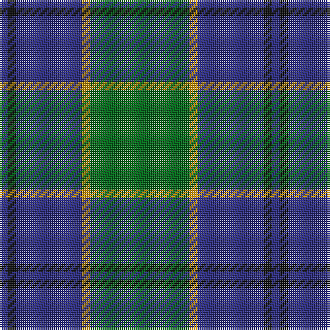

**Bands:** [BKBYG](/stripes/bkbyg/) · **Stripes:** [DB K DB LO G](/stripes/stripes5/) DB K DB LO G

This was sourced from register-of-tartans.  It is a [5 band tartan](/bands/bands5/).

Original link https://www.tartanregister.gov.uk/tartanDetails.aspx?ref=3580

## Register references

External register numbers recorded for this tartan.

- Scottish Register of Tartans: [3580](https://www.tartanregister.gov.uk/tartanDetails.aspx?ref=3580)
- Scottish Tartans Authority (ITI): 2067
- Scottish Tartans World Register: 2067

## Thread count
DB/4 K4 DB32 DY4 G/48

## Palette
Each colour and its ΔE from the base-6 reference it is a variant of.

| Colour | Shade | Base | ΔE (OKLab) |
|---|---|---|---|
| DB | <code style="background-color:#2C2C80;">#2C2C80</code> `#2C2C80` | B <code style="background-color:#2A418A;">#2A418A</code> | 0.06 |
| DY | <code style="background-color:#D09800;">#D09800</code> `#D09800` | Y <code style="background-color:#F2BF00;">#F2BF00</code> | 0.12 |
| G | <code style="background-color:#006818;">#006818</code> `#006818` | G <code style="background-color:#006100;">#006100</code> | 0.02 |
| K | <code style="background-color:#101010;">#101010</code> `#101010` | K <code style="background-color:#000000;">#000000</code> | 0.17 |

# Sample pattern

## Nearest tartans

The nearest existing variants by ΔTartan distance.

1. [MacIntyre](/setts/s6/dg4db12r3db12dg32w4~x2/) — ΔT 0.75
1. [Hector James](/setts/s5/o2g11db27g5r2~x2/) — ΔT 0.81
1. [St. Andrews Old Course Hotel (Corp)](/setts/s6/g26db10k3db2dy2db10~x4/) — ΔT 0.85
1. [Shaw (Clan 1)](/setts/s6/g24k2db3k2db8r2~x2/) — ΔT 0.88
1. [Gracie (Name)](/setts/s5/g47r3g6db35lo3~x2/) — ΔT 0.91
1. [MacIntyre LC](/setts/s6/dg4db12r3db12dg32lr4~x2/) — ΔT 1.04
1. [MacIntyre LC](/setts/s6/dg4db12r3db12dg32lr4/) — ΔT 1.04
1. [Davidson, Half](/setts/s6/k3g22db3g3db19r3~x2/) — ΔT 1.05
1. [St. Andrew Society, Sao Paulo (Corp)](/setts/s6/db5w3db36g38ly5g5~x2/) — ΔT 1.06
1. [Robert Byers Family - Dooballagh, Ireland](/setts/s4/k5g40db20ly3~x2/) — ΔT 1.16

## Neighbour map

Every grey dot is one of 14313 variants placed by the first two principal components of the ΔTartan feature space (44% of its variance). Red is this tartan; blue dots are its nearest — click one to open its page.

<svg viewBox="0 0 640 380" role="img" style="max-width:100%;height:auto;border:1px solid #e0e0e0;border-radius:4px;display:block" xmlns="http://www.w3.org/2000/svg"><image href="/nn/cloud.v1.png" width="640" height="380"/><a href="/setts/s6/dg4db12r3db12dg32w4~x2/"><circle cx="323.4" cy="226.0" r="4" fill="#3465a4"><title>MacIntyre</title></circle></a><a href="/setts/s5/o2g11db27g5r2~x2/"><circle cx="379.2" cy="224.0" r="4" fill="#3465a4"><title>Hector James</title></circle></a><a href="/setts/s6/g26db10k3db2dy2db10~x4/"><circle cx="315.6" cy="217.6" r="4" fill="#3465a4"><title>St. Andrews Old Course Hotel (Corp)</title></circle></a><a href="/setts/s6/g24k2db3k2db8r2~x2/"><circle cx="369.9" cy="208.7" r="4" fill="#3465a4"><title>Shaw (Clan 1)</title></circle></a><a href="/setts/s5/g47r3g6db35lo3~x2/"><circle cx="356.9" cy="210.6" r="4" fill="#3465a4"><title>Gracie (Name)</title></circle></a><a href="/setts/s6/dg4db12r3db12dg32lr4~x2/"><circle cx="322.1" cy="228.8" r="4" fill="#3465a4"><title>MacIntyre LC</title></circle></a><a href="/setts/s6/dg4db12r3db12dg32lr4/"><circle cx="322.1" cy="228.8" r="4" fill="#3465a4"><title>MacIntyre LC</title></circle></a><a href="/setts/s6/k3g22db3g3db19r3~x2/"><circle cx="291.9" cy="239.1" r="4" fill="#3465a4"><title>Davidson, Half</title></circle></a><a href="/setts/s6/db5w3db36g38ly5g5~x2/"><circle cx="294.0" cy="201.8" r="4" fill="#3465a4"><title>St. Andrew Society, Sao Paulo (Corp)</title></circle></a><a href="/setts/s4/k5g40db20ly3~x2/"><circle cx="353.6" cy="237.5" r="4" fill="#3465a4"><title>Robert Byers Family - Dooballagh, Ireland</title></circle></a><circle cx="340.2" cy="226.2" r="5" fill="#c00000"/></svg>

ID: /setts/s5/g12lo1db8k1db1~x4/
