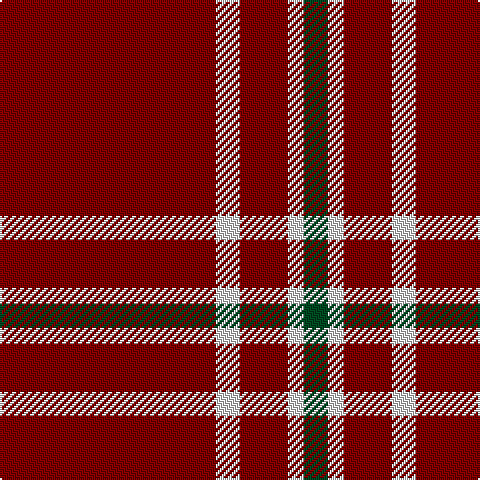

In pattern [GWRWR](/patterns/gwrwr/).

This was sourced from house-of-tartan.  It is a [5 stripes tartan](/stripes/stripes5/).

Original link http://www.house-of-tartan.scotland.net/house/TartanViewjs.asp?colr=Def&tnam=10481

## Thread count
DR/108 LN12 DR24 LN8 Ga/12

## Palette
Each colour and its ΔE from the base-6 reference it is a variant of.

| Colour | Shade | Base | ΔE (OKLab) |
|---|---|---|---|
| DR | <code style="background-color:#800000;">#800000</code> `#800000` | R <code style="background-color:#C80000;">#C80000</code> | 0.16 |
| DRa | <code style="background-color:#901C38;">#901C38</code> `#901C38` | R <code style="background-color:#C80000;">#C80000</code> | 0.12 |
| G | <code style="background-color:#004820;">#004820</code> `#004820` | G <code style="background-color:#006400;">#006400</code> | 0.10 |
| Ga | <code style="background-color:#004820;">#004820</code> `#004820` | G <code style="background-color:#006400;">#006400</code> | 0.10 |
| LN | <code style="background-color:#E0E0E0;">#E0E0E0</code> `#E0E0E0` | W <code style="background-color:#F4F4F0;">#F4F4F0</code> | 0.06 |

# Sample pattern

ID: /setts/s5/g12w8r24w12r108-g004820-r800000-we0e0e0/
