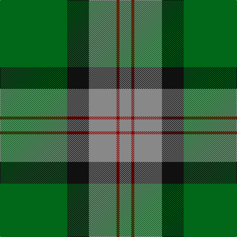

In pattern [GKRRR](/patterns/gkrrr/).

This was sourced from register-of-tartans.  It is a [5 stripes tartan](/stripes/stripes5/).

Original link https://www.tartanregister.gov.uk/tartanDetails.aspx?ref=1690

## Attestations

This cloth appears in 2 source records; the oldest owns this page.

- 01/01/1985 — Herbage of Laggan (Personal) (register-of-tartans, [record](https://www.tartanregister.gov.uk/tartanDetails.aspx?ref=1690))
- pre 1985 — Herbage of Laggan (Personal) (tartans-authority, [record](http://www.tartansauthority.com/tartan-ferret/display/811/))

## Thread count
G/136 K44 N56 DR6 N/24

## Palette
Each colour and its ΔE from the base-6 reference it is a variant of.

| Colour | Shade | Base | ΔE (OKLab) |
|---|---|---|---|
| DR | <code style="background-color:#880000;">#880000</code> `#880000` | R <code style="background-color:#C80000;">#C80000</code> | 0.14 |
| G | <code style="background-color:#006818;">#006818</code> `#006818` | G <code style="background-color:#006400;">#006400</code> | 0.02 |
| K | <code style="background-color:#101010;">#101010</code> `#101010` | K <code style="background-color:#000000;">#000000</code> | 0.17 |
| N | <code style="background-color:#888888;">#888888</code> `#888888` | R <code style="background-color:#C80000;">#C80000</code> | 0.24 |

# Sample pattern

## Nearest tartans

The nearest existing variants by ΔTartan distance.

1. [Herbage Family Tartan Tartan Number: 811. Earliest known date: 1983 Designed by the Scottish Tartans Society for Mr Herbage, Laggan. See products available Copyright © Blair Urquhart, Comrie, 2015](/setts/s5/g100k32r40ra4r12-g006818-k101010-r888888-rac80000/) — ΔT 0.31
1. [Gracie](/setts/s5/g94r6g12b70y6-b304080-g008000-rc00000-yf0c000/) — ΔT 1.25
1. [Herbage](/setts/s5/g100k32ga40r4ga12-g008000-ga808080-k000000-rc00000/) — ΔT 1.37
1. [MacArthur-Fox Htg (Personal)](/setts/s6/r6g60k24g2k32y4-g006818-k101010-r880000-yd09800/) — ΔT 1.37
1. [Sinclair](/setts/s7/g20r6g60ga20w4b30r8-b304080-g008000-ga808080-rc00000-we0e0e0/) — ΔT 1.39
1. [U.S. Border Patrol (Corporate)](/setts/s5/g80k30b20k20y6-b1474b4-g408060-k101010-ye8c000/) — ΔT 1.40
1. [MacArthur (Variant)](/setts/s6/r6g60k24g12k32y4-g006818-k101010-rc80000-ye8c000/) — ΔT 1.40
1. [Robert Byers Family - Dooballagh, Ireland](/setts/s4/k10g80b40y6-b1c1c50-g006818-k101010-ye8c000/) — ΔT 1.42
1. [Byers (Name)](/setts/s4/k10g80b40y6-b202060-g006818-k101010-yfccc00/) — ΔT 1.43
1. [New Mexico](/setts/s8/r2g32b4g20b44y8r4y2-b304080-g008000-rc00000-yf0c000/) — ΔT 1.43

## Neighbour map

Every grey dot is one of 15726 variants placed by the first two principal components of the ΔTartan feature space (44% of its variance). Red is this tartan; blue dots are its nearest — click one to open its page.

<svg viewBox="0 0 640 380" role="img" style="max-width:100%;height:auto;border:1px solid #e0e0e0;border-radius:4px;display:block" xmlns="http://www.w3.org/2000/svg"><image href="/nn/cloud.v1.png" width="640" height="380"/><a href="/setts/s5/g100k32r40ra4r12-g006818-k101010-r888888-rac80000/"><circle cx="336.8" cy="195.0" r="4" fill="#3465a4"><title>Herbage Family Tartan Tartan Number: 811. Earliest known date: 1983 Designed by the Scottish Tartans Society for Mr Herbage, Laggan. See products available Copyright © Blair Urquhart, Comrie, 2015</title></circle></a><a href="/setts/s5/g94r6g12b70y6-b304080-g008000-rc00000-yf0c000/"><circle cx="361.9" cy="208.8" r="4" fill="#3465a4"><title>Gracie</title></circle></a><a href="/setts/s5/g100k32ga40r4ga12-g008000-ga808080-k000000-rc00000/"><circle cx="299.2" cy="180.4" r="4" fill="#3465a4"><title>Herbage</title></circle></a><a href="/setts/s6/r6g60k24g2k32y4-g006818-k101010-r880000-yd09800/"><circle cx="344.9" cy="180.9" r="4" fill="#3465a4"><title>MacArthur-Fox Htg (Personal)</title></circle></a><a href="/setts/s7/g20r6g60ga20w4b30r8-b304080-g008000-ga808080-rc00000-we0e0e0/"><circle cx="286.2" cy="185.4" r="4" fill="#3465a4"><title>Sinclair</title></circle></a><a href="/setts/s5/g80k30b20k20y6-b1474b4-g408060-k101010-ye8c000/"><circle cx="277.5" cy="214.3" r="4" fill="#3465a4"><title>U.S. Border Patrol (Corporate)</title></circle></a><a href="/setts/s6/r6g60k24g12k32y4-g006818-k101010-rc80000-ye8c000/"><circle cx="317.1" cy="211.1" r="4" fill="#3465a4"><title>MacArthur (Variant)</title></circle></a><a href="/setts/s4/k10g80b40y6-b1c1c50-g006818-k101010-ye8c000/"><circle cx="351.5" cy="233.8" r="4" fill="#3465a4"><title>Robert Byers Family - Dooballagh, Ireland</title></circle></a><a href="/setts/s4/k10g80b40y6-b202060-g006818-k101010-yfccc00/"><circle cx="348.0" cy="232.0" r="4" fill="#3465a4"><title>Byers (Name)</title></circle></a><a href="/setts/s8/r2g32b4g20b44y8r4y2-b304080-g008000-rc00000-yf0c000/"><circle cx="285.8" cy="161.3" r="4" fill="#3465a4"><title>New Mexico</title></circle></a><circle cx="319.5" cy="202.9" r="5" fill="#c00000"/></svg>

ID: /setts/s5/g136k44r56ra6r24-g006818-k101010-r888888-ra880000/
