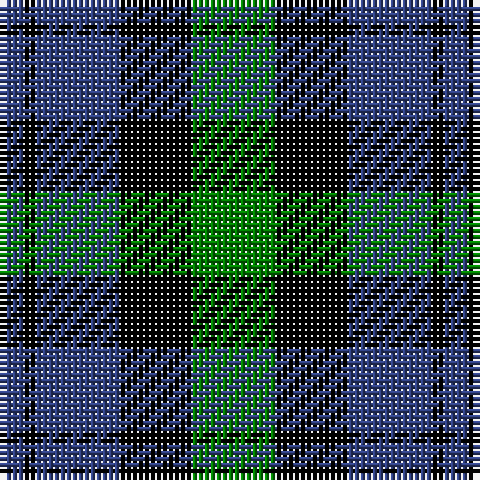

In pattern [BKBKG](/patterns/bkbkg/).

This was sourced from weddslist.  It is a [5 stripes tartan](/stripes/stripes5/).

Original link http://www.weddslist.com/cgi-bin/tartans/pg.pl?source=sts

## Thread count
B/4 K2 B14 K12 G/14

## Palette
Each colour and its ΔE from the base-6 reference it is a variant of.

| Colour | Shade | Base | ΔE (OKLab) |
|---|---|---|---|
| B | <code style="background-color:#304080;">#304080</code> `#304080` | B <code style="background-color:#2C4084;">#2C4084</code> | 0.01 |
| G | <code style="background-color:#008000;">#008000</code> `#008000` | G <code style="background-color:#006400;">#006400</code> | 0.09 |
| K | <code style="background-color:#000000;">#000000</code> `#000000` | K <code style="background-color:#000000;">#000000</code> | 0.00 |

# Sample pattern

## Nearest tartans

The nearest existing variants by ΔTartan distance.

1. [MacKay](/setts/s6/g6b28g4k28g28k6-b304080-g008000-k000000/) — ΔT 0.82
1. [Austin, or Keith](/setts/s5/b8k8b8g18k4-b304080-g008000-k000000/) — ΔT 0.85
1. [Campbell, the 42nd](/setts/s6/b6k6b18k18g22k5-b304080-g008000-k000000/) — ΔT 0.86
1. [Wilson's, No 166](/setts/s6/b6g24k28b22k6b6-b5480b0-g008000-k000000/) — ΔT 0.98
1. [Wartley Htg (Fashion)](/setts/s6/b8k4b32k20g36k6-b000088-g007800-k000000/) — ΔT 1.11
1. [Wilson's, Folio 131](/setts/s5/b24k34g38w4k10-b304080-g008000-k000000-we0e0e0/) — ΔT 1.18
1. [Fletcher #2](/setts/s7/b20k6b20k28r4g28k8-b1474b4-g007800-k000000-rc80000/) — ΔT 1.18
1. [Douglas Green](/setts/s5/k4w2g8b8w1-b000064-g004c00-k000000-wd0d0d0/) — ΔT 1.19
1. [Murray](/setts/s6/b4k4b24k16g22r4-b304080-g008000-k000000-rc00000/) — ΔT 1.21
1. [Scottish Airports](/setts/s6/b8g36b6k34b36ba8-b102040-ba800070-g008000-k000000/) — ΔT 1.22

## Neighbour map

Every grey dot is one of 15726 variants placed by the first two principal components of the ΔTartan feature space (44% of its variance). Red is this tartan; blue dots are its nearest — click one to open its page.

<svg viewBox="0 0 640 380" role="img" style="max-width:100%;height:auto;border:1px solid #e0e0e0;border-radius:4px;display:block" xmlns="http://www.w3.org/2000/svg"><image href="/nn/cloud.v1.png" width="640" height="380"/><a href="/setts/s6/g6b28g4k28g28k6-b304080-g008000-k000000/"><circle cx="176.8" cy="253.7" r="4" fill="#3465a4"><title>MacKay</title></circle></a><a href="/setts/s5/b8k8b8g18k4-b304080-g008000-k000000/"><circle cx="154.3" cy="297.0" r="4" fill="#3465a4"><title>Austin, or Keith</title></circle></a><a href="/setts/s6/b6k6b18k18g22k5-b304080-g008000-k000000/"><circle cx="152.4" cy="284.4" r="4" fill="#3465a4"><title>Campbell, the 42nd</title></circle></a><a href="/setts/s6/b6g24k28b22k6b6-b5480b0-g008000-k000000/"><circle cx="143.1" cy="267.7" r="4" fill="#3465a4"><title>Wilson's, No 166</title></circle></a><a href="/setts/s6/b8k4b32k20g36k6-b000088-g007800-k000000/"><circle cx="191.2" cy="245.9" r="4" fill="#3465a4"><title>Wartley Htg (Fashion)</title></circle></a><a href="/setts/s5/b24k34g38w4k10-b304080-g008000-k000000-we0e0e0/"><circle cx="162.3" cy="240.1" r="4" fill="#3465a4"><title>Wilson's, Folio 131</title></circle></a><a href="/setts/s7/b20k6b20k28r4g28k8-b1474b4-g007800-k000000-rc80000/"><circle cx="128.4" cy="237.6" r="4" fill="#3465a4"><title>Fletcher #2</title></circle></a><a href="/setts/s5/k4w2g8b8w1-b000064-g004c00-k000000-wd0d0d0/"><circle cx="132.3" cy="241.9" r="4" fill="#3465a4"><title>Douglas Green</title></circle></a><a href="/setts/s6/b4k4b24k16g22r4-b304080-g008000-k000000-rc00000/"><circle cx="149.3" cy="238.9" r="4" fill="#3465a4"><title>Murray</title></circle></a><a href="/setts/s6/b8g36b6k34b36ba8-b102040-ba800070-g008000-k000000/"><circle cx="159.1" cy="250.6" r="4" fill="#3465a4"><title>Scottish Airports</title></circle></a><circle cx="176.8" cy="275.4" r="5" fill="#c00000"/></svg>

ID: /setts/s5/g14k12b14k2b4-b304080-g008000-k000000/
