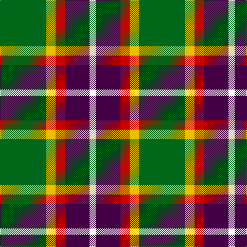

In pattern [GYRBW](/patterns/gyrbw/).

This was sourced from tartans-authority.  It is a [5 stripes tartan](/stripes/stripes5/).

Original link http://www.tartansauthority.com/tartan-ferret/display/10852/

## Thread count
G/90 Y18 R18 DP48 W/12

## Palette
Each colour and its ΔE from the base-6 reference it is a variant of.

| Colour | Shade | Base | ΔE (OKLab) |
|---|---|---|---|
| DP | <code style="background-color:#440044;">#440044</code> `#440044` | B <code style="background-color:#2A418A;">#2A418A</code> | 0.18 |
| G | <code style="background-color:#006818;">#006818</code> `#006818` | G <code style="background-color:#006100;">#006100</code> | 0.02 |
| R | <code style="background-color:#C80000;">#C80000</code> `#C80000` | R <code style="background-color:#CC0000;">#CC0000</code> | 0.01 |
| W | <code style="background-color:#FCFCFC;">#FCFCFC</code> `#FCFCFC` | W <code style="background-color:#F7F7F7;">#F7F7F7</code> | 0.01 |
| Y | <code style="background-color:#E8C000;">#E8C000</code> `#E8C000` | Y <code style="background-color:#F2BF00;">#F2BF00</code> | 0.02 |

# Sample pattern

## Nearest tartans

The nearest existing variants by ΔTartan distance.

1. [ChuMac (Personal)](/setts/s5/g15y3r3b8w2~b543060-g006430-re01c18-we8e8e8-yf0c400~x6/) — ΔT 0.62
1. [Phinn (Personal)](/setts/s5/g11ga3r4y2w2~g003820-ga206058-r880000-we0e0e0-ye8c000~x10/) — ΔT 0.71
1. [Entre Rios Province (Provisional](/setts/s6/g36w4g8k29r24wa7~g44a054-k101010-rc80000-wa8ace8-wae0e0e0~x2/) — ΔT 0.95
1. [Sachie Hara Scottish Check (Personal)](/setts/s5/k5b4g24r21w3~b2c2c80-g006818-k101010-rc80000-wfcfcfc~x2/) — ΔT 1.00
1. [Wellington, No 122](/setts/s5/k4b3ba11g14y2~b5480b0-ba800080-g008000-k000000-yf0c000~x2/) — ΔT 1.04
1. [Lindley-Highfield of Ballumbie Castle](/setts/s7/g7b3w1y2g1wa2b1~b800080-g006400-wffffff-wadda0dd-y32cd32~x8/) — ΔT 1.04
1. [St Andrews Bay](/setts/s7/y30w4y20g20k20ya3k6~g006818-k101010-we0e0e0-ya08858-yad87c00~x2/) — ΔT 1.05
1. [Lindley-Highfield Name Tartan Tartan Number: 10002. Earliest known date: 13 February 2009 'Lindley-Highfield of Ballumbie Castle' is a tartan of the family of the Lindley-Highfields of Ballumbie Castle, sometime Barons of Cartsburn. The colours of this particular tartan are taken from the armorial bearings of the Head of the Family of Lindley-Highfield of Ballumbie Castle. See products available Copyright © Blair Urquhart, Comrie, 2015](/setts/s7/g7b3w1y2g1k2b1~b800080-g006400-k000000-wffffff-y32cd32~x8/) — ΔT 1.06
1. [Cornish National District Tartan Tartan Number: 1567. Earliest known date: 1963 The ancient kingdom of Cornwall is remembered in this tartan, designed by the Cornish poet, E.E. Morton-Nance. He regarded tartan as the "heritage of all Celts" and extold brave Cornishmen to wear the kilt of black and saffron, "Tints blazoned by her ancient Kings". There is also a Cornish Hunting tartan of more recent origin based on this sett. See products available Copyright © Blair Urquhart, Comrie, 2015](/setts/s6/w5k26y26b7k3r3~b5c8ca8-k101010-rc80000-we0e0e0-ye8c000~x2/) — ΔT 1.15
1. [Wilson's, No 193](/setts/s5/g6k1r1b2r2~b5480b0-g008000-k000000-rc00000~x4/) — ΔT 1.16

## Neighbour map

Every grey dot is one of 15726 variants placed by the first two principal components of the ΔTartan feature space (44% of its variance). Red is this tartan; blue dots are its nearest — click one to open its page.

<svg viewBox="0 0 640 380" role="img" style="max-width:100%;height:auto;border:1px solid #e0e0e0;border-radius:4px;display:block" xmlns="http://www.w3.org/2000/svg"><image href="/nn/cloud.v1.png" width="640" height="380"/><a href="/setts/s5/g15y3r3b8w2~b543060-g006430-re01c18-we8e8e8-yf0c400~x6/"><circle cx="203.6" cy="210.8" r="4" fill="#3465a4"><title>ChuMac (Personal)</title></circle></a><a href="/setts/s5/g11ga3r4y2w2~g003820-ga206058-r880000-we0e0e0-ye8c000~x10/"><circle cx="189.1" cy="224.6" r="4" fill="#3465a4"><title>Phinn (Personal)</title></circle></a><a href="/setts/s6/g36w4g8k29r24wa7~g44a054-k101010-rc80000-wa8ace8-wae0e0e0~x2/"><circle cx="142.3" cy="195.5" r="4" fill="#3465a4"><title>Entre Rios Province (Provisional</title></circle></a><a href="/setts/s5/k5b4g24r21w3~b2c2c80-g006818-k101010-rc80000-wfcfcfc~x2/"><circle cx="192.5" cy="203.0" r="4" fill="#3465a4"><title>Sachie Hara Scottish Check (Personal)</title></circle></a><a href="/setts/s5/k4b3ba11g14y2~b5480b0-ba800080-g008000-k000000-yf0c000~x2/"><circle cx="145.0" cy="214.9" r="4" fill="#3465a4"><title>Wellington, No 122</title></circle></a><a href="/setts/s7/g7b3w1y2g1wa2b1~b800080-g006400-wffffff-wadda0dd-y32cd32~x8/"><circle cx="167.7" cy="188.3" r="4" fill="#3465a4"><title>Lindley-Highfield of Ballumbie Castle</title></circle></a><a href="/setts/s7/y30w4y20g20k20ya3k6~g006818-k101010-we0e0e0-ya08858-yad87c00~x2/"><circle cx="197.2" cy="198.3" r="4" fill="#3465a4"><title>St Andrews Bay</title></circle></a><a href="/setts/s7/g7b3w1y2g1k2b1~b800080-g006400-k000000-wffffff-y32cd32~x8/"><circle cx="159.9" cy="190.8" r="4" fill="#3465a4"><title>Lindley-Highfield Name Tartan Tartan Number: 10002. Earliest known date: 13 February 2009 'Lindley-Highfield of Ballumbie Castle' is a tartan of the family of the Lindley-Highfields of Ballumbie Castle, sometime Barons of Cartsburn. The colours of this particular tartan are taken from the armorial bearings of the Head of the Family of Lindley-Highfield of Ballumbie Castle. See products available Copyright © Blair Urquhart, Comrie, 2015</title></circle></a><a href="/setts/s6/w5k26y26b7k3r3~b5c8ca8-k101010-rc80000-we0e0e0-ye8c000~x2/"><circle cx="158.3" cy="173.1" r="4" fill="#3465a4"><title>Cornish National District Tartan Tartan Number: 1567. Earliest known date: 1963 The ancient kingdom of Cornwall is remembered in this tartan, designed by the Cornish poet, E.E. Morton-Nance. He regarded tartan as the &quot;heritage of all Celts&quot; and extold brave Cornishmen to wear the kilt of black and saffron, &quot;Tints blazoned by her ancient Kings&quot;. There is also a Cornish Hunting tartan of more recent origin based on this sett. See products available Copyright © Blair Urquhart, Comrie, 2015</title></circle></a><a href="/setts/s5/g6k1r1b2r2~b5480b0-g008000-k000000-rc00000~x4/"><circle cx="222.9" cy="238.0" r="4" fill="#3465a4"><title>Wilson's, No 193</title></circle></a><circle cx="190.1" cy="205.5" r="5" fill="#c00000"/></svg>

ID: /setts/s5/g15y3r3b8w2~b440044-g006818-rc80000-wfcfcfc-ye8c000~x6/
