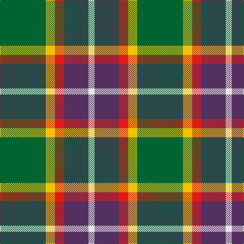

In pattern [GYRBW](/patterns/gyrbw/).

This was sourced from register-of-tartans.  It is a [5 stripes tartan](/stripes/stripes5/).

Original link https://www.tartanregister.gov.uk/tartanDetails.aspx?ref=10852

## Register references

External register numbers recorded for this tartan.

- Scottish Register of Tartans: [10852](https://www.tartanregister.gov.uk/tartanDetails.aspx?ref=10852)

## Thread count
G/90 Y18 R18 N48 LN/12

## Palette
Each colour and its ΔE from the base-6 reference it is a variant of.

| Colour | Shade | Base | ΔE (OKLab) |
|---|---|---|---|
| G | <code style="background-color:#006430;">#006430</code> `#006430` | G <code style="background-color:#006100;">#006100</code> | 0.04 |
| LN | <code style="background-color:#E8E8E8;">#E8E8E8</code> `#E8E8E8` | W <code style="background-color:#F7F7F7;">#F7F7F7</code> | 0.05 |
| N | <code style="background-color:#543060;">#543060</code> `#543060` | B <code style="background-color:#2A418A;">#2A418A</code> | 0.10 |
| R | <code style="background-color:#E01C18;">#E01C18</code> `#E01C18` | R <code style="background-color:#CC0000;">#CC0000</code> | 0.05 |
| Y | <code style="background-color:#F0C400;">#F0C400</code> `#F0C400` | Y <code style="background-color:#F2BF00;">#F2BF00</code> | 0.01 |

# Sample pattern

## Nearest tartans

The nearest existing variants by ΔTartan distance.

1. [ChuMac (Personal)](/setts/s5/g15y3r3b8w2~b440044-g006818-rc80000-wfcfcfc-ye8c000~x6/) — ΔT 0.62
1. [Phinn (Personal)](/setts/s5/g11ga3r4y2w2~g003820-ga206058-r880000-we0e0e0-ye8c000~x10/) — ΔT 0.80
1. [Lindley-Highfield of Ballumbie Castle](/setts/s7/g7b3w1y2g1wa2b1~b800080-g006400-wffffff-wadda0dd-y32cd32~x8/) — ΔT 1.01
1. [St Andrews Bay](/setts/s7/y30w4y20g20k20ya3k6~g006818-k101010-we0e0e0-ya08858-yad87c00~x2/) — ΔT 1.05
1. [Sachie Hara Scottish Check (Personal)](/setts/s5/k5b4g24r21w3~b2c2c80-g006818-k101010-rc80000-wfcfcfc~x2/) — ΔT 1.10
1. [Bronte House Check (Fashion)](/setts/s6/r10g60b13w24b24g8~b003c64-g604000-re87878-we8ccb8/) — ΔT 1.14
1. [Turnbull, hunting](/setts/s5/r7y3g28b28w3~b304080-g008000-r800000-we0e0e0-yf0c000~x2/) — ΔT 1.14
1. [Afternoon Tea / Afternoon Tea](/setts/s6/w15k8r25k72g98y15~g408060-k1c1714-r781638-we0e0e0-yc89800/) — ΔT 1.17
1. [Wilson's, No 193](/setts/s5/g6k1r1b2r2~b5480b0-g008000-k000000-rc00000~x4/) — ΔT 1.17
1. [Wellington, No 122](/setts/s5/k4b3ba11g14y2~b5480b0-ba800080-g008000-k000000-yf0c000~x2/) — ΔT 1.18

## Neighbour map

Every grey dot is one of 15726 variants placed by the first two principal components of the ΔTartan feature space (44% of its variance). Red is this tartan; blue dots are its nearest — click one to open its page.

<svg viewBox="0 0 640 380" role="img" style="max-width:100%;height:auto;border:1px solid #e0e0e0;border-radius:4px;display:block" xmlns="http://www.w3.org/2000/svg"><image href="/nn/cloud.v1.png" width="640" height="380"/><a href="/setts/s5/g15y3r3b8w2~b440044-g006818-rc80000-wfcfcfc-ye8c000~x6/"><circle cx="190.1" cy="205.5" r="4" fill="#3465a4"><title>ChuMac (Personal)</title></circle></a><a href="/setts/s5/g11ga3r4y2w2~g003820-ga206058-r880000-we0e0e0-ye8c000~x10/"><circle cx="189.1" cy="224.6" r="4" fill="#3465a4"><title>Phinn (Personal)</title></circle></a><a href="/setts/s7/g7b3w1y2g1wa2b1~b800080-g006400-wffffff-wadda0dd-y32cd32~x8/"><circle cx="167.7" cy="188.3" r="4" fill="#3465a4"><title>Lindley-Highfield of Ballumbie Castle</title></circle></a><a href="/setts/s7/y30w4y20g20k20ya3k6~g006818-k101010-we0e0e0-ya08858-yad87c00~x2/"><circle cx="197.2" cy="198.3" r="4" fill="#3465a4"><title>St Andrews Bay</title></circle></a><a href="/setts/s5/k5b4g24r21w3~b2c2c80-g006818-k101010-rc80000-wfcfcfc~x2/"><circle cx="192.5" cy="203.0" r="4" fill="#3465a4"><title>Sachie Hara Scottish Check (Personal)</title></circle></a><a href="/setts/s6/r10g60b13w24b24g8~b003c64-g604000-re87878-we8ccb8/"><circle cx="230.3" cy="221.4" r="4" fill="#3465a4"><title>Bronte House Check (Fashion)</title></circle></a><a href="/setts/s5/r7y3g28b28w3~b304080-g008000-r800000-we0e0e0-yf0c000~x2/"><circle cx="204.2" cy="206.9" r="4" fill="#3465a4"><title>Turnbull, hunting</title></circle></a><a href="/setts/s6/w15k8r25k72g98y15~g408060-k1c1714-r781638-we0e0e0-yc89800/"><circle cx="198.8" cy="180.2" r="4" fill="#3465a4"><title>Afternoon Tea / Afternoon Tea</title></circle></a><a href="/setts/s5/g6k1r1b2r2~b5480b0-g008000-k000000-rc00000~x4/"><circle cx="222.9" cy="238.0" r="4" fill="#3465a4"><title>Wilson's, No 193</title></circle></a><a href="/setts/s5/k4b3ba11g14y2~b5480b0-ba800080-g008000-k000000-yf0c000~x2/"><circle cx="145.0" cy="214.9" r="4" fill="#3465a4"><title>Wellington, No 122</title></circle></a><circle cx="203.6" cy="210.8" r="5" fill="#c00000"/></svg>

ID: /setts/s5/g15y3r3b8w2~b543060-g006430-re01c18-we8e8e8-yf0c400~x6/
