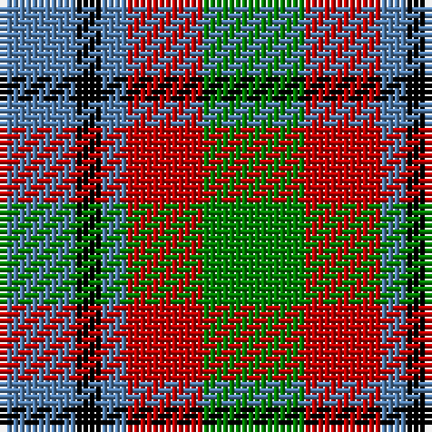

In pattern [BKBRG](/patterns/bkbrg/).

This was sourced from weddslist.  It is a [5 stripes tartan](/stripes/stripes5/).

Original link http://www.weddslist.com/cgi-bin/tartans/pg.pl?source=sts

## Thread count
B/12 K4 B4 R12 G/16

## Palette
Each colour and its ΔE from the base-6 reference it is a variant of.

| Colour | Shade | Base | ΔE (OKLab) |
|---|---|---|---|
| B | <code style="background-color:#5480B0;">#5480B0</code> `#5480B0` | B <code style="background-color:#2C4084;">#2C4084</code> | 0.20 |
| G | <code style="background-color:#008000;">#008000</code> `#008000` | G <code style="background-color:#006400;">#006400</code> | 0.09 |
| K | <code style="background-color:#000000;">#000000</code> `#000000` | K <code style="background-color:#000000;">#000000</code> | 0.00 |
| R | <code style="background-color:#C00000;">#C00000</code> `#C00000` | R <code style="background-color:#C80000;">#C80000</code> | 0.02 |

# Sample pattern

## Nearest tartans

The nearest existing variants by ΔTartan distance.

1. [Creek Indian Nation](/setts/s5/b24g48y12b12r24-b2c2c80-g006818-rc80000-ye8c000/) — ΔT 0.65
1. [Timespan](/setts/s5/g36r6k36r6ra36-g006818-k101010-rc80000-ra888888/) — ΔT 1.06
1. [Ramsay (Orange)](/setts/s7/k8y18k26g12y6g18w8-g006818-k101010-we0e0e0-yd87c00/) — ΔT 1.17
1. [Stewart, Plaid](/setts/s7/r4g8b16r18g18k4r4-b304080-g008000-k000000-rc00000/) — ΔT 1.20
1. [Inspiration](/setts/s5/r10b24y22ba42ya10-b5f749c-ba14283c-rc8002c-yc4bc68-yae0a126/) — ΔT 1.22
1. [Gallowater Old District Tartan Tartan Number: 1025. Earliest known date: 1819 Both 'Old' and 'New' appear in Wilson's 1819 pattern book. See products available Copyright © Blair Urquhart, Comrie, 2015](/setts/s5/k19b10ba19g40y10-b5c8ca8-ba780078-g006818-k101010-ye8c000/) — ΔT 1.23
1. [Wilson's No.214](/setts/s8/b12k4b4r12g16r12b4k4-b2888c4-g006818-k101010-rc80000/) — ΔT 1.25
1. [Wilson's No.203](/setts/s4/b8r16g20y4-b2888c4-g006818-rc80000-ye8c000/) — ΔT 1.28
1. [Waterloo](/setts/s6/g6ga12k12g8r2g2-g789484-ga003820-k101010-rc80000/) — ΔT 1.29
1. [Harbison (2015)](/setts/s4/b42g68r28w12-b2c2c80-g006818-rc80000-wfcfcfc/) — ΔT 1.29

## Neighbour map

Every grey dot is one of 15726 variants placed by the first two principal components of the ΔTartan feature space (44% of its variance). Red is this tartan; blue dots are its nearest — click one to open its page.

<svg viewBox="0 0 640 380" role="img" style="max-width:100%;height:auto;border:1px solid #e0e0e0;border-radius:4px;display:block" xmlns="http://www.w3.org/2000/svg"><image href="/nn/cloud.v1.png" width="640" height="380"/><a href="/setts/s5/b24g48y12b12r24-b2c2c80-g006818-rc80000-ye8c000/"><circle cx="143.7" cy="273.0" r="4" fill="#3465a4"><title>Creek Indian Nation</title></circle></a><a href="/setts/s5/g36r6k36r6ra36-g006818-k101010-rc80000-ra888888/"><circle cx="127.4" cy="254.9" r="4" fill="#3465a4"><title>Timespan</title></circle></a><a href="/setts/s7/k8y18k26g12y6g18w8-g006818-k101010-we0e0e0-yd87c00/"><circle cx="94.0" cy="255.7" r="4" fill="#3465a4"><title>Ramsay (Orange)</title></circle></a><a href="/setts/s7/r4g8b16r18g18k4r4-b304080-g008000-k000000-rc00000/"><circle cx="145.0" cy="246.3" r="4" fill="#3465a4"><title>Stewart, Plaid</title></circle></a><a href="/setts/s5/r10b24y22ba42ya10-b5f749c-ba14283c-rc8002c-yc4bc68-yae0a126/"><circle cx="96.7" cy="246.9" r="4" fill="#3465a4"><title>Inspiration</title></circle></a><a href="/setts/s5/k19b10ba19g40y10-b5c8ca8-ba780078-g006818-k101010-ye8c000/"><circle cx="107.0" cy="255.2" r="4" fill="#3465a4"><title>Gallowater Old District Tartan Tartan Number: 1025. Earliest known date: 1819 Both 'Old' and 'New' appear in Wilson's 1819 pattern book. See products available Copyright © Blair Urquhart, Comrie, 2015</title></circle></a><a href="/setts/s8/b12k4b4r12g16r12b4k4-b2888c4-g006818-k101010-rc80000/"><circle cx="116.1" cy="249.5" r="4" fill="#3465a4"><title>Wilson's No.214</title></circle></a><a href="/setts/s4/b8r16g20y4-b2888c4-g006818-rc80000-ye8c000/"><circle cx="177.8" cy="277.0" r="4" fill="#3465a4"><title>Wilson's No.203</title></circle></a><a href="/setts/s6/g6ga12k12g8r2g2-g789484-ga003820-k101010-rc80000/"><circle cx="155.3" cy="252.6" r="4" fill="#3465a4"><title>Waterloo</title></circle></a><a href="/setts/s4/b42g68r28w12-b2c2c80-g006818-rc80000-wfcfcfc/"><circle cx="177.9" cy="268.2" r="4" fill="#3465a4"><title>Harbison (2015)</title></circle></a><circle cx="107.9" cy="276.0" r="5" fill="#c00000"/></svg>

ID: /setts/s5/g16r12b4k4b12-b5480b0-g008000-k000000-rc00000/
