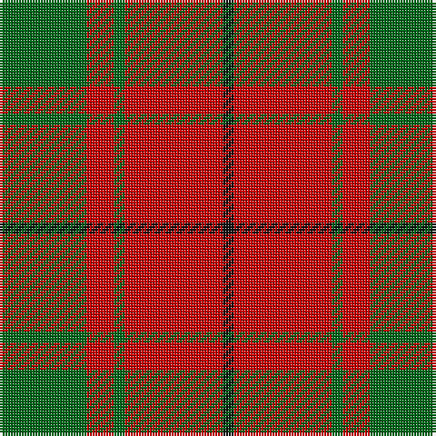

This page is one **sett** — a single exact thread-count. It belongs to the [tartan](/tartans/g16r5g2r18k2/)
(the same proportion at any scale), whose colour order is pattern [GRGRK](/stripes/grgrk/).

Sourced from tartans-authority.  It is a [5 stripe tartan](/stripes/stripes5/).

Original link http://www.tartansauthority.com/tartan-ferret/display/873/

## Also known as

This cloth is also recorded under:

- MacCullough
- MacDonald Lord of the Isles #2
- MacDonald of the Isles Portrait
- MacDonald, Lord of The Isles
- MacDonald, Lord of the Isles

5 attestations — the source records this cloth was collapsed from (oldest owns this page)

<ul>
<li>1750 — MacDonald, Lord of The Isles (Artef) (tartans-authority, <a href="http://www.tartansauthority.com/tartan-ferret/display/873/">record</a>)</li>
<li>01/01/1845 — MacCullough (register-of-tartans, <a href="https://www.tartanregister.gov.uk/tartanDetails.aspx?ref=5199">record</a>)</li>
<li>1845 — MacCullough (Clan) (tartans-authority, <a href="http://www.tartansauthority.com/tartan-ferret/display/3339/">record</a>)</li>
<li>undated — MacDonald, Lord of the Isles (weddslist, <a href="http://www.weddslist.com/cgi-bin/tartans/pg.pl?source=sts">record</a>)</li>
<li>undated — MacDonald of the Isles (Red) Portrait Tartan Tartan Number: 873. Earliest known date: 1750 This is MacDonald of Sleat with an extra black overcheck. See products available Copyright © Blair Urquhart, Comrie, 2015 (house-of-tartan, <a href="http://www.house-of-tartan.scotland.net/house/TartanViewjs.asp?colr=Def&tnam=873">record</a>)</li>
</ul>

## Register references

External register numbers recorded for this tartan.

- Scottish Register of Tartans: [5199](https://www.tartanregister.gov.uk/tartanDetails.aspx?ref=5199)
- Scottish Tartans Authority (ITI): 3339

## Thread count
G/32 R10 G4 R36 K/4

## Palette
Each colour and the base-6 reference it is a variant of.

| Colour | Shade | Base |
|---|---|---|
| G | <code style="background-color:#006818;">#006818</code> `oklch(45.0% 0.142 145.0)` <small>#006818</small> | G <code style="background-color:#006100;">#006100</code> |
| K | <code style="background-color:#101010;">#101010</code> `oklch(17.3% 0.000 89.9)` <small>#101010</small> | K <code style="background-color:#000000;">#000000</code> |
| R | <code style="background-color:#C80000;">#C80000</code> `oklch(52.3% 0.215 29.2)` <small>#C80000</small> | R <code style="background-color:#CC0000;">#CC0000</code> |

# Sample pattern

## Nearest tartans

The nearest existing variants by ΔTartan distance, with this tartan at the top so the swatches line up against it.

ΔTartan

Tartan

Sett

—

<a href="/ttd/edit/#slug=g16r5g2r18k2~x2">MacDonald, Lord of The Isles (Artef)</a> <a class="nn-out" href="/setts/s5/g16r5g2r18k2~x2/" title="open its dictionary page">↗</a>

0.60

<a href="/ttd/edit/#slug=dg16r5dg2r18k2~x2">MacDonald Lord of the Isles #2</a> <a class="nn-out" href="/setts/s5/dg16r5dg2r18k2~x2/" title="open its dictionary page">↗</a>

0.78

<a href="/ttd/edit/#slug=r1g7r9ly1~x4">Bryce</a> <a class="nn-out" href="/setts/s4/r1g7r9ly1~x4/" title="open its dictionary page">↗</a>

0.78

<a href="/ttd/edit/#slug=k1r5g10r5g1~x4">Murray, Lord George (Hose)</a> <a class="nn-out" href="/setts/s5/k1r5g10r5g1~x4/" title="open its dictionary page">↗</a>

0.79

<a href="/ttd/edit/#slug=dg7r3dg1r9k1~x2">MacDonald of Sleat</a> <a class="nn-out" href="/setts/s5/dg7r3dg1r9k1~x2/" title="open its dictionary page">↗</a>

0.82

<a href="/ttd/edit/#slug=dg16r5dg2r18k2">MacDonald of Sleat</a> <a class="nn-out" href="/setts/s5/dg16r5dg2r18k2/" title="open its dictionary page">↗</a>

0.83

<a href="/ttd/edit/#slug=r1g3r1g3r8ly1~x8">Cameron</a> <a class="nn-out" href="/setts/s6/r1g3r1g3r8ly1~x8/" title="open its dictionary page">↗</a>

0.83

<a href="/ttd/edit/#slug=r3g20r25w3~x4">MacKinnon 11</a> <a class="nn-out" href="/setts/s4/r3g20r25w3~x4/" title="open its dictionary page">↗</a>

0.88

<a href="/setts/s4/r10dg4lo1~x8/">Lugo (2013)</a>

1.05

<a href="/ttd/edit/#slug=r3dg20r25w3~x4">MacKinnon #6</a> <a class="nn-out" href="/setts/s4/r3dg20r25w3~x4/" title="open its dictionary page">↗</a>

1.06

<a href="/setts/s4/r10dg4ly1~x8/">Lugo (2013)</a>

## Neighbour map

Every grey dot is one of 14299 variants placed by the first two principal components of the ΔTartan feature space (44% of its variance). Red is this tartan; blue dots are its nearest — click one to open its page.

<svg viewBox="0 0 640 380" role="img" style="max-width:100%;height:auto;border:1px solid #e0e0e0;border-radius:4px;display:block" xmlns="http://www.w3.org/2000/svg"><image href="/nn/cloud.v1.png" width="640" height="380"/><a href="/setts/s5/dg16r5dg2r18k2~x2/"><circle cx="343.2" cy="232.8" r="4" fill="#3465a4"><title>MacDonald Lord of the Isles #2</title></circle></a><a href="/setts/s4/r1g7r9ly1~x4/"><circle cx="355.9" cy="245.7" r="4" fill="#3465a4"><title>Bryce</title></circle></a><a href="/setts/s5/k1r5g10r5g1~x4/"><circle cx="324.0" cy="239.4" r="4" fill="#3465a4"><title>Murray, Lord George (Hose)</title></circle></a><a href="/setts/s5/dg7r3dg1r9k1~x2/"><circle cx="354.7" cy="237.0" r="4" fill="#3465a4"><title>MacDonald of Sleat</title></circle></a><a href="/setts/s5/dg16r5dg2r18k2/"><circle cx="363.1" cy="249.6" r="4" fill="#3465a4"><title>MacDonald of Sleat</title></circle></a><a href="/setts/s6/r1g3r1g3r8ly1~x8/"><circle cx="370.7" cy="226.4" r="4" fill="#3465a4"><title>Cameron</title></circle></a><a href="/setts/s4/r3g20r25w3~x4/"><circle cx="339.7" cy="246.1" r="4" fill="#3465a4"><title>MacKinnon 11</title></circle></a><a href="/setts/s4/r10dg4lo1~x8/"><circle cx="349.6" cy="263.4" r="4" fill="#3465a4"><title>Lugo (2013)</title></circle></a><a href="/setts/s4/r3dg20r25w3~x4/"><circle cx="335.1" cy="239.8" r="4" fill="#3465a4"><title>MacKinnon #6</title></circle></a><a href="/setts/s4/r10dg4ly1~x8/"><circle cx="331.2" cy="248.6" r="4" fill="#3465a4"><title>Lugo (2013)</title></circle></a><circle cx="352.4" cy="240.2" r="5" fill="#c00000"/></svg>

ID: /setts/s5/g16r5g2r18k2~x2/
