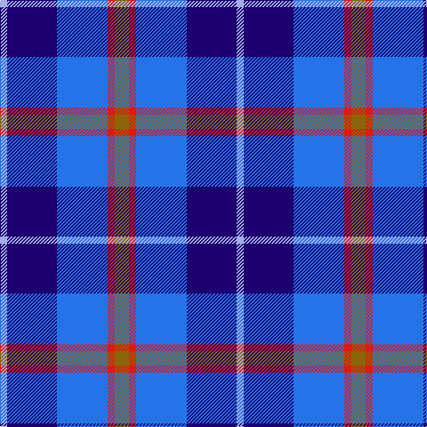

In pattern [GRBBW](/patterns/grbbw/).

This was sourced from register-of-tartans.  It is a [5 stripes tartan](/stripes/stripes5/).

Original link https://www.tartanregister.gov.uk/tartanDetails.aspx?ref=5007

## Thread count
LP/8 DB56 B57 R8 T/16

## Palette
Each colour and its ΔE from the base-6 reference it is a variant of.

| Colour | Shade | Base | ΔE (OKLab) |
|---|---|---|---|
| B | <code style="background-color:#2474E8;">#2474E8</code> `#2474E8` | B <code style="background-color:#2C4084;">#2C4084</code> | 0.20 |
| DB | <code style="background-color:#1C0070;">#1C0070</code> `#1C0070` | B <code style="background-color:#2C4084;">#2C4084</code> | 0.14 |
| LP | <code style="background-color:#A8ACE8;">#A8ACE8</code> `#A8ACE8` | W <code style="background-color:#F4F4F0;">#F4F4F0</code> | 0.22 |
| R | <code style="background-color:#E3170D;">#E3170D</code> `#E3170D` | R <code style="background-color:#C80000;">#C80000</code> | 0.06 |
| T | <code style="background-color:#8B6508;">#8B6508</code> `#8B6508` | G <code style="background-color:#006400;">#006400</code> | 0.16 |

# Sample pattern

## Nearest tartans

The nearest existing variants by ΔTartan distance.

1. [SABA](/setts/s5/w12b8ba60bb60r8-b003c64-ba2c2c80-bb2888c4-rc80000-we0e0e0/) — ΔT 0.88
1. [RSCDS Australia? (Corporate)](/setts/s5/r8b48k20ba64w8-b2c2c80-ba2888c4-k101010-rc80000-wfcfcfc/) — ΔT 0.95
1. [Bryson (1988) (Name)](/setts/s5/y16r8b56ba56w8-b78849c-ba000064-rc80000-wc8d8dc-ya0a0a0/) — ΔT 1.18
1. [American Express](/setts/s6/b8ba36r4b20g20w8-b000064-ba3474fc-g007800-r8c0000-wc8c8c8/) — ΔT 1.40
1. [Lauder Primary School](/setts/s6/y8b36r8ba24y4r4-b003beb-ba000080-rff0000-yffe600/) — ΔT 1.52
1. [Icelandair](/setts/s7/b6ba48k22b40w4b10y6-b2c4084-ba2888c4-k101010-wffffff-yd87c00/) — ΔT 1.52
1. [Blue](/setts/s7/r4b22r6b22ba24bb20w4-b304080-ba5480b0-bb000050-rc00000-we0e0e0/) — ΔT 1.52
1. [Mary Washington](/setts/s7/k6b36ba6ka36ba36k6w6-b304080-ba8080d0-k000000-ka000030-we0e0e0/) — ΔT 1.55
1. [Lands of Liberty](/setts/s5/r40w20b120ba80r12-b2c4084-ba0596fa-rc80000-wffffff/) — ΔT 1.55
1. [Ballater](/setts/s10/b12ba4b24r8bb24k4r4k4bb24r12-b00008c-ba788cb4-bb3474fc-k000000-r8c0000/) — ΔT 1.56

## Neighbour map

Every grey dot is one of 15726 variants placed by the first two principal components of the ΔTartan feature space (44% of its variance). Red is this tartan; blue dots are its nearest — click one to open its page.

<svg viewBox="0 0 640 380" role="img" style="max-width:100%;height:auto;border:1px solid #e0e0e0;border-radius:4px;display:block" xmlns="http://www.w3.org/2000/svg"><image href="/nn/cloud.v1.png" width="640" height="380"/><a href="/setts/s5/w12b8ba60bb60r8-b003c64-ba2c2c80-bb2888c4-rc80000-we0e0e0/"><circle cx="199.3" cy="215.5" r="4" fill="#3465a4"><title>SABA</title></circle></a><a href="/setts/s5/r8b48k20ba64w8-b2c2c80-ba2888c4-k101010-rc80000-wfcfcfc/"><circle cx="178.7" cy="212.7" r="4" fill="#3465a4"><title>RSCDS Australia? (Corporate)</title></circle></a><a href="/setts/s5/y16r8b56ba56w8-b78849c-ba000064-rc80000-wc8d8dc-ya0a0a0/"><circle cx="157.8" cy="211.0" r="4" fill="#3465a4"><title>Bryson (1988) (Name)</title></circle></a><a href="/setts/s6/b8ba36r4b20g20w8-b000064-ba3474fc-g007800-r8c0000-wc8c8c8/"><circle cx="124.6" cy="206.5" r="4" fill="#3465a4"><title>American Express</title></circle></a><a href="/setts/s6/y8b36r8ba24y4r4-b003beb-ba000080-rff0000-yffe600/"><circle cx="174.6" cy="194.7" r="4" fill="#3465a4"><title>Lauder Primary School</title></circle></a><a href="/setts/s7/b6ba48k22b40w4b10y6-b2c4084-ba2888c4-k101010-wffffff-yd87c00/"><circle cx="202.1" cy="184.1" r="4" fill="#3465a4"><title>Icelandair</title></circle></a><a href="/setts/s7/r4b22r6b22ba24bb20w4-b304080-ba5480b0-bb000050-rc00000-we0e0e0/"><circle cx="159.7" cy="234.4" r="4" fill="#3465a4"><title>Blue</title></circle></a><a href="/setts/s7/k6b36ba6ka36ba36k6w6-b304080-ba8080d0-k000000-ka000030-we0e0e0/"><circle cx="96.7" cy="202.0" r="4" fill="#3465a4"><title>Mary Washington</title></circle></a><a href="/setts/s5/r40w20b120ba80r12-b2c4084-ba0596fa-rc80000-wffffff/"><circle cx="208.2" cy="215.1" r="4" fill="#3465a4"><title>Lands of Liberty</title></circle></a><a href="/setts/s10/b12ba4b24r8bb24k4r4k4bb24r12-b00008c-ba788cb4-bb3474fc-k000000-r8c0000/"><circle cx="128.9" cy="198.7" r="4" fill="#3465a4"><title>Ballater</title></circle></a><circle cx="173.2" cy="217.7" r="5" fill="#c00000"/></svg>

ID: /setts/s5/g16r8b57ba56w8-b2474e8-ba1c0070-g8b6508-re3170d-wa8ace8/
