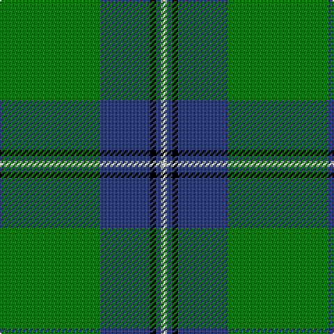

This page is one **sett** — a single exact thread-count. It belongs to the [tartan](/tartans/g18db9k1db1w1/)
(the same proportion at any scale), whose colour order is pattern [GBKBW](/stripes/gbkbw/).

Sourced from weddslist.  It is a [5 stripe tartan](/stripes/stripes5/).

Original link http://www.weddslist.com/cgi-bin/tartans/pg.pl?source=sts

2 attestations — the source records this cloth was collapsed from (oldest owns this page)

<ul>
<li>undated — Irvine (weddslist, <a href="http://www.weddslist.com/cgi-bin/tartans/pg.pl?source=sts">record</a>)</li>
<li>undated — Irvine Clan Tartan Tartan Number: 733. Earliest known date: c.1889 Scottish Tartans Society notes say that this tartan was 'first made by Peter MacArthur and Co, Hamilton'. MacKinlay, a tartan collector between 1930 and 1950, gives the earliest date as 1889 but it is not known upon what evidence. The name Irvine derives from an old parish name in Dumfries-shire, and from Irvine in Ayrshire. William de Irwyne obtained the forest of Drum in 1324, and is thus the ancestor of the Irvines of Drum. See products available Copyright © Blair Urquhart, Comrie, 2015 (house-of-tartan, <a href="http://www.house-of-tartan.scotland.net/house/TartanViewjs.asp?colr=Def&tnam=733">record</a>)</li>
</ul>

## Thread count
G/72 B36 K4 B4 LN/4

## Palette

Palette: <strong>Tartan Register</strong> <small style="color:#888">(2 of 4 colours)</small>
<table><thead><tr><th>Colour</th><th>Threads</th><th>Shade</th><th>Base</th><th>OKLCh</th></tr></thead><tbody><tr><td>G/</td><td style="text-align:right;font-variant-numeric:tabular-nums">72</td><td><code style="background-color:#008000;">#008000</code> <small style="color:#888">#008000</small></td><td>G <code style="background-color:#006100;">#006100</code></td><td><small style="color:#888">oklch(52.0% 0.177 142.5)</small></td></tr><tr><td>B</td><td style="text-align:right;font-variant-numeric:tabular-nums">36</td><td><code style="background-color:#304080;">#304080</code> <small style="color:#888">#304080</small></td><td>B <code style="background-color:#2A418A;">#2A418A</code></td><td><small style="color:#888">oklch(39.4% 0.109 270.2)</small></td></tr><tr><td>K</td><td style="text-align:right;font-variant-numeric:tabular-nums">4</td><td><code style="background-color:#000000;">#000000</code> <small style="color:#888">#000000</small></td><td>K <code style="background-color:#000000;">#000000</code></td><td><small style="color:#888">oklch(0.0% 0.000 0.0)</small></td></tr><tr><td>B</td><td style="text-align:right;font-variant-numeric:tabular-nums">4</td><td><code style="background-color:#304080;">#304080</code> <small style="color:#888">#304080</small></td><td>B <code style="background-color:#2A418A;">#2A418A</code></td><td><small style="color:#888">oklch(39.4% 0.109 270.2)</small></td></tr><tr><td>LN/</td><td style="text-align:right;font-variant-numeric:tabular-nums">4</td><td><code style="background-color:#E0E0E0;">#E0E0E0</code> <small style="color:#888">#E0E0E0</small></td><td>W <code style="background-color:#F7F7F7;">#F7F7F7</code></td><td><small style="color:#888">oklch(90.7% 0.000 89.9)</small></td></tr></tbody></table>

# Sample pattern

## Nearest tartans

The nearest existing variants by ΔTartan distance, with this tartan at the top so the swatches line up against it.

ΔTartan

Tartan

Sett

—

<a href="/ttd/edit/#slug=g18db9k1db1w1~x4">Irvine</a> <a class="nn-out" href="/setts/s5/g18db9k1db1w1~x4/" title="open its dictionary page">↗</a>

0.59

<a href="/ttd/edit/#slug=g27db14k2db2ly2~x4">Irving of Bonshaw</a> <a class="nn-out" href="/setts/s5/g27db14k2db2ly2~x4/" title="open its dictionary page">↗</a>

0.78

<a href="/ttd/edit/#slug=g47r3g6db35ly3~x2">Gracie</a> <a class="nn-out" href="/setts/s5/g47r3g6db35ly3~x2/" title="open its dictionary page">↗</a>

0.86

<a href="/ttd/edit/#slug=g50db20k3db2o2db5~x2">St Andrews Hotel, Golf Resort, and SPA</a> <a class="nn-out" href="/setts/s6/g50db20k3db2o2db5~x2/" title="open its dictionary page">↗</a>

1.23

<a href="/ttd/edit/#slug=g62k40ly3k3w3~x2">O'Donoghue</a> <a class="nn-out" href="/setts/s5/g62k40ly3k3w3~x2/" title="open its dictionary page">↗</a>

1.23

<a href="/ttd/edit/#slug=g99db20w8db30ly8db10ly8g46">Duke of York Hunting</a> <a class="nn-out" href="/setts/s8/g99db20w8db30ly8db10ly8g46/" title="open its dictionary page">↗</a>

1.26

<a href="/ttd/edit/#slug=t1db4g10ly1~x2">Wilson's No.174</a> <a class="nn-out" href="/setts/s4/t1db4g10ly1~x2/" title="open its dictionary page">↗</a>

1.30

<a href="/ttd/edit/#slug=t1db4g10w1~x2">Wilson's, No 205</a> <a class="nn-out" href="/setts/s4/t1db4g10w1~x2/" title="open its dictionary page">↗</a>

1.35

<a href="/ttd/edit/#slug=g47r3g6db35lo3~x2">Gracie (Name)</a> <a class="nn-out" href="/setts/s5/g47r3g6db35lo3~x2/" title="open its dictionary page">↗</a>

1.35

<a href="/ttd/edit/#slug=k5g40db20ly3~x2">Robert Byers Family - Dooballagh, Ireland</a> <a class="nn-out" href="/setts/s4/k5g40db20ly3~x2/" title="open its dictionary page">↗</a>

1.36

<a href="/ttd/edit/#slug=db4k4db24g32w1g2~x2">Oliphant</a> <a class="nn-out" href="/setts/s6/db4k4db24g32w1g2~x2/" title="open its dictionary page">↗</a>

## Neighbour map

Every grey dot is one of 14299 variants placed by the first two principal components of the ΔTartan feature space (44% of its variance). Red is this tartan; blue dots are its nearest — click one to open its page.

<svg viewBox="0 0 640 380" role="img" style="max-width:100%;height:auto;border:1px solid #e0e0e0;border-radius:4px;display:block" xmlns="http://www.w3.org/2000/svg"><image href="/nn/cloud.v1.png" width="640" height="380"/><a href="/setts/s5/g27db14k2db2ly2~x4/"><circle cx="353.5" cy="209.1" r="4" fill="#3465a4"><title>Irving of Bonshaw</title></circle></a><a href="/setts/s5/g47r3g6db35ly3~x2/"><circle cx="364.4" cy="212.4" r="4" fill="#3465a4"><title>Gracie</title></circle></a><a href="/setts/s6/g50db20k3db2o2db5~x2/"><circle cx="416.7" cy="173.4" r="4" fill="#3465a4"><title>St Andrews Hotel, Golf Resort, and SPA</title></circle></a><a href="/setts/s5/g62k40ly3k3w3~x2/"><circle cx="362.9" cy="187.4" r="4" fill="#3465a4"><title>O'Donoghue</title></circle></a><a href="/setts/s8/g99db20w8db30ly8db10ly8g46/"><circle cx="357.0" cy="188.3" r="4" fill="#3465a4"><title>Duke of York Hunting</title></circle></a><a href="/setts/s4/t1db4g10ly1~x2/"><circle cx="362.6" cy="241.7" r="4" fill="#3465a4"><title>Wilson's No.174</title></circle></a><a href="/setts/s4/t1db4g10w1~x2/"><circle cx="360.2" cy="240.0" r="4" fill="#3465a4"><title>Wilson's, No 205</title></circle></a><a href="/setts/s5/g47r3g6db35lo3~x2/"><circle cx="356.9" cy="210.4" r="4" fill="#3465a4"><title>Gracie (Name)</title></circle></a><a href="/setts/s4/k5g40db20ly3~x2/"><circle cx="353.5" cy="237.3" r="4" fill="#3465a4"><title>Robert Byers Family - Dooballagh, Ireland</title></circle></a><a href="/setts/s6/db4k4db24g32w1g2~x2/"><circle cx="350.3" cy="166.0" r="4" fill="#3465a4"><title>Oliphant</title></circle></a><circle cx="379.9" cy="193.3" r="5" fill="#c00000"/></svg>

ID: /setts/s5/g18db9k1db1w1~x4/
