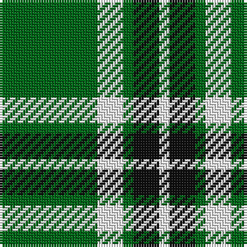

**Bands:** [GWGKW](/stripes/gwgkw/) · **Stripes:** [G W G K W](/stripes/stripes5/) G W G K W

This was sourced from register-of-tartans.  It is a [5 band tartan](/bands/bands5/).

Original link https://www.tartanregister.gov.uk/tartanDetails.aspx?ref=2156

## Register references

External register numbers recorded for this tartan.

- Scottish Register of Tartans: [2156](https://www.tartanregister.gov.uk/tartanDetails.aspx?ref=2156)
- Scottish Tartans Authority (ITI): 943
- Scottish Tartans World Register: 943

## Variants

Other setts woven to the same stripe pattern.

- [Loch Rannoch](/setts/s5/g37w9g3k9w3/)

## Thread count
G/38 W10 G4 K10 W/4

## Palette
Each colour and its ΔE from the base-6 reference it is a variant of.

| Colour | Shade | Base | ΔE (OKLab) |
|---|---|---|---|
| G | <code style="background-color:#006818;">#006818</code> `#006818` | G <code style="background-color:#006100;">#006100</code> | 0.02 |
| K | <code style="background-color:#101010;">#101010</code> `#101010` | K <code style="background-color:#000000;">#000000</code> | 0.17 |
| W | <code style="background-color:#FCFCFC;">#FCFCFC</code> `#FCFCFC` | W <code style="background-color:#F7F7F7;">#F7F7F7</code> | 0.01 |

# Sample pattern

## Nearest tartans

The nearest existing variants by ΔTartan distance.

1. [Loch Rannoch](/setts/s5/g37w9g3k9w3/) — ΔT 0.75
1. [Big Spruce Brewing](/setts/s6/dg11ly1dg1ly6k1ly1~x8/) — ΔT 1.20
1. [Special Saffron Tartan Tartan Number: 201. Earliest known date: pre 2003 Y = Saffron See products available Copyright © Blair Urquhart, Comrie, 2015](/setts/s4/dg21ly43dg86t10/) — ΔT 1.33
1. [Heritage #2](/setts/s7/dg20w2dg9w2ly5w7dg10~x2/) — ΔT 1.44
1. [Big Spruce Brewing](/setts/s6/dg11lo1dg1lo6k1lo1~x4/) — ΔT 1.47
1. [Instakilt, Green (Fashion)](/setts/s7/g8w4g50k12g4k15lo5~x2/) — ΔT 1.48
1. [Juchter (Personal)](/setts/s4/dg20w5r3~x2/) — ΔT 1.52
1. [Wilson's, No 189](/setts/s4/p4g10w1r1~x2/) — ΔT 1.58
1. [Leach Hunting](/setts/s7/k3lb1g15g6k2dr3lb2~x2/) — ΔT 1.64
1. [Limerick County Crest (Fashion)](/setts/s6/w12k3g50w3k13lo6~x2/) — ΔT 1.65

## Neighbour map

Every grey dot is one of 14299 variants placed by the first two principal components of the ΔTartan feature space (44% of its variance). Red is this tartan; blue dots are its nearest — click one to open its page.

<svg viewBox="0 0 640 380" role="img" style="max-width:100%;height:auto;border:1px solid #e0e0e0;border-radius:4px;display:block" xmlns="http://www.w3.org/2000/svg"><image href="/nn/cloud.v1.png" width="640" height="380"/><a href="/setts/s5/g37w9g3k9w3/"><circle cx="357.5" cy="203.3" r="4" fill="#3465a4"><title>Loch Rannoch</title></circle></a><a href="/setts/s6/dg11ly1dg1ly6k1ly1~x8/"><circle cx="330.1" cy="192.0" r="4" fill="#3465a4"><title>Big Spruce Brewing</title></circle></a><a href="/setts/s4/dg21ly43dg86t10/"><circle cx="357.6" cy="254.7" r="4" fill="#3465a4"><title>Special Saffron Tartan Tartan Number: 201. Earliest known date: pre 2003 Y = Saffron See products available Copyright © Blair Urquhart, Comrie, 2015</title></circle></a><a href="/setts/s7/dg20w2dg9w2ly5w7dg10~x2/"><circle cx="372.6" cy="225.6" r="4" fill="#3465a4"><title>Heritage #2</title></circle></a><a href="/setts/s6/dg11lo1dg1lo6k1lo1~x4/"><circle cx="351.6" cy="201.1" r="4" fill="#3465a4"><title>Big Spruce Brewing</title></circle></a><a href="/setts/s7/g8w4g50k12g4k15lo5~x2/"><circle cx="338.6" cy="176.7" r="4" fill="#3465a4"><title>Instakilt, Green (Fashion)</title></circle></a><a href="/setts/s4/dg20w5r3~x2/"><circle cx="306.5" cy="242.5" r="4" fill="#3465a4"><title>Juchter (Personal)</title></circle></a><a href="/setts/s4/p4g10w1r1~x2/"><circle cx="343.3" cy="220.0" r="4" fill="#3465a4"><title>Wilson's, No 189</title></circle></a><a href="/setts/s7/k3lb1g15g6k2dr3lb2~x2/"><circle cx="351.9" cy="179.7" r="4" fill="#3465a4"><title>Leach Hunting</title></circle></a><a href="/setts/s6/w12k3g50w3k13lo6~x2/"><circle cx="309.7" cy="166.2" r="4" fill="#3465a4"><title>Limerick County Crest (Fashion)</title></circle></a><circle cx="333.1" cy="216.4" r="5" fill="#c00000"/></svg>

ID: /setts/s5/g19w5g2k5w2~x2/
