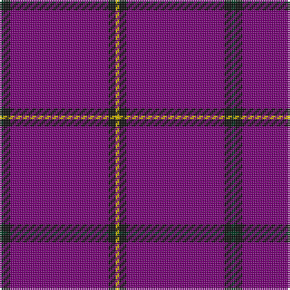

In pattern [GKBKY](/patterns/gkbky/).

This was sourced from register-of-tartans.  It is a [5 stripes tartan](/stripes/stripes5/).

Original link https://www.tartanregister.gov.uk/tartanDetails.aspx?ref=5149

## Attestations

This cloth appears in 2 source records; the oldest owns this page.

- 01/01/1998 — Carolina University, Western (register-of-tartans, [record](https://www.tartanregister.gov.uk/tartanDetails.aspx?ref=5149))
- 1998 — Western Carolina University (Corp.) (tartans-authority, [record](http://www.tartansauthority.com/tartan-ferret/display/3893/))

## Thread count
DG/2 K4 P54 K4 Y/2

## Palette
Each colour and its ΔE from the base-6 reference it is a variant of.

| Colour | Shade | Base | ΔE (OKLab) |
|---|---|---|---|
| DG | <code style="background-color:#003820;">#003820</code> `#003820` | G <code style="background-color:#006100;">#006100</code> | 0.15 |
| K | <code style="background-color:#101010;">#101010</code> `#101010` | K <code style="background-color:#000000;">#000000</code> | 0.17 |
| P | <code style="background-color:#780078;">#780078</code> `#780078` | B <code style="background-color:#2A418A;">#2A418A</code> | 0.17 |
| Y | <code style="background-color:#E8C000;">#E8C000</code> `#E8C000` | Y <code style="background-color:#F2BF00;">#F2BF00</code> | 0.02 |

# Sample pattern

## Nearest tartans

The nearest existing variants by ΔTartan distance.

1. [East Carolina University (Corp.)](/setts/s7/b13w2b8k5y10b75y3~b780078-k101010-we0e0e0-ybc8c00~x2/) — ΔT 1.08
1. [Cairngorms National Park](/setts/s8/b57r5b2r8w2b3y2b14~b440044-ra00048-wc8c8c8-yf8e38c~x2/) — ΔT 1.26
1. [Wedding (Fashion)](/setts/s5/r2b30w1y2ra1~b440044-re87878-rac80000-we0e0e0-ybc8c00~x2/) — ΔT 1.70
1. [Wedding](/setts/s5/r2w1b30ba1ra2~b2a074b-ba530014-ra46216-raae566c-wffffff~x2/) — ΔT 1.98
1. [Spirit of Hoxa (District)](/setts/s9/g2b19g2b46ba2b10g3w2r2~b440044-ba5c8ca8-g003820-re87878-wc49cd8~x2/) — ΔT 2.04
1. [Lynch Variant](/setts/s6/r12b3r7b52g4b4~b500050-g005020-rdc0000~x2/) — ΔT 2.11
1. [Lynch](/setts/s6/r3b2r1b18g1b2~b2c2c80-g007c00-rc80000~x4/) — ΔT 2.31
1. [Lynch Family Tartan Tartan Number: 2163. Earliest known date: 1994 Information from Dr. Phil Smith, Narvon, USA. See products available Copyright © Blair Urquhart, Comrie, 2015](/setts/s6/r19b6r14b101g7b7~b2c2c80-g006818-rc80000/) — ΔT 2.38
1. [MacLaine of Lochbuie Hunting Clan Tartan Tartan Number: 491. Earliest known date: 1906 The Sett is also recorded by Adam in 1908. The hunting version first appeared in this century, in the work of H. Whyte published by W. and A.K. Johnston. His book introduced many new hunting and dress forms of both clan and family tartans. D.W. Stewart (1893) pointed out that the use of so much blue, was unique among old tartan setts. See products available Copyright © Blair Urquhart, Comrie, 2015](/setts/s5/b32r3b4k1y3~b2c2c80-k101010-rc80000-ye8c000~x2/) — ΔT 2.44
1. [Wedding Day (Fashion)](/setts/s9/y4w1b48r2ra3r2b3w1y4~b780078-rc80000-rae87878-wfcfcfc-ybc8c00~x2/) — ΔT 2.45

## Neighbour map

Every grey dot is one of 15726 variants placed by the first two principal components of the ΔTartan feature space (44% of its variance). Red is this tartan; blue dots are its nearest — click one to open its page.

<svg viewBox="0 0 640 380" role="img" style="max-width:100%;height:auto;border:1px solid #e0e0e0;border-radius:4px;display:block" xmlns="http://www.w3.org/2000/svg"><image href="/nn/cloud.v1.png" width="640" height="380"/><a href="/setts/s7/b13w2b8k5y10b75y3~b780078-k101010-we0e0e0-ybc8c00~x2/"><circle cx="619.5" cy="134.7" r="4" fill="#3465a4"><title>East Carolina University (Corp.)</title></circle></a><a href="/setts/s8/b57r5b2r8w2b3y2b14~b440044-ra00048-wc8c8c8-yf8e38c~x2/"><circle cx="615.1" cy="148.7" r="4" fill="#3465a4"><title>Cairngorms National Park</title></circle></a><a href="/setts/s5/r2b30w1y2ra1~b440044-re87878-rac80000-we0e0e0-ybc8c00~x2/"><circle cx="589.5" cy="135.8" r="4" fill="#3465a4"><title>Wedding (Fashion)</title></circle></a><a href="/setts/s5/r2w1b30ba1ra2~b2a074b-ba530014-ra46216-raae566c-wffffff~x2/"><circle cx="592.8" cy="146.9" r="4" fill="#3465a4"><title>Wedding</title></circle></a><a href="/setts/s9/g2b19g2b46ba2b10g3w2r2~b440044-ba5c8ca8-g003820-re87878-wc49cd8~x2/"><circle cx="626.0" cy="152.5" r="4" fill="#3465a4"><title>Spirit of Hoxa (District)</title></circle></a><a href="/setts/s6/r12b3r7b52g4b4~b500050-g005020-rdc0000~x2/"><circle cx="530.4" cy="193.7" r="4" fill="#3465a4"><title>Lynch Variant</title></circle></a><a href="/setts/s6/r3b2r1b18g1b2~b2c2c80-g007c00-rc80000~x4/"><circle cx="601.0" cy="206.7" r="4" fill="#3465a4"><title>Lynch</title></circle></a><a href="/setts/s6/r19b6r14b101g7b7~b2c2c80-g006818-rc80000/"><circle cx="529.7" cy="200.0" r="4" fill="#3465a4"><title>Lynch Family Tartan Tartan Number: 2163. Earliest known date: 1994 Information from Dr. Phil Smith, Narvon, USA. See products available Copyright © Blair Urquhart, Comrie, 2015</title></circle></a><a href="/setts/s5/b32r3b4k1y3~b2c2c80-k101010-rc80000-ye8c000~x2/"><circle cx="595.2" cy="168.7" r="4" fill="#3465a4"><title>MacLaine of Lochbuie Hunting Clan Tartan Tartan Number: 491. Earliest known date: 1906 The Sett is also recorded by Adam in 1908. The hunting version first appeared in this century, in the work of H. Whyte published by W. and A.K. Johnston. His book introduced many new hunting and dress forms of both clan and family tartans. D.W. Stewart (1893) pointed out that the use of so much blue, was unique among old tartan setts. See products available Copyright © Blair Urquhart, Comrie, 2015</title></circle></a><a href="/setts/s9/y4w1b48r2ra3r2b3w1y4~b780078-rc80000-rae87878-wfcfcfc-ybc8c00~x2/"><circle cx="542.2" cy="69.1" r="4" fill="#3465a4"><title>Wedding Day (Fashion)</title></circle></a><circle cx="623.8" cy="164.7" r="5" fill="#c00000"/></svg>

ID: /setts/s5/g1k2b27k2y1~b780078-g003820-k101010-ye8c000~x2/
