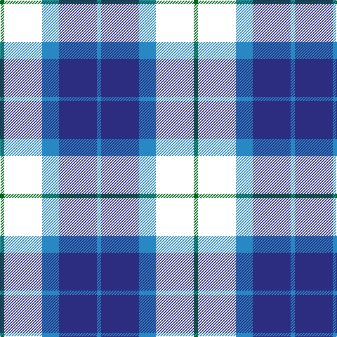

**Bands:** [GKBBB](/stripes/gkbbb/) · **Stripes:** [G K T DB T](/stripes/stripes5/) G K T DB T

This was sourced from house-of-tartan.  It is a [5 band tartan](/bands/bands5/).

Original link http://www.house-of-tartan.scotland.net/house/TartanViewjs.asp?colr=Def&tnam=6569

## Thread count
G/6 W54 B24 DB54 B/6

## Palette
Each colour and its ΔE from the base-6 reference it is a variant of.

| Colour | Shade | Base | ΔE (OKLab) |
|---|---|---|---|
| B | <code style="background-color:#2888C4;">#2888C4</code> `#2888C4` | B <code style="background-color:#2A418A;">#2A418A</code> | 0.21 |
| DB | <code style="background-color:#2C2C80;">#2C2C80</code> `#2C2C80` | B <code style="background-color:#2A418A;">#2A418A</code> | 0.06 |
| G | <code style="background-color:#006818;">#006818</code> `#006818` | G <code style="background-color:#006100;">#006100</code> | 0.02 |
| LN | <code style="background-color:#E0E0E0;">#E0E0E0</code> `#E0E0E0` | W <code style="background-color:#F7F7F7;">#F7F7F7</code> | 0.07 |

# Sample pattern

## Nearest tartans

The nearest existing variants by ΔTartan distance.

1. [Frobo Nairn](/setts/s5/r2db9k5g6db1~x4/) — ΔT 0.93
1. [MacCorquodale](/setts/s7/r7k4db28k24t24k4db4~x2/) — ΔT 1.11
1. [Allianz Deutschland 2012](/setts/s7/n6db3n6db20k20db8w4~x2/) — ΔT 1.14
1. [Commonwealth Games](/setts/s6/m3db17dt13m2k20w2~x2/) — ΔT 1.21
1. [Graham of Menteith](/setts/s6/dg8lb2dg1k12db12k1~x2/) — ΔT 1.22
1. [Douglas](/setts/s5/k2lb2dg8db8lb1/) — ΔT 1.25
1. [Douglas Green](/setts/s5/k4lb2dg8db8lb1/) — ΔT 1.30
1. [Melville](/setts/s6/k5lb2dg18k17dp16k3/) — ΔT 1.32
1. [Scottish Express International](/setts/s6/k6db50k29b6k29db6/) — ΔT 1.35
1. [Bhatti](/setts/s5/k7lt3dg18db18w2~x2/) — ΔT 1.38

## Neighbour map

Every grey dot is one of 14299 variants placed by the first two principal components of the ΔTartan feature space (44% of its variance). Red is this tartan; blue dots are its nearest — click one to open its page.

<svg viewBox="0 0 640 380" role="img" style="max-width:100%;height:auto;border:1px solid #e0e0e0;border-radius:4px;display:block" xmlns="http://www.w3.org/2000/svg"><image href="/nn/cloud.v1.png" width="640" height="380"/><a href="/setts/s5/r2db9k5g6db1~x4/"><circle cx="186.4" cy="247.5" r="4" fill="#3465a4"><title>Frobo Nairn</title></circle></a><a href="/setts/s7/r7k4db28k24t24k4db4~x2/"><circle cx="144.2" cy="219.1" r="4" fill="#3465a4"><title>MacCorquodale</title></circle></a><a href="/setts/s7/n6db3n6db20k20db8w4~x2/"><circle cx="199.7" cy="236.2" r="4" fill="#3465a4"><title>Allianz Deutschland 2012</title></circle></a><a href="/setts/s6/m3db17dt13m2k20w2~x2/"><circle cx="143.2" cy="200.2" r="4" fill="#3465a4"><title>Commonwealth Games</title></circle></a><a href="/setts/s6/dg8lb2dg1k12db12k1~x2/"><circle cx="190.6" cy="216.9" r="4" fill="#3465a4"><title>Graham of Menteith</title></circle></a><a href="/setts/s5/k2lb2dg8db8lb1/"><circle cx="168.2" cy="233.3" r="4" fill="#3465a4"><title>Douglas</title></circle></a><a href="/setts/s5/k4lb2dg8db8lb1/"><circle cx="135.9" cy="243.1" r="4" fill="#3465a4"><title>Douglas Green</title></circle></a><a href="/setts/s6/k5lb2dg18k17dp16k3/"><circle cx="187.5" cy="231.6" r="4" fill="#3465a4"><title>Melville</title></circle></a><a href="/setts/s6/k6db50k29b6k29db6/"><circle cx="255.9" cy="234.7" r="4" fill="#3465a4"><title>Scottish Express International</title></circle></a><a href="/setts/s5/k7lt3dg18db18w2~x2/"><circle cx="165.2" cy="225.1" r="4" fill="#3465a4"><title>Bhatti</title></circle></a><circle cx="183.9" cy="232.9" r="5" fill="#c00000"/></svg>

ID: /setts/s5/g1k9t4db9t1~x6/
