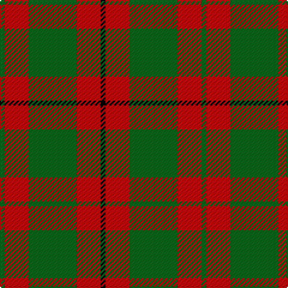

**Bands:** [GRGRK](/stripes/grgrk/) · **Stripes:** [G R G R K](/stripes/stripes5/) G R G R K

This was sourced from register-of-tartans.  It is a [5 band tartan](/bands/bands5/).

Original link https://www.tartanregister.gov.uk/tartanDetails.aspx?ref=3076

## Attestations

This cloth appears in 2 source records; the oldest owns this page.

- 01/01/1745 — Murray, Lord George (Hose) (register-of-tartans, [record](https://www.tartanregister.gov.uk/tartanDetails.aspx?ref=3076))
- 1745 — Murray, Lord George (Hose) (tartans-authority, [record](http://www.tartansauthority.com/tartan-ferret/display/5644/))

## Register references

External register numbers recorded for this tartan.

- Scottish Register of Tartans: [3076](https://www.tartanregister.gov.uk/tartanDetails.aspx?ref=3076)
- Scottish Tartans Authority (ITI): 5644

## Variants

Other setts woven to the same stripe pattern.

- [MacDonald, Lord of The Isles (Artef)](/setts/s5/g16r5g2r18k2~x2/)

## Thread count
G/4 R20 G40 R20 K/4

## Palette
Each colour and its ΔE from the base-6 reference it is a variant of.

| Colour | Shade | Base | ΔE (OKLab) |
|---|---|---|---|
| G | <code style="background-color:#006818;">#006818</code> `#006818` | G <code style="background-color:#006100;">#006100</code> | 0.02 |
| K | <code style="background-color:#000000;">#000000</code> `#000000` | K <code style="background-color:#000000;">#000000</code> | 0.00 |
| R | <code style="background-color:#C80000;">#C80000</code> `#C80000` | R <code style="background-color:#CC0000;">#CC0000</code> | 0.01 |

# Sample pattern

## Nearest tartans

The nearest existing variants by ΔTartan distance.

1. [MacDonald, Lord of The Isles (Artef)](/setts/s5/g16r5g2r18k2~x2/) — ΔT 0.78
1. [Lugo (2013)](/setts/s4/r10dg4lo1dg4~x8/) — ΔT 1.00
1. [MacKinnon 11](/setts/s4/r3g20r25w3~x4/) — ΔT 1.00
1. [MacDonald Lord of the Isles #2](/setts/s5/dg16r5dg2r18k2~x2/) — ΔT 1.01
1. [MacGregor of Balquhidder](/setts/s5/dg8r2dg9r16w1~x2/) — ΔT 1.02
1. [MacDonald of Glenaladale (symmetrical)](/setts/s6/g5w2r27g27r5w2~x2/) — ΔT 1.08
1. [Bryce](/setts/s4/ly1r9g7r1~x4/) — ΔT 1.09
1. [Prince of Orange](/setts/s4/t6do28lo20t3~x2/) — ΔT 1.09
1. [Unidentified #42](/setts/s7/ly1r3dg7r3dg7r3ly1~x4/) — ΔT 1.12
1. [MacDonald of Sleat](/setts/s5/dg7r3dg1r9k1~x2/) — ΔT 1.13

## Neighbour map

Every grey dot is one of 14313 variants placed by the first two principal components of the ΔTartan feature space (44% of its variance). Red is this tartan; blue dots are its nearest — click one to open its page.

<svg viewBox="0 0 640 380" role="img" style="max-width:100%;height:auto;border:1px solid #e0e0e0;border-radius:4px;display:block" xmlns="http://www.w3.org/2000/svg"><image href="/nn/cloud.v1.png" width="640" height="380"/><a href="/setts/s5/g16r5g2r18k2~x2/"><circle cx="352.7" cy="240.4" r="4" fill="#3465a4"><title>MacDonald, Lord of The Isles (Artef)</title></circle></a><a href="/setts/s4/r10dg4lo1dg4~x8/"><circle cx="349.8" cy="263.6" r="4" fill="#3465a4"><title>Lugo (2013)</title></circle></a><a href="/setts/s4/r3g20r25w3~x4/"><circle cx="340.0" cy="246.3" r="4" fill="#3465a4"><title>MacKinnon 11</title></circle></a><a href="/setts/s5/dg16r5dg2r18k2~x2/"><circle cx="343.4" cy="233.0" r="4" fill="#3465a4"><title>MacDonald Lord of the Isles #2</title></circle></a><a href="/setts/s5/dg8r2dg9r16w1~x2/"><circle cx="346.9" cy="217.3" r="4" fill="#3465a4"><title>MacGregor of Balquhidder</title></circle></a><a href="/setts/s6/g5w2r27g27r5w2~x2/"><circle cx="335.6" cy="199.3" r="4" fill="#3465a4"><title>MacDonald of Glenaladale (symmetrical)</title></circle></a><a href="/setts/s4/ly1r9g7r1~x4/"><circle cx="356.3" cy="246.0" r="4" fill="#3465a4"><title>Bryce</title></circle></a><a href="/setts/s4/t6do28lo20t3~x2/"><circle cx="283.1" cy="244.7" r="4" fill="#3465a4"><title>Prince of Orange</title></circle></a><a href="/setts/s7/ly1r3dg7r3dg7r3ly1~x4/"><circle cx="301.3" cy="244.2" r="4" fill="#3465a4"><title>Unidentified #42</title></circle></a><a href="/setts/s5/dg7r3dg1r9k1~x2/"><circle cx="354.9" cy="237.2" r="4" fill="#3465a4"><title>MacDonald of Sleat</title></circle></a><circle cx="324.2" cy="239.6" r="5" fill="#c00000"/></svg>

ID: /setts/s5/g1r5g10r5k1~x4/
