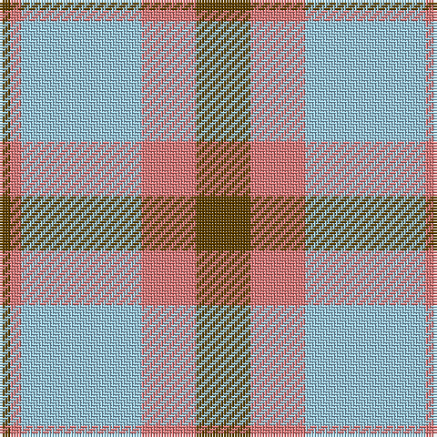

In pattern [GRWRG](/patterns/grwrg/).

This was sourced from tartans-authority.  It is a [5 stripes tartan](/stripes/stripes5/).

Original link http://www.tartansauthority.com/tartan-ferret/display/6398/

## Thread count
T/4 LR4 LB44 LR20 T/20

## Palette
Each colour and its ΔE from the base-6 reference it is a variant of.

| Colour | Shade | Base | ΔE (OKLab) |
|---|---|---|---|
| LB | <code style="background-color:#98C8E8;">#98C8E8</code> `#98C8E8` | W <code style="background-color:#F4F4F0;">#F4F4F0</code> | 0.17 |
| LR | <code style="background-color:#E87878;">#E87878</code> `#E87878` | R <code style="background-color:#C80000;">#C80000</code> | 0.19 |
| T | <code style="background-color:#604000;">#604000</code> `#604000` | G <code style="background-color:#006400;">#006400</code> | 0.14 |

# Sample pattern

ID: /setts/s5/g20r20w44r4g4-g604000-re87878-w98c8e8/
 `#98C8E8` | W <code style="background-color:#F4F4F0;">#F4F4F0</code> | 0.17 |
| LR | <code style="background-color:#E87878;">#E87878</code> `#E87878` | R <code style="background-color:#C80000;">#C80000</code> | 0.19 |
| LRa | <code style="background-color:#E08070;">#E08070</code> `#E08070` | Y <code style="background-color:#E8C000;">#E8C000</code> | 0.20 |
| T | <code style="background-color:#604000;">#604000</code> `#604000` | G <code style="background-color:#006400;">#006400</code> | 0.14 |

# Sample pattern

ID: /setts/s5/g20r20w44r4g4-g604000-re87878-w98c8e8/
