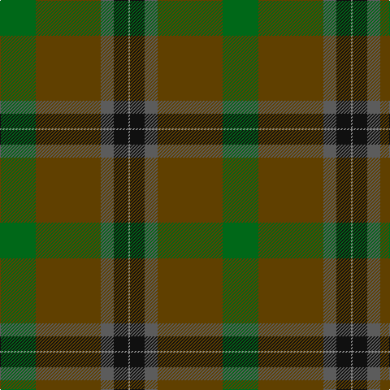

In pattern [GGBKR](/patterns/ggbkr/).

This was sourced from tartans-authority.  It is a [5 stripes tartan](/stripes/stripes5/).

Original link http://www.tartansauthority.com/tartan-ferret/display/8508/

## Thread count
G/44 T80 N16 K18 Na/2

## Palette
Each colour and its ΔE from the base-6 reference it is a variant of.

| Colour | Shade | Base | ΔE (OKLab) |
|---|---|---|---|
| G | <code style="background-color:#006818;">#006818</code> `#006818` | G <code style="background-color:#006100;">#006100</code> | 0.02 |
| K | <code style="background-color:#101010;">#101010</code> `#101010` | K <code style="background-color:#000000;">#000000</code> | 0.17 |
| N | <code style="background-color:#5C5C5C;">#5C5C5C</code> `#5C5C5C` | B <code style="background-color:#2A418A;">#2A418A</code> | 0.15 |
| Na | <code style="background-color:#888888;">#888888</code> `#888888` | R <code style="background-color:#CC0000;">#CC0000</code> | 0.24 |
| T | <code style="background-color:#604000;">#604000</code> `#604000` | G <code style="background-color:#006100;">#006100</code> | 0.14 |

# Sample pattern

## Nearest tartans

The nearest existing variants by ΔTartan distance.

1. [Nolan (Personal)](/setts/s5/b8g19ga42y3r1~b480800-g006818-ga003820-ra00000-ybc8c00~x2/) — ΔT 1.55
1. [Ramsay (Green Fashion)](/setts/s7/g1r7g7b2r1ga15w1~b5c5c5c-g006818-ga285800-r880000-wc0c0c0~x4/) — ΔT 1.91
1. [Yorkland (Personal)](/setts/s8/b36r2b4w1g14ga4y2ga18~b2c6074-g805400-ga006818-rc80000-we0e0e0-ye8c000~x2/) — ΔT 1.94
1. [Waterford, County](/setts/s6/g42y2ga16b7ba16r5~b202060-ba441800-g003820-ga5c6428-rc80000-yd09800~x2/) — ΔT 1.98
1. [Exabyte](/setts/s5/r3b34ba4g47w3~b5c5c5c-ba1c0070-g006818-r880000-wc0c0c0~x2/) — ΔT 2.02
1. [Willsher Wedding (Personal)](/setts/s9/b8r4w2r4b1r12g9b24ra4~b5c5c5c-g006818-r888888-ra880000-we8ccb8~x2/) — ΔT 2.08
1. [Highland Greenford (Personal)](/setts/s4/g50ga25y2b6~b440044-g5c6428-ga604000-yc4bc68~x2/) — ΔT 2.09
1. [Symington](/setts/s5/y5g33ga33r6w2~g5c6428-ga004c10-rc80000-we0e0e0-ybc8c00~x2/) — ΔT 2.09
1. [Stansbury (2014)](/setts/s8/g28r3k28b8ba1g8r2k3~b003c64-ba2888c4-g003820-k101010-rc80000~x2/) — ΔT 2.14
1. [Grenauld](/setts/s10/g36k52y2k8g8ga8y2ga6g36r1~g003820-ga603800-k101010-r880000-yd09800~x2/) — ΔT 2.15

## Neighbour map

Every grey dot is one of 15726 variants placed by the first two principal components of the ΔTartan feature space (44% of its variance). Red is this tartan; blue dots are its nearest — click one to open its page.

<svg viewBox="0 0 640 380" role="img" style="max-width:100%;height:auto;border:1px solid #e0e0e0;border-radius:4px;display:block" xmlns="http://www.w3.org/2000/svg"><image href="/nn/cloud.v1.png" width="640" height="380"/><a href="/setts/s5/b8g19ga42y3r1~b480800-g006818-ga003820-ra00000-ybc8c00~x2/"><circle cx="438.2" cy="186.0" r="4" fill="#3465a4"><title>Nolan (Personal)</title></circle></a><a href="/setts/s7/g1r7g7b2r1ga15w1~b5c5c5c-g006818-ga285800-r880000-wc0c0c0~x4/"><circle cx="313.0" cy="199.5" r="4" fill="#3465a4"><title>Ramsay (Green Fashion)</title></circle></a><a href="/setts/s8/b36r2b4w1g14ga4y2ga18~b2c6074-g805400-ga006818-rc80000-we0e0e0-ye8c000~x2/"><circle cx="362.8" cy="141.1" r="4" fill="#3465a4"><title>Yorkland (Personal)</title></circle></a><a href="/setts/s6/g42y2ga16b7ba16r5~b202060-ba441800-g003820-ga5c6428-rc80000-yd09800~x2/"><circle cx="300.7" cy="180.7" r="4" fill="#3465a4"><title>Waterford, County</title></circle></a><a href="/setts/s5/r3b34ba4g47w3~b5c5c5c-ba1c0070-g006818-r880000-wc0c0c0~x2/"><circle cx="379.1" cy="215.2" r="4" fill="#3465a4"><title>Exabyte</title></circle></a><a href="/setts/s9/b8r4w2r4b1r12g9b24ra4~b5c5c5c-g006818-r888888-ra880000-we8ccb8~x2/"><circle cx="348.6" cy="177.3" r="4" fill="#3465a4"><title>Willsher Wedding (Personal)</title></circle></a><a href="/setts/s4/g50ga25y2b6~b440044-g5c6428-ga604000-yc4bc68~x2/"><circle cx="506.1" cy="248.8" r="4" fill="#3465a4"><title>Highland Greenford (Personal)</title></circle></a><a href="/setts/s5/y5g33ga33r6w2~g5c6428-ga004c10-rc80000-we0e0e0-ybc8c00~x2/"><circle cx="304.4" cy="210.1" r="4" fill="#3465a4"><title>Symington</title></circle></a><a href="/setts/s8/g28r3k28b8ba1g8r2k3~b003c64-ba2888c4-g003820-k101010-rc80000~x2/"><circle cx="356.8" cy="178.0" r="4" fill="#3465a4"><title>Stansbury (2014)</title></circle></a><a href="/setts/s10/g36k52y2k8g8ga8y2ga6g36r1~g003820-ga603800-k101010-r880000-yd09800~x2/"><circle cx="430.7" cy="155.9" r="4" fill="#3465a4"><title>Grenauld</title></circle></a><circle cx="397.2" cy="198.8" r="5" fill="#c00000"/></svg>

ID: /setts/s5/g22ga40b8k9r1~b5c5c5c-g006818-ga604000-k101010-r888888~x2/
