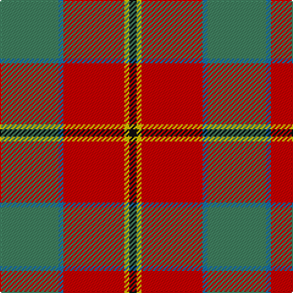

In pattern [GBRYK](/stripes/gbryk/).

This was sourced from register-of-tartans.  It is a [5 stripe tartan](/stripes/stripes5/).

Original link https://www.tartanregister.gov.uk/tartanDetails.aspx?ref=379

## Attestations

This cloth appears in 2 source records; the oldest owns this page.

- 01/01/2005 — Bronte (register-of-tartans, [record](https://www.tartanregister.gov.uk/tartanDetails.aspx?ref=379))
- pre 2005 — Bronte (Name) (tartans-authority, [record](http://www.tartansauthority.com/tartan-ferret/display/6614/))

## Register references

External register numbers recorded for this tartan.

- Scottish Register of Tartans: [379](https://www.tartanregister.gov.uk/tartanDetails.aspx?ref=379)
- Scottish Tartans Authority (ITI): 6614

## Thread count
G/48 B4 R50 Y4 K/6

## Palette
Each colour and its ΔE from the base-6 reference it is a variant of.

| Colour | Shade | Base | ΔE (OKLab) |
|---|---|---|---|
| B | <code style="background-color:#1870A4;">#1870A4</code> `#1870A4` | B <code style="background-color:#2A418A;">#2A418A</code> | 0.13 |
| G | <code style="background-color:#408060;">#408060</code> `#408060` | G <code style="background-color:#006100;">#006100</code> | 0.14 |
| K | <code style="background-color:#101010;">#101010</code> `#101010` | K <code style="background-color:#000000;">#000000</code> | 0.17 |
| R | <code style="background-color:#C80000;">#C80000</code> `#C80000` | R <code style="background-color:#CC0000;">#CC0000</code> | 0.01 |
| Y | <code style="background-color:#E8C000;">#E8C000</code> `#E8C000` | Y <code style="background-color:#F2BF00;">#F2BF00</code> | 0.02 |

# Sample pattern

## Nearest tartans

The nearest existing variants by ΔTartan distance.

1. [Eglinton, Duke of (Artefact)](/setts/s5/r15w1db4ly1g15~x4/) — ΔT 0.85
1. [Turnbull Dress](/setts/s5/k2db1g10r10ly1~x6/) — ΔT 1.02
1. [Prince of Orange #2](/setts/s5/db6lo25dy16k2db3~x2/) — ΔT 1.12
1. [Spragg, Andrew](/setts/s7/r2dg16r1r2r12ly1y1~x2/) — ΔT 1.14
1. [Cetoloni (Personal)](/setts/s6/db1r12g6ly1g6db1~x4/) — ΔT 1.15
1. [Leckie (Personal)](/setts/s7/r3db1r12o3dg12lb1dg2~x4/) — ΔT 1.18
1. [Afternoon Tea / Milk Tea](/setts/s6/w15lo98do72r25do8lg15/) — ΔT 1.18
1. [Spragg (Name)](/setts/s7/r2g16r1r2r12ly1t1~x2/) — ΔT 1.20
1. [Hutcheson (Name)](/setts/s6/dt8y4r30g30lo3g4~x2/) — ΔT 1.22
1. [Duminiak (Trevose, Pennsylvania)](/setts/s6/y47w6r24w3dp5lo3~x2/) — ΔT 1.24

## Neighbour map

Every grey dot is one of 14299 variants placed by the first two principal components of the ΔTartan feature space (44% of its variance). Red is this tartan; blue dots are its nearest — click one to open its page.

<svg viewBox="0 0 640 380" role="img" style="max-width:100%;height:auto;border:1px solid #e0e0e0;border-radius:4px;display:block" xmlns="http://www.w3.org/2000/svg"><image href="/nn/cloud.v1.png" width="640" height="380"/><a href="/setts/s5/r15w1db4ly1g15~x4/"><circle cx="250.4" cy="177.2" r="4" fill="#3465a4"><title>Eglinton, Duke of (Artefact)</title></circle></a><a href="/setts/s5/k2db1g10r10ly1~x6/"><circle cx="235.9" cy="194.0" r="4" fill="#3465a4"><title>Turnbull Dress</title></circle></a><a href="/setts/s5/db6lo25dy16k2db3~x2/"><circle cx="277.3" cy="200.3" r="4" fill="#3465a4"><title>Prince of Orange #2</title></circle></a><a href="/setts/s7/r2dg16r1r2r12ly1y1~x2/"><circle cx="302.5" cy="154.1" r="4" fill="#3465a4"><title>Spragg, Andrew</title></circle></a><a href="/setts/s6/db1r12g6ly1g6db1~x4/"><circle cx="288.3" cy="197.8" r="4" fill="#3465a4"><title>Cetoloni (Personal)</title></circle></a><a href="/setts/s7/r3db1r12o3dg12lb1dg2~x4/"><circle cx="275.0" cy="180.8" r="4" fill="#3465a4"><title>Leckie (Personal)</title></circle></a><a href="/setts/s6/w15lo98do72r25do8lg15/"><circle cx="227.8" cy="181.5" r="4" fill="#3465a4"><title>Afternoon Tea / Milk Tea</title></circle></a><a href="/setts/s7/r2g16r1r2r12ly1t1~x2/"><circle cx="299.2" cy="152.4" r="4" fill="#3465a4"><title>Spragg (Name)</title></circle></a><a href="/setts/s6/dt8y4r30g30lo3g4~x2/"><circle cx="256.0" cy="199.9" r="4" fill="#3465a4"><title>Hutcheson (Name)</title></circle></a><a href="/setts/s6/y47w6r24w3dp5lo3~x2/"><circle cx="335.4" cy="166.8" r="4" fill="#3465a4"><title>Duminiak (Trevose, Pennsylvania)</title></circle></a><circle cx="284.0" cy="182.7" r="5" fill="#c00000"/></svg>

ID: /setts/s5/g24b2r25ly2k3~x2/
