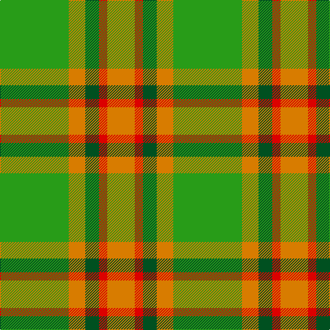

In pattern [GYGRY](/patterns/gygry/).

This was sourced from register-of-tartans.  It is a [5 stripes tartan](/stripes/stripes5/).

Original link https://www.tartanregister.gov.uk/tartanDetails.aspx?ref=11462

## Thread count
G/100 O24 Ga20 R12 O/40

## Palette
Each colour and its ΔE from the base-6 reference it is a variant of.

| Colour | Shade | Base | ΔE (OKLab) |
|---|---|---|---|
| G | <code style="background-color:#289C18;">#289C18</code> `#289C18` | G <code style="background-color:#006100;">#006100</code> | 0.19 |
| Ga | <code style="background-color:#005020;">#005020</code> `#005020` | G <code style="background-color:#006100;">#006100</code> | 0.07 |
| O | <code style="background-color:#D87C00;">#D87C00</code> `#D87C00` | Y <code style="background-color:#F2BF00;">#F2BF00</code> | 0.17 |
| R | <code style="background-color:#DC0000;">#DC0000</code> `#DC0000` | R <code style="background-color:#CC0000;">#CC0000</code> | 0.03 |

# Sample pattern

## Nearest tartans

The nearest existing variants by ΔTartan distance.

1. [MacKinnon, hunting](/setts/s4/r1g8ra8w1x2~g008000-rc00000-ra806050-we0e0e0/) — ΔT 1.45
1. [North Dakota State University (Corp.](/setts/s6/y11g5y10ga4g26y4x2~g006818-ga289c18-ybc8c00/) — ΔT 1.47
1. [Wilson's, No 179](/setts/s5/g6y1r1b2r2x4~b5480b0-g008000-rc00000-yf0c000/) — ΔT 1.48
1. [Forget Family (Personal)](/setts/s6/g8y1g8y12r1y1x4~g006818-rc8002c-ybc8c00/) — ΔT 1.50
1. [Newfoundland](/setts/s7/r4g3ra8w3ra4g18y3x2~g008000-rc00000-ra806050-we0e0e0-yf0c000/) — ΔT 1.60
1. [MacKinnon Hunting (Var) Clan Tartan Tartan Number: 1542. Earliest known date: pre 2003 Two times actual count given in letter from MacKinnon of MacKinnon 1908 as 'the Composition of the MacKinnon tartan...' See products available Copyright © Blair Urquhart, Comrie, 2015](/setts/s4/r1g8ga8w1x2~g006818-ga604000-rc80000-we0e0e0/) — ΔT 1.82
1. [O'Neill Pipe Band 1983 (Corporate)](/setts/s7/r1g1r5g8y1g1y1x4~g006818-rb84c00-y48a4c0/) — ΔT 1.87
1. [Dohmen Family (Zuid-Nederland)](/setts/s4/g30y3b8r25x2~b5f749c-g649848-ra32d18-ye0a126/) — ΔT 1.89
1. [Clare, Richard (Personal)](/setts/s5/b5y5g13ga41r3x2~b003c64-g604000-ga289c18-rc8002c-ybc8c00/) — ΔT 1.89
1. [Invertere (Daks #2) (Fashion)](/setts/s8/y5g14ga4b4ga27g3ga4y5x2~b2c2c80-g289c18-ga604000-ye8c000/) — ΔT 1.92

## Neighbour map

Every grey dot is one of 15726 variants placed by the first two principal components of the ΔTartan feature space (44% of its variance). Red is this tartan; blue dots are its nearest — click one to open its page.

<svg viewBox="0 0 640 380" role="img" style="max-width:100%;height:auto;border:1px solid #e0e0e0;border-radius:4px;display:block" xmlns="http://www.w3.org/2000/svg"><image href="/nn/cloud.v1.png" width="640" height="380"/><a href="/setts/s4/r1g8ra8w1x2~g008000-rc00000-ra806050-we0e0e0/"><circle cx="300.5" cy="262.5" r="4" fill="#3465a4"><title>MacKinnon, hunting</title></circle></a><a href="/setts/s6/y11g5y10ga4g26y4x2~g006818-ga289c18-ybc8c00/"><circle cx="344.7" cy="274.6" r="4" fill="#3465a4"><title>North Dakota State University (Corp.</title></circle></a><a href="/setts/s5/g6y1r1b2r2x4~b5480b0-g008000-rc00000-yf0c000/"><circle cx="243.6" cy="242.5" r="4" fill="#3465a4"><title>Wilson's, No 179</title></circle></a><a href="/setts/s6/g8y1g8y12r1y1x4~g006818-rc8002c-ybc8c00/"><circle cx="374.3" cy="240.7" r="4" fill="#3465a4"><title>Forget Family (Personal)</title></circle></a><a href="/setts/s7/r4g3ra8w3ra4g18y3x2~g008000-rc00000-ra806050-we0e0e0-yf0c000/"><circle cx="223.3" cy="211.2" r="4" fill="#3465a4"><title>Newfoundland</title></circle></a><a href="/setts/s4/r1g8ga8w1x2~g006818-ga604000-rc80000-we0e0e0/"><circle cx="304.3" cy="267.2" r="4" fill="#3465a4"><title>MacKinnon Hunting (Var) Clan Tartan Tartan Number: 1542. Earliest known date: pre 2003 Two times actual count given in letter from MacKinnon of MacKinnon 1908 as 'the Composition of the MacKinnon tartan...' See products available Copyright © Blair Urquhart, Comrie, 2015</title></circle></a><a href="/setts/s7/r1g1r5g8y1g1y1x4~g006818-rb84c00-y48a4c0/"><circle cx="367.8" cy="236.0" r="4" fill="#3465a4"><title>O'Neill Pipe Band 1983 (Corporate)</title></circle></a><a href="/setts/s4/g30y3b8r25x2~b5f749c-g649848-ra32d18-ye0a126/"><circle cx="294.4" cy="254.3" r="4" fill="#3465a4"><title>Dohmen Family (Zuid-Nederland)</title></circle></a><a href="/setts/s5/b5y5g13ga41r3x2~b003c64-g604000-ga289c18-rc8002c-ybc8c00/"><circle cx="358.5" cy="193.4" r="4" fill="#3465a4"><title>Clare, Richard (Personal)</title></circle></a><a href="/setts/s8/y5g14ga4b4ga27g3ga4y5x2~b2c2c80-g289c18-ga604000-ye8c000/"><circle cx="276.8" cy="194.3" r="4" fill="#3465a4"><title>Invertere (Daks #2) (Fashion)</title></circle></a><circle cx="298.1" cy="238.5" r="5" fill="#c00000"/></svg>

ID: /setts/s5/g25y6ga5r3y10x4~g289c18-ga005020-rdc0000-yd87c00/
