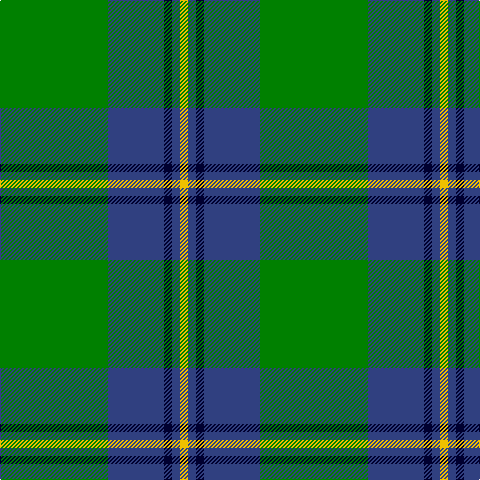

In pattern [GBKBY](/stripes/gbkby/).

This was sourced from weddslist.  It is a [5 stripe tartan](/stripes/stripes5/).

Original link http://www.weddslist.com/cgi-bin/tartans/pg.pl?source=sts

## Also known as

This cloth is also recorded under:

- Irving of Bonshaw Clan/Family

## Thread count
G/108 B56 DB8 B8 Y/8

## Palette
Each colour and the base-6 reference it is a variant of.

| Colour | Shade | Base |
|---|---|---|
| B | <code style="background-color:#304080;">#304080</code> `oklch(39.4% 0.109 270.2)` <small>#304080</small> | B <code style="background-color:#2A418A;">#2A418A</code> |
| DB | <code style="background-color:#000030;">#000030</code> `oklch(14.0% 0.097 264.1)` <small>#000030</small> | K <code style="background-color:#000000;">#000000</code> |
| G | <code style="background-color:#008000;">#008000</code> `oklch(52.0% 0.177 142.5)` <small>#008000</small> | G <code style="background-color:#006100;">#006100</code> |
| Y | <code style="background-color:#F0C000;">#F0C000</code> `oklch(82.7% 0.169 90.5)` <small>#F0C000</small> | Y <code style="background-color:#F2BF00;">#F2BF00</code> |

# Sample pattern

## Nearest tartans

The nearest existing variants by ΔTartan distance, with this tartan at the top so the swatches line up against it.

ΔTartan

Tartan

Sett

—

<a href="/ttd/edit/#slug=g27db14k2db2ly2~x4">Irving of Bonshaw</a> <a class="nn-out" href="/setts/s5/g27db14k2db2ly2~x4/" title="open its dictionary page">↗</a>

0.49

<a href="/ttd/edit/#slug=g47r3g6db35ly3~x2">Gracie</a> <a class="nn-out" href="/setts/s5/g47r3g6db35ly3~x2/" title="open its dictionary page">↗</a>

0.59

<a href="/ttd/edit/#slug=g18db9k1db1w1~x4">Irvine</a> <a class="nn-out" href="/setts/s5/g18db9k1db1w1~x4/" title="open its dictionary page">↗</a>

0.92

<a href="/ttd/edit/#slug=t1db4g10ly1~x2">Wilson's No.174</a> <a class="nn-out" href="/setts/s4/t1db4g10ly1~x2/" title="open its dictionary page">↗</a>

0.98

<a href="/ttd/edit/#slug=t1db4g10w1~x2">Wilson's, No 205</a> <a class="nn-out" href="/setts/s4/t1db4g10w1~x2/" title="open its dictionary page">↗</a>

1.08

<a href="/ttd/edit/#slug=k5g40db20ly3~x2">Robert Byers Family - Dooballagh, Ireland</a> <a class="nn-out" href="/setts/s4/k5g40db20ly3~x2/" title="open its dictionary page">↗</a>

1.19

<a href="/ttd/edit/#slug=g24k2db3k2db8r2~x2">Shaw (Clan 1)</a> <a class="nn-out" href="/setts/s6/g24k2db3k2db8r2~x2/" title="open its dictionary page">↗</a>

1.20

<a href="/ttd/edit/#slug=g99db20w8db30ly8db10ly8g46">Duke of York Hunting</a> <a class="nn-out" href="/setts/s8/g99db20w8db30ly8db10ly8g46/" title="open its dictionary page">↗</a>

1.24

<a href="/ttd/edit/#slug=g50db20k3db2o2db5~x2">St Andrews Hotel, Golf Resort, and SPA</a> <a class="nn-out" href="/setts/s6/g50db20k3db2o2db5~x2/" title="open its dictionary page">↗</a>

1.25

<a href="/ttd/edit/#slug=g47r3g6db35lo3~x2">Gracie (Name)</a> <a class="nn-out" href="/setts/s5/g47r3g6db35lo3~x2/" title="open its dictionary page">↗</a>

1.27

<a href="/ttd/edit/#slug=g12lo1db8k1db1~x4">Rowan (Personal)</a> <a class="nn-out" href="/setts/s5/g12lo1db8k1db1~x4/" title="open its dictionary page">↗</a>

## Neighbour map

Every grey dot is one of 14299 variants placed by the first two principal components of the ΔTartan feature space (44% of its variance). Red is this tartan; blue dots are its nearest — click one to open its page.

<svg viewBox="0 0 640 380" role="img" style="max-width:100%;height:auto;border:1px solid #e0e0e0;border-radius:4px;display:block" xmlns="http://www.w3.org/2000/svg"><image href="/nn/cloud.v1.png" width="640" height="380"/><a href="/setts/s5/g47r3g6db35ly3~x2/"><circle cx="364.4" cy="212.4" r="4" fill="#3465a4"><title>Gracie</title></circle></a><a href="/setts/s5/g18db9k1db1w1~x4/"><circle cx="379.9" cy="193.3" r="4" fill="#3465a4"><title>Irvine</title></circle></a><a href="/setts/s4/t1db4g10ly1~x2/"><circle cx="362.6" cy="241.7" r="4" fill="#3465a4"><title>Wilson's No.174</title></circle></a><a href="/setts/s4/t1db4g10w1~x2/"><circle cx="360.2" cy="240.0" r="4" fill="#3465a4"><title>Wilson's, No 205</title></circle></a><a href="/setts/s4/k5g40db20ly3~x2/"><circle cx="353.5" cy="237.3" r="4" fill="#3465a4"><title>Robert Byers Family - Dooballagh, Ireland</title></circle></a><a href="/setts/s6/g24k2db3k2db8r2~x2/"><circle cx="369.8" cy="208.6" r="4" fill="#3465a4"><title>Shaw (Clan 1)</title></circle></a><a href="/setts/s8/g99db20w8db30ly8db10ly8g46/"><circle cx="357.0" cy="188.3" r="4" fill="#3465a4"><title>Duke of York Hunting</title></circle></a><a href="/setts/s6/g50db20k3db2o2db5~x2/"><circle cx="416.7" cy="173.4" r="4" fill="#3465a4"><title>St Andrews Hotel, Golf Resort, and SPA</title></circle></a><a href="/setts/s5/g47r3g6db35lo3~x2/"><circle cx="356.9" cy="210.4" r="4" fill="#3465a4"><title>Gracie (Name)</title></circle></a><a href="/setts/s5/g12lo1db8k1db1~x4/"><circle cx="340.2" cy="226.0" r="4" fill="#3465a4"><title>Rowan (Personal)</title></circle></a><circle cx="353.5" cy="209.1" r="5" fill="#c00000"/></svg>

ID: /setts/s5/g27db14k2db2ly2~x4/
