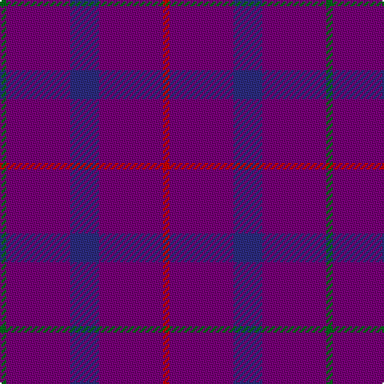

In pattern [GBBBR](/patterns/gbbbr/).

This was sourced from tartans-authority.  It is a [5 stripes tartan](/stripes/stripes5/).

Original link http://www.tartansauthority.com/tartan-ferret/display/689/

## Attestations

This cloth appears in 2 source records; the oldest owns this page.

- 1987 — Scottish Netball (1987) (Corporate) (tartans-authority, [record](http://www.tartansauthority.com/tartan-ferret/display/689/))
- undated — Scottish Netball Association Corporate Tartan Tartan Number: 689. Earliest known date: 1987 Designed for the World Netball Championship held in 1987. See products available Copyright © Blair Urquhart, Comrie, 2015 (house-of-tartan, [record](http://www.house-of-tartan.scotland.net/house/TartanViewjs.asp?colr=Def&tnam=689))

## Thread count
G/4 P40 DB18 P40 R/4

## Palette
Each colour and its ΔE from the base-6 reference it is a variant of.

| Colour | Shade | Base | ΔE (OKLab) |
|---|---|---|---|
| DB | <code style="background-color:#2C2C80;">#2C2C80</code> `#2C2C80` | B <code style="background-color:#2A418A;">#2A418A</code> | 0.06 |
| G | <code style="background-color:#006818;">#006818</code> `#006818` | G <code style="background-color:#006100;">#006100</code> | 0.02 |
| P | <code style="background-color:#780078;">#780078</code> `#780078` | B <code style="background-color:#2A418A;">#2A418A</code> | 0.17 |
| R | <code style="background-color:#C80000;">#C80000</code> `#C80000` | R <code style="background-color:#CC0000;">#CC0000</code> | 0.01 |

# Sample pattern

## Nearest tartans

The nearest existing variants by ΔTartan distance.

1. [Scottish Netball Association](/setts/s5/g2b20ba9b20r2~b800080-ba304080-g008000-rc00000~x2/) — ΔT 0.48
1. [Scottish Netball Association (1987)](/setts/s8/b20ba9b20r2b20ba9b20g2~b780078-ba2c2c80-g006818-rc80000~x2/) — ΔT 1.60
1. [Meanwood McMain (Personal)](/setts/s9/b30ba10r5ba10b30ba3bb5ba3b30~b440044-ba2c2c80-bb780078-rb468ac~x2/) — ΔT 2.00
1. [Highland Spring Corporate Tartan Tartan Number: 130. Earliest known date: 1987 Highland Spring manufacture bottled drinking water at Blackford in Perthshire, Scotland. See products available Copyright © Blair Urquhart, Comrie, 2015](/setts/s4/b5g2b19r5~b780078-g006818-rc80000~x2/) — ΔT 2.16
1. [Elliot](/setts/s4/b16r4b3ra1~b304080-r802040-rac00000~x2/) — ΔT 2.58
1. [Elliot (Clan)](/setts/s4/b44g12b9r3~b2c2c80-g604000-r901c38~x2/) — ΔT 2.63
1. [Elliot](/setts/s6/b9g12b44g12b9r3~b2c2c80-g604000-r901c38~x2/) — ΔT 2.69
1. [Highland Spring](/setts/s4/b5g3b19r5~b800080-g008000-rc00000~x2/) — ΔT 2.69
1. [Feniston (Personal)](/setts/s5/b30ba10b3ba30r3~b680028-ba202060-rec34c4~x2/) — ΔT 2.92
1. [Elliot Clan Tartan Tartan Number: 596. Earliest known date: pre 1906 The Elliot tartan was first recorded by H. Whyte in his book, 'The Tartans of the Clans and Septs of Scotland' (1906), along with many others in use at the time. The colouring is unique among traditional tartans, being described as maroon and blue. The Elliots are a 'Border Clan', founders of the Minto family. The Chiefship once belonged to to the Elliots of Redheugh but passed to the Elliots of Stobs near Hawick in Roxburghshire. The present Chief is Mrs Margaret Elliot of that Ilk. See products available Copyright © Blair Urquhart, Comrie, 2015](/setts/s4/b16ba4b3r1~b202050-ba481410-rc50000~x6/) — ΔT 2.92

## Neighbour map

Every grey dot is one of 15726 variants placed by the first two principal components of the ΔTartan feature space (44% of its variance). Red is this tartan; blue dots are its nearest — click one to open its page.

<svg viewBox="0 0 640 380" role="img" style="max-width:100%;height:auto;border:1px solid #e0e0e0;border-radius:4px;display:block" xmlns="http://www.w3.org/2000/svg"><image href="/nn/cloud.v1.png" width="640" height="380"/><a href="/setts/s5/g2b20ba9b20r2~b800080-ba304080-g008000-rc00000~x2/"><circle cx="544.6" cy="268.1" r="4" fill="#3465a4"><title>Scottish Netball Association</title></circle></a><a href="/setts/s8/b20ba9b20r2b20ba9b20g2~b780078-ba2c2c80-g006818-rc80000~x2/"><circle cx="586.9" cy="284.5" r="4" fill="#3465a4"><title>Scottish Netball Association (1987)</title></circle></a><a href="/setts/s9/b30ba10r5ba10b30ba3bb5ba3b30~b440044-ba2c2c80-bb780078-rb468ac~x2/"><circle cx="539.9" cy="260.3" r="4" fill="#3465a4"><title>Meanwood McMain (Personal)</title></circle></a><a href="/setts/s4/b5g2b19r5~b780078-g006818-rc80000~x2/"><circle cx="563.0" cy="272.9" r="4" fill="#3465a4"><title>Highland Spring Corporate Tartan Tartan Number: 130. Earliest known date: 1987 Highland Spring manufacture bottled drinking water at Blackford in Perthshire, Scotland. See products available Copyright © Blair Urquhart, Comrie, 2015</title></circle></a><a href="/setts/s4/b16r4b3ra1~b304080-r802040-rac00000~x2/"><circle cx="626.0" cy="283.2" r="4" fill="#3465a4"><title>Elliot</title></circle></a><a href="/setts/s4/b44g12b9r3~b2c2c80-g604000-r901c38~x2/"><circle cx="611.3" cy="284.0" r="4" fill="#3465a4"><title>Elliot (Clan)</title></circle></a><a href="/setts/s6/b9g12b44g12b9r3~b2c2c80-g604000-r901c38~x2/"><circle cx="531.4" cy="260.3" r="4" fill="#3465a4"><title>Elliot</title></circle></a><a href="/setts/s4/b5g3b19r5~b800080-g008000-rc00000~x2/"><circle cx="502.4" cy="281.9" r="4" fill="#3465a4"><title>Highland Spring</title></circle></a><a href="/setts/s5/b30ba10b3ba30r3~b680028-ba202060-rec34c4~x2/"><circle cx="424.4" cy="277.7" r="4" fill="#3465a4"><title>Feniston (Personal)</title></circle></a><a href="/setts/s4/b16ba4b3r1~b202050-ba481410-rc50000~x6/"><circle cx="626.0" cy="295.1" r="4" fill="#3465a4"><title>Elliot Clan Tartan Tartan Number: 596. Earliest known date: pre 1906 The Elliot tartan was first recorded by H. Whyte in his book, 'The Tartans of the Clans and Septs of Scotland' (1906), along with many others in use at the time. The colouring is unique among traditional tartans, being described as maroon and blue. The Elliots are a 'Border Clan', founders of the Minto family. The Chiefship once belonged to to the Elliots of Redheugh but passed to the Elliots of Stobs near Hawick in Roxburghshire. The present Chief is Mrs Margaret Elliot of that Ilk. See products available Copyright © Blair Urquhart, Comrie, 2015</title></circle></a><circle cx="557.0" cy="274.7" r="5" fill="#c00000"/></svg>

ID: /setts/s5/g2b20ba9b20r2~b780078-ba2c2c80-g006818-rc80000~x2/
