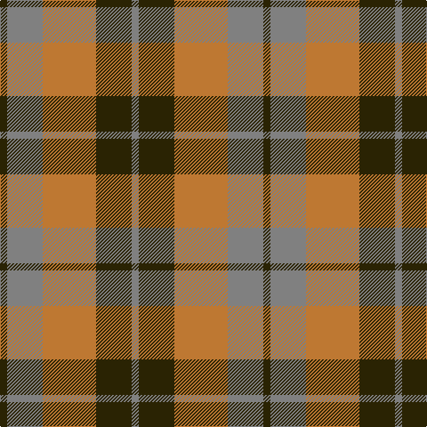

In pattern [GGRGG](/patterns/ggrgg/).

This was sourced from register-of-tartans.  It is a [5 stripes tartan](/stripes/stripes5/).

Original link https://www.tartanregister.gov.uk/tartanDetails.aspx?ref=1612

## Thread count
K/8 N40 DO60 K40 N/8

## Palette
Each colour and its ΔE from the base-6 reference it is a variant of.

| Colour | Shade | Base | ΔE (OKLab) |
|---|---|---|---|
| DO | <code style="background-color:#BE7832;">#BE7832</code> `#BE7832` | R <code style="background-color:#CC0000;">#CC0000</code> | 0.17 |
| K | <code style="background-color:#2A2303;">#2A2303</code> `#2A2303` | G <code style="background-color:#006100;">#006100</code> | 0.21 |
| N | <code style="background-color:#808080;">#808080</code> `#808080` | G <code style="background-color:#006100;">#006100</code> | 0.23 |

# Sample pattern

## Nearest tartans

The nearest existing variants by ΔTartan distance.

1. [Harmony 8](/setts/s5/b2g10r15b10g2x4~b401000-g808080-r906030/) — ΔT 1.04
1. [Harmony, 6](/setts/s5/b2g10r15b10g2x4~b800070-g008000-r806050/) — ΔT 1.12
1. [Logan, or Skene](/setts/s7/b9r3b1r3g9r3b1x2~b304080-g008000-rc00000/) — ΔT 1.19
1. [MacNab, Variant](/setts/s6/g1r1g7r4ra7r1x4~g008000-r900030-rac00000/) — ΔT 1.22
1. [MacFadyen, MacBean (Old)](/setts/s7/b3r25b17r5g22r9b3x2~b304080-g008000-rc00000/) — ΔT 1.24
1. [MacNab 1](/setts/s6/b3r19b18g19b3g3x2~b500060-g008000-rc00000/) — ΔT 1.31
1. [Dohmen (Personal)](/setts/s4/g30y3b8r25x2~b2c2c80-g006818-ra00000-yfccc00/) — ΔT 1.35
1. [Dunoon Irish (Corporate)](/setts/s4/w2g13r13w2x6~g006c3c-rb84c00-wfcfcfc/) — ΔT 1.36
1. [Glasgow](/setts/s7/g25r4b24r21g25r3b4x2~b304080-g008000-rd03030/) — ΔT 1.37
1. [Glen Esk (1993)](/setts/s7/g2r1g8r5ga5r1ga2x4~g005020-ga5c6428-rdc0000/) — ΔT 1.39

## Neighbour map

Every grey dot is one of 15726 variants placed by the first two principal components of the ΔTartan feature space (44% of its variance). Red is this tartan; blue dots are its nearest — click one to open its page.

<svg viewBox="0 0 640 380" role="img" style="max-width:100%;height:auto;border:1px solid #e0e0e0;border-radius:4px;display:block" xmlns="http://www.w3.org/2000/svg"><image href="/nn/cloud.v1.png" width="640" height="380"/><a href="/setts/s5/b2g10r15b10g2x4~b401000-g808080-r906030/"><circle cx="256.1" cy="273.1" r="4" fill="#3465a4"><title>Harmony 8</title></circle></a><a href="/setts/s5/b2g10r15b10g2x4~b800070-g008000-r806050/"><circle cx="252.5" cy="273.6" r="4" fill="#3465a4"><title>Harmony, 6</title></circle></a><a href="/setts/s7/b9r3b1r3g9r3b1x2~b304080-g008000-rc00000/"><circle cx="233.8" cy="231.5" r="4" fill="#3465a4"><title>Logan, or Skene</title></circle></a><a href="/setts/s6/g1r1g7r4ra7r1x4~g008000-r900030-rac00000/"><circle cx="251.4" cy="246.8" r="4" fill="#3465a4"><title>MacNab, Variant</title></circle></a><a href="/setts/s7/b3r25b17r5g22r9b3x2~b304080-g008000-rc00000/"><circle cx="267.4" cy="235.9" r="4" fill="#3465a4"><title>MacFadyen, MacBean (Old)</title></circle></a><a href="/setts/s6/b3r19b18g19b3g3x2~b500060-g008000-rc00000/"><circle cx="208.9" cy="246.6" r="4" fill="#3465a4"><title>MacNab 1</title></circle></a><a href="/setts/s4/g30y3b8r25x2~b2c2c80-g006818-ra00000-yfccc00/"><circle cx="261.5" cy="246.2" r="4" fill="#3465a4"><title>Dohmen (Personal)</title></circle></a><a href="/setts/s4/w2g13r13w2x6~g006c3c-rb84c00-wfcfcfc/"><circle cx="247.7" cy="260.0" r="4" fill="#3465a4"><title>Dunoon Irish (Corporate)</title></circle></a><a href="/setts/s7/g25r4b24r21g25r3b4x2~b304080-g008000-rd03030/"><circle cx="255.1" cy="246.9" r="4" fill="#3465a4"><title>Glasgow</title></circle></a><a href="/setts/s7/g2r1g8r5ga5r1ga2x4~g005020-ga5c6428-rdc0000/"><circle cx="270.1" cy="253.4" r="4" fill="#3465a4"><title>Glen Esk (1993)</title></circle></a><circle cx="227.8" cy="261.3" r="5" fill="#c00000"/></svg>

ID: /setts/s5/g2ga10r15g10ga2x4~g2a2303-ga808080-rbe7832/
