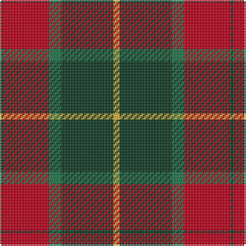

In pattern [GRGGY](/patterns/grggy/).

This was sourced from register-of-tartans.  It is a [5 stripes tartan](/stripes/stripes5/).

Original link https://www.tartanregister.gov.uk/tartanDetails.aspx?ref=10554

## Thread count
DG/2 R30 G8 DG34 Y/4

## Palette
Each colour and its ΔE from the base-6 reference it is a variant of.

| Colour | Shade | Base | ΔE (OKLab) |
|---|---|---|---|
| DG | <code style="background-color:#0E3923;">#0E3923</code> `#0E3923` | G <code style="background-color:#006400;">#006400</code> | 0.16 |
| G | <code style="background-color:#207449;">#207449</code> `#207449` | G <code style="background-color:#006400;">#006400</code> | 0.08 |
| R | <code style="background-color:#BB001A;">#BB001A</code> `#BB001A` | R <code style="background-color:#C80000;">#C80000</code> | 0.03 |
| Y | <code style="background-color:#E3B235;">#E3B235</code> `#E3B235` | Y <code style="background-color:#E8C000;">#E8C000</code> | 0.04 |

# Sample pattern

ID: /setts/s5/g2r30ga8g34y4-g0e3923-ga207449-rbb001a-ye3b235/
