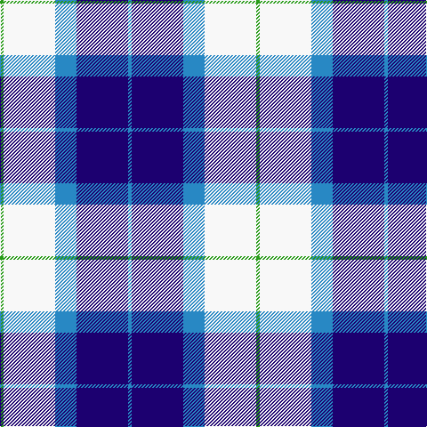

This page is one **sett** — a single exact thread-count. It belongs to the [tartan](/tartans/g2w29t12db29t2/)
(the same proportion at any scale), whose colour order is pattern [BBBWG](/stripes/bbbwg/).

Sourced from register-of-tartans.  It is a [5 stripe tartan](/stripes/stripes5/).

Original link https://www.tartanregister.gov.uk/tartanDetails.aspx?ref=4484

## Register references

External register numbers recorded for this tartan.

- Scottish Register of Tartans: [4484](https://www.tartanregister.gov.uk/tartanDetails.aspx?ref=4484)
- Scottish Tartans Authority (ITI): 6569

## Thread count
G/4 W58 B24 DB58 B/4

## Palette

Palette: <strong>Tartan Register</strong>
<table><thead><tr><th>Colour</th><th>Threads</th><th>Shade</th><th>Base</th><th>OKLCh</th></tr></thead><tbody><tr><td>G/</td><td style="text-align:right;font-variant-numeric:tabular-nums">4</td><td><code style="background-color:#289C18;">#289C18</code> <small style="color:#888">#289C18</small></td><td>G <code style="background-color:#006100;">#006100</code></td><td><small style="color:#888">oklch(60.6% 0.191 141.6)</small></td></tr><tr><td>W</td><td style="text-align:right;font-variant-numeric:tabular-nums">58</td><td><code style="background-color:#F8F8F8;">#F8F8F8</code> <small style="color:#888">#F8F8F8</small></td><td>W <code style="background-color:#F7F7F7;">#F7F7F7</code></td><td><small style="color:#888">oklch(97.9% 0.000 89.9)</small></td></tr><tr><td>B</td><td style="text-align:right;font-variant-numeric:tabular-nums">24</td><td><code style="background-color:#2888C4;">#2888C4</code> <small style="color:#888">#2888C4</small></td><td>B <code style="background-color:#2A418A;">#2A418A</code></td><td><small style="color:#888">oklch(60.1% 0.125 241.5)</small></td></tr><tr><td>DB</td><td style="text-align:right;font-variant-numeric:tabular-nums">58</td><td><code style="background-color:#1C0070;">#1C0070</code> <small style="color:#888">#1C0070</small></td><td>B <code style="background-color:#2A418A;">#2A418A</code></td><td><small style="color:#888">oklch(26.3% 0.162 277.1)</small></td></tr><tr><td>B/</td><td style="text-align:right;font-variant-numeric:tabular-nums">4</td><td><code style="background-color:#2888C4;">#2888C4</code> <small style="color:#888">#2888C4</small></td><td>B <code style="background-color:#2A418A;">#2A418A</code></td><td><small style="color:#888">oklch(60.1% 0.125 241.5)</small></td></tr></tbody></table>

# Sample pattern

## Nearest tartans

The nearest existing variants by ΔTartan distance, with this tartan at the top so the swatches line up against it.

ΔTartan

Tartan

Sett

—

<a href="/ttd/edit/#slug=g2w29t12db29t2~x2">Wallace Blue Dress (Dance)</a> <a class="nn-out" href="/setts/s5/g2w29t12db29t2~x2/" title="open its dictionary page">↗</a>

1.03

<a href="/ttd/edit/#slug=w5db32g12db2w30k4~x2">Bonnie Royal</a> <a class="nn-out" href="/setts/s6/w5db32g12db2w30k4~x2/" title="open its dictionary page">↗</a>

1.31

<a href="/ttd/edit/#slug=t34db24w18r3w18g2w3~x2">Ferguson, dress</a> <a class="nn-out" href="/setts/s7/t34db24w18r3w18g2w3~x2/" title="open its dictionary page">↗</a>

1.35

<a href="/ttd/edit/#slug=w28t19db19w4db2p2db7~x2">St. Andrews Dress, Earl of (Danc</a> <a class="nn-out" href="/setts/s7/w28t19db19w4db2p2db7~x2/" title="open its dictionary page">↗</a>

1.38

<a href="/ttd/edit/#slug=k2lb16w2db16w15k2w2~x2">Strathclyde 1975 (District)</a> <a class="nn-out" href="/setts/s7/k2lb16w2db16w15k2w2~x2/" title="open its dictionary page">↗</a>

1.39

<a href="/ttd/edit/#slug=b27w2b14k14lg4k4lg4k4lg27">(1) Abercrombie</a> <a class="nn-out" href="/setts/s9/b27w2b14k14lg4k4lg4k4lg27/" title="open its dictionary page">↗</a>

1.39

<a href="/ttd/edit/#slug=db8t3db28w32dt3w4~x2">Ailsa, Royal Blue (Dance)</a> <a class="nn-out" href="/setts/s6/db8t3db28w32dt3w4~x2/" title="open its dictionary page">↗</a>

1.43

<a href="/ttd/edit/#slug=w20db14dt14w4db2b2dt7~x2">Earl of St. Andrews Dress</a> <a class="nn-out" href="/setts/s7/w20db14dt14w4db2b2dt7~x2/" title="open its dictionary page">↗</a>

1.47

<a href="/ttd/edit/#slug=db3db2db14db1lb10lb16db2lb3~x2">Bannockbane Blue #2</a> <a class="nn-out" href="/setts/s8/db3db2db14db1lb10lb16db2lb3~x2/" title="open its dictionary page">↗</a>

1.47

<a href="/ttd/edit/#slug=k2b2w11b5k5w2k1b2~x2">Conquergood</a> <a class="nn-out" href="/setts/s8/k2b2w11b5k5w2k1b2~x2/" title="open its dictionary page">↗</a>

1.47

<a href="/ttd/edit/#slug=w28t19db19w4db2lp2db7~x2">St Andrews, Earl of, dress</a> <a class="nn-out" href="/setts/s7/w28t19db19w4db2lp2db7~x2/" title="open its dictionary page">↗</a>

## Neighbour map

Every grey dot is one of 14299 variants placed by the first two principal components of the ΔTartan feature space (44% of its variance). Red is this tartan; blue dots are its nearest — click one to open its page.

<svg viewBox="0 0 640 380" role="img" style="max-width:100%;height:auto;border:1px solid #e0e0e0;border-radius:4px;display:block" xmlns="http://www.w3.org/2000/svg"><image href="/nn/cloud.v1.png" width="640" height="380"/><a href="/setts/s6/w5db32g12db2w30k4~x2/"><circle cx="197.9" cy="161.8" r="4" fill="#3465a4"><title>Bonnie Royal</title></circle></a><a href="/setts/s7/t34db24w18r3w18g2w3~x2/"><circle cx="159.1" cy="149.7" r="4" fill="#3465a4"><title>Ferguson, dress</title></circle></a><a href="/setts/s7/w28t19db19w4db2p2db7~x2/"><circle cx="169.8" cy="155.5" r="4" fill="#3465a4"><title>St. Andrews Dress, Earl of (Danc</title></circle></a><a href="/setts/s7/k2lb16w2db16w15k2w2~x2/"><circle cx="128.5" cy="176.0" r="4" fill="#3465a4"><title>Strathclyde 1975 (District)</title></circle></a><a href="/setts/s9/b27w2b14k14lg4k4lg4k4lg27/"><circle cx="184.6" cy="159.4" r="4" fill="#3465a4"><title>(1) Abercrombie</title></circle></a><a href="/setts/s6/db8t3db28w32dt3w4~x2/"><circle cx="243.3" cy="175.5" r="4" fill="#3465a4"><title>Ailsa, Royal Blue (Dance)</title></circle></a><a href="/setts/s7/w20db14dt14w4db2b2dt7~x2/"><circle cx="129.1" cy="171.7" r="4" fill="#3465a4"><title>Earl of St. Andrews Dress</title></circle></a><a href="/setts/s8/db3db2db14db1lb10lb16db2lb3~x2/"><circle cx="183.9" cy="159.6" r="4" fill="#3465a4"><title>Bannockbane Blue #2</title></circle></a><a href="/setts/s8/k2b2w11b5k5w2k1b2~x2/"><circle cx="201.5" cy="182.7" r="4" fill="#3465a4"><title>Conquergood</title></circle></a><a href="/setts/s7/w28t19db19w4db2lp2db7~x2/"><circle cx="174.1" cy="158.0" r="4" fill="#3465a4"><title>St Andrews, Earl of, dress</title></circle></a><circle cx="185.3" cy="178.6" r="5" fill="#c00000"/></svg>

ID: /setts/s5/g2w29t12db29t2~x2/
