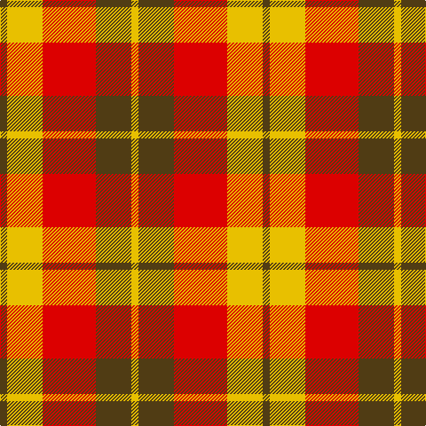

In pattern [GYRGY](/patterns/gyrgy/).

This was sourced from register-of-tartans.  It is a [5 stripes tartan](/stripes/stripes5/).

Original link https://www.tartanregister.gov.uk/tartanDetails.aspx?ref=1613

## Register references

External register numbers recorded for this tartan.

- Scottish Register of Tartans: [1613](https://www.tartanregister.gov.uk/tartanDetails.aspx?ref=1613)
- Scottish Tartans World Register: 1754

## Thread count
T/8 Y40 R60 T40 Y/8

## Palette
Each colour and its ΔE from the base-6 reference it is a variant of.

| Colour | Shade | Base | ΔE (OKLab) |
|---|---|---|---|
| R | <code style="background-color:#DC0000;">#DC0000</code> `#DC0000` | R <code style="background-color:#CC0000;">#CC0000</code> | 0.03 |
| T | <code style="background-color:#503C14;">#503C14</code> `#503C14` | G <code style="background-color:#006100;">#006100</code> | 0.14 |
| Y | <code style="background-color:#E8C000;">#E8C000</code> `#E8C000` | Y <code style="background-color:#F2BF00;">#F2BF00</code> | 0.02 |

# Sample pattern

## Nearest tartans

The nearest existing variants by ΔTartan distance.

1. [Harmony, 9](/setts/s5/r2y10ra15r10y2~r806050-rac00000-yf0c000~x4/) — ΔT 0.90
1. [Kozlosky, Kilt](/setts/s6/y42r15ra28y12r6ra20~rd03030-rac00000-yf0c000/) — ΔT 1.34
1. [Manx Mannin Plaid](/setts/s4/w1r5g5y1~g503c14-rdc0000-we0e0e0-ye8c000~x4/) — ΔT 1.39
1. [Kozlosky (Personal)](/setts/s6/y21r8ra14y6r3ra10~re87878-rac80000-ye8c000~x2/) — ΔT 1.51
1. [Buchele Check (Fashion?)](/setts/s6/r4y1r3ya1y8ya2~r901c38-ydcc08c-yad0c830~x4/) — ΔT 1.64
1. [Shire of Hornwood (Corporate)](/setts/s5/r18y3r18y30k4~k101010-rc80000-yfccc00~x2/) — ΔT 1.70
1. [Al-Maktoum](/setts/s6/w11r32g12r5g12r5~g006818-rc80000-wfcfcfc~x2/) — ΔT 1.73
1. [Glassary #2](/setts/s8/b4r1y12r2y2r12y1b4~b2c2c80-rc80000-ye8c000~x4/) — ΔT 1.77
1. [St. Andrews (Queens University) (Cor](/setts/s8/g11b1g11w10b1r11b1r11~b2c2c80-g604000-rc80000-we0e0e0~x2/) — ΔT 1.78
1. [MacNab, Variant](/setts/s6/g1r1g7r4ra7r1~g008000-r900030-rac00000~x4/) — ΔT 1.83

## Neighbour map

Every grey dot is one of 15726 variants placed by the first two principal components of the ΔTartan feature space (44% of its variance). Red is this tartan; blue dots are its nearest — click one to open its page.

<svg viewBox="0 0 640 380" role="img" style="max-width:100%;height:auto;border:1px solid #e0e0e0;border-radius:4px;display:block" xmlns="http://www.w3.org/2000/svg"><image href="/nn/cloud.v1.png" width="640" height="380"/><a href="/setts/s5/r2y10ra15r10y2~r806050-rac00000-yf0c000~x4/"><circle cx="234.0" cy="247.8" r="4" fill="#3465a4"><title>Harmony, 9</title></circle></a><a href="/setts/s6/y42r15ra28y12r6ra20~rd03030-rac00000-yf0c000/"><circle cx="249.5" cy="245.5" r="4" fill="#3465a4"><title>Kozlosky, Kilt</title></circle></a><a href="/setts/s4/w1r5g5y1~g503c14-rdc0000-we0e0e0-ye8c000~x4/"><circle cx="210.3" cy="250.9" r="4" fill="#3465a4"><title>Manx Mannin Plaid</title></circle></a><a href="/setts/s6/y21r8ra14y6r3ra10~re87878-rac80000-ye8c000~x2/"><circle cx="251.0" cy="248.6" r="4" fill="#3465a4"><title>Kozlosky (Personal)</title></circle></a><a href="/setts/s6/r4y1r3ya1y8ya2~r901c38-ydcc08c-yad0c830~x4/"><circle cx="260.2" cy="220.5" r="4" fill="#3465a4"><title>Buchele Check (Fashion?)</title></circle></a><a href="/setts/s5/r18y3r18y30k4~k101010-rc80000-yfccc00~x2/"><circle cx="291.5" cy="220.2" r="4" fill="#3465a4"><title>Shire of Hornwood (Corporate)</title></circle></a><a href="/setts/s6/w11r32g12r5g12r5~g006818-rc80000-wfcfcfc~x2/"><circle cx="275.8" cy="234.5" r="4" fill="#3465a4"><title>Al-Maktoum</title></circle></a><a href="/setts/s8/b4r1y12r2y2r12y1b4~b2c2c80-rc80000-ye8c000~x4/"><circle cx="235.3" cy="175.1" r="4" fill="#3465a4"><title>Glassary #2</title></circle></a><a href="/setts/s8/g11b1g11w10b1r11b1r11~b2c2c80-g604000-rc80000-we0e0e0~x2/"><circle cx="200.0" cy="192.4" r="4" fill="#3465a4"><title>St. Andrews (Queens University) (Cor</title></circle></a><a href="/setts/s6/g1r1g7r4ra7r1~g008000-r900030-rac00000~x4/"><circle cx="251.4" cy="246.8" r="4" fill="#3465a4"><title>MacNab, Variant</title></circle></a><circle cx="211.8" cy="239.7" r="5" fill="#c00000"/></svg>

ID: /setts/s5/g2y10r15g10y2~g503c14-rdc0000-ye8c000~x4/
