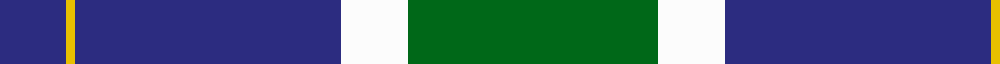

**Bands:** [BYBWG](/stripes/bybwg/) · **Stripes:** [DB LY DB W G](/stripes/stripes5/) DB LY DB W G

This was sourced from register-of-tartans.  It is a [5 band tartan](/bands/bands5/).

Original link https://www.tartanregister.gov.uk/tartanDetails.aspx?ref=3714

## Register references

External register numbers recorded for this tartan.

- Scottish Register of Tartans: [3714](https://www.tartanregister.gov.uk/tartanDetails.aspx?ref=3714)
- Scottish Tartans World Register: 2688

## Thread count
DB/16 Y2 DB64 W16 G/60

## Palette
Each colour and its ΔE from the base-6 reference it is a variant of.

| Colour | Shade | Base | ΔE (OKLab) |
|---|---|---|---|
| DB | <code style="background-color:#2C2C80;">#2C2C80</code> `#2C2C80` | B <code style="background-color:#2A418A;">#2A418A</code> | 0.06 |
| G | <code style="background-color:#006818;">#006818</code> `#006818` | G <code style="background-color:#006100;">#006100</code> | 0.02 |
| W | <code style="background-color:#FCFCFC;">#FCFCFC</code> `#FCFCFC` | W <code style="background-color:#F7F7F7;">#F7F7F7</code> | 0.01 |
| Y | <code style="background-color:#E8C000;">#E8C000</code> `#E8C000` | Y <code style="background-color:#F2BF00;">#F2BF00</code> | 0.02 |

# Sample pattern

## Nearest tartans

The nearest existing variants by ΔTartan distance.

1. [Intergen (Corporate)](/setts/s6/k4lg3k30lg33r1lg4~x2/) — ΔT 1.09
1. [Bro-Spirit of Northmen (Corporate)](/setts/s5/r3k1b27k27w3~x2/) — ΔT 1.10
1. [Boroughmuir](/setts/s5/dg30w8dt32ly1dt8~x2/) — ΔT 1.18
1. [MacRobart](/setts/s6/db72k21g16t3g17t3~x2/) — ΔT 1.33
1. [Rothesay & Caithness Fencibles (Mil)](/setts/s5/b32k10g15k2ly4~x2/) — ΔT 1.39
1. [Muir, John](/setts/s7/ly2w21db16b8db30w8db1~x2/) — ΔT 1.46
1. [Unidentified Furnishing #2](/setts/s6/r4g40k21lo2k21g2~x2/) — ΔT 1.46
1. [Nynashamn Whisky Society (Corporate)](/setts/s6/ly21g26db62w2dg2w2/) — ΔT 1.46
1. [Centennial-King George Lodge No.171](/setts/s5/ly2dg36b30w7r2~x2/) — ΔT 1.46
1. [Connacht Irish District Tartan Tartan Number: 4485. Earliest known date: 1994 Phil Smith obtained in Perthshire from a swatch dated 1994 shown to him by Keith Lumsden of the Scottish Tartans Society. However www.uniq-orn.com shows this as Connaught Green. See products available Copyright © Blair Urquhart, Comrie, 2015](/setts/s6/r2db32g14db5g16w2~x2/) — ΔT 1.47

## Neighbour map

Every grey dot is one of 14313 variants placed by the first two principal components of the ΔTartan feature space (44% of its variance). Red is this tartan; blue dots are its nearest — click one to open its page.

<svg viewBox="0 0 640 380" role="img" style="max-width:100%;height:auto;border:1px solid #e0e0e0;border-radius:4px;display:block" xmlns="http://www.w3.org/2000/svg"><image href="/nn/cloud.v1.png" width="640" height="380"/><a href="/setts/s6/k4lg3k30lg33r1lg4~x2/"><circle cx="323.5" cy="147.3" r="4" fill="#3465a4"><title>Intergen (Corporate)</title></circle></a><a href="/setts/s5/r3k1b27k27w3~x2/"><circle cx="303.9" cy="174.1" r="4" fill="#3465a4"><title>Bro-Spirit of Northmen (Corporate)</title></circle></a><a href="/setts/s5/dg30w8dt32ly1dt8~x2/"><circle cx="322.6" cy="193.4" r="4" fill="#3465a4"><title>Boroughmuir</title></circle></a><a href="/setts/s6/db72k21g16t3g17t3~x2/"><circle cx="327.8" cy="172.9" r="4" fill="#3465a4"><title>MacRobart</title></circle></a><a href="/setts/s5/b32k10g15k2ly4~x2/"><circle cx="277.0" cy="208.6" r="4" fill="#3465a4"><title>Rothesay &amp; Caithness Fencibles (Mil)</title></circle></a><a href="/setts/s7/ly2w21db16b8db30w8db1~x2/"><circle cx="289.1" cy="150.2" r="4" fill="#3465a4"><title>Muir, John</title></circle></a><a href="/setts/s6/r4g40k21lo2k21g2~x2/"><circle cx="298.7" cy="185.3" r="4" fill="#3465a4"><title>Unidentified Furnishing #2</title></circle></a><a href="/setts/s6/ly21g26db62w2dg2w2/"><circle cx="301.3" cy="128.3" r="4" fill="#3465a4"><title>Nynashamn Whisky Society (Corporate)</title></circle></a><a href="/setts/s5/ly2dg36b30w7r2~x2/"><circle cx="255.9" cy="173.6" r="4" fill="#3465a4"><title>Centennial-King George Lodge No.171</title></circle></a><a href="/setts/s6/r2db32g14db5g16w2~x2/"><circle cx="323.6" cy="202.3" r="4" fill="#3465a4"><title>Connacht Irish District Tartan Tartan Number: 4485. Earliest known date: 1994 Phil Smith obtained in Perthshire from a swatch dated 1994 shown to him by Keith Lumsden of the Scottish Tartans Society. However www.uniq-orn.com shows this as Connaught Green. See products available Copyright © Blair Urquhart, Comrie, 2015</title></circle></a><circle cx="305.5" cy="180.5" r="5" fill="#c00000"/></svg>

ID: /setts/s5/g30w8db32ly1db8~x2/
