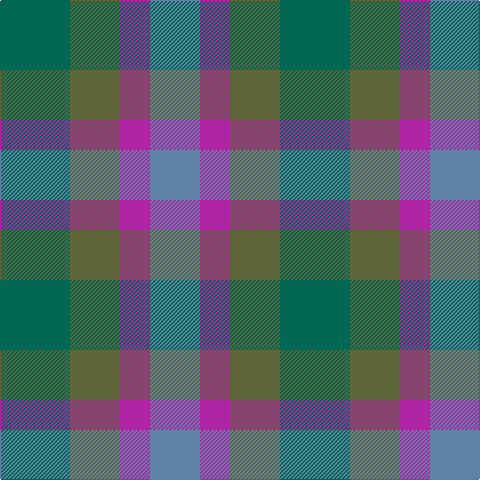

**Bands:** [GGRBB](/stripes/ggrbb/) · **Stripes:** [G Y M T T](/stripes/stripes5/) G Y M T T

This was sourced from register-of-tartans.  It is a [5 band tartan](/bands/bands5/).

Original link https://www.tartanregister.gov.uk/tartanDetails.aspx?ref=10821

## Register references

External register numbers recorded for this tartan.

- Scottish Register of Tartans: [10821](https://www.tartanregister.gov.uk/tartanDetails.aspx?ref=10821)

## Thread count
G/70 Ga50 P30 B4 B/42

## Palette
Each colour and its ΔE from the base-6 reference it is a variant of.

| Colour | Shade | Base | ΔE (OKLab) |
|---|---|---|---|
| B | <code style="background-color:#5E82A3;">#5E82A3</code> `#5E82A3` | B <code style="background-color:#2A418A;">#2A418A</code> | 0.20 |
| G | <code style="background-color:#006752;">#006752</code> `#006752` | G <code style="background-color:#006100;">#006100</code> | 0.09 |
| Ga | <code style="background-color:#5E6639;">#5E6639</code> `#5E6639` | G <code style="background-color:#006100;">#006100</code> | 0.11 |
| P | <code style="background-color:#AF23A5;">#AF23A5</code> `#AF23A5` | R <code style="background-color:#CC0000;">#CC0000</code> | 0.21 |

# Sample pattern

## Nearest tartans

The nearest existing variants by ΔTartan distance.

1. [Skibo (Corporate)](/setts/s5/r2y23db11b22r2~x2/) — ΔT 1.62
1. [Skibo](/setts/s8/y23db11b22r2b22db11y23r2~x2/) — ΔT 1.83
1. [Porcelanosa](/setts/s4/lr24o9n23ly3~x2/) — ΔT 1.84
1. [Dunanas Rising (Corporate)](/setts/s5/dg35y25r15b2db21~x2/) — ΔT 2.02
1. [Universal, Ancient](/setts/s8/t12g2t2g2t2o8g8o1~x2/) — ΔT 2.05
1. [House of Bruar (Corporate)](/setts/s6/dr6do26dt28g26dt8y3~x2/) — ΔT 2.07
1. [Scottish Ballet](/setts/s6/lo5y22m15lp11m5y2~x2/) — ΔT 2.08
1. [Dewar (WCWM)](/setts/s6/dt1dy1dt7dy5y7lr1~x4/) — ΔT 2.12
1. [Bright of Garth (Personal)](/setts/s5/g7y6n7y1n2~x6/) — ΔT 2.14
1. [Saorsa (Corporate)](/setts/s6/db11g15k2n5db3n11~x2/) — ΔT 2.15

## Neighbour map

Every grey dot is one of 14299 variants placed by the first two principal components of the ΔTartan feature space (44% of its variance). Red is this tartan; blue dots are its nearest — click one to open its page.

<svg viewBox="0 0 640 380" role="img" style="max-width:100%;height:auto;border:1px solid #e0e0e0;border-radius:4px;display:block" xmlns="http://www.w3.org/2000/svg"><image href="/nn/cloud.v1.png" width="640" height="380"/><a href="/setts/s5/r2y23db11b22r2~x2/"><circle cx="291.0" cy="268.0" r="4" fill="#3465a4"><title>Skibo (Corporate)</title></circle></a><a href="/setts/s8/y23db11b22r2b22db11y23r2~x2/"><circle cx="289.0" cy="275.1" r="4" fill="#3465a4"><title>Skibo</title></circle></a><a href="/setts/s4/lr24o9n23ly3~x2/"><circle cx="281.4" cy="292.2" r="4" fill="#3465a4"><title>Porcelanosa</title></circle></a><a href="/setts/s5/dg35y25r15b2db21~x2/"><circle cx="208.7" cy="235.7" r="4" fill="#3465a4"><title>Dunanas Rising (Corporate)</title></circle></a><a href="/setts/s8/t12g2t2g2t2o8g8o1~x2/"><circle cx="290.1" cy="234.8" r="4" fill="#3465a4"><title>Universal, Ancient</title></circle></a><a href="/setts/s6/dr6do26dt28g26dt8y3~x2/"><circle cx="251.6" cy="272.8" r="4" fill="#3465a4"><title>House of Bruar (Corporate)</title></circle></a><a href="/setts/s6/lo5y22m15lp11m5y2~x2/"><circle cx="309.6" cy="266.1" r="4" fill="#3465a4"><title>Scottish Ballet</title></circle></a><a href="/setts/s6/dt1dy1dt7dy5y7lr1~x4/"><circle cx="256.2" cy="272.5" r="4" fill="#3465a4"><title>Dewar (WCWM)</title></circle></a><a href="/setts/s5/g7y6n7y1n2~x6/"><circle cx="301.9" cy="334.8" r="4" fill="#3465a4"><title>Bright of Garth (Personal)</title></circle></a><a href="/setts/s6/db11g15k2n5db3n11~x2/"><circle cx="186.0" cy="261.8" r="4" fill="#3465a4"><title>Saorsa (Corporate)</title></circle></a><circle cx="263.2" cy="271.6" r="5" fill="#c00000"/></svg>

ID: /setts/s5/g35y25m15t2t21~x2/
