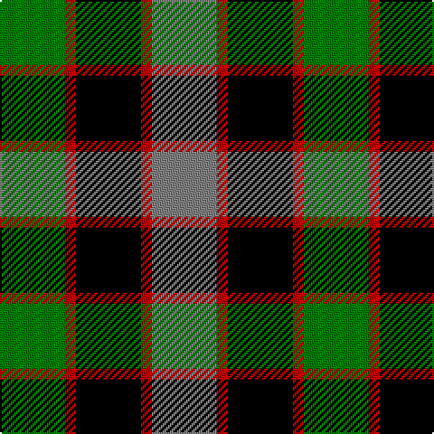

In pattern [GRKRG](/patterns/grkrg/).

This was sourced from weddslist.  It is a [5 stripes tartan](/stripes/stripes5/).

Original link http://www.weddslist.com/cgi-bin/tartans/pg.pl?source=sts

## Thread count
G/36 R6 K36 R6 N/36

## Palette
Each colour and its ΔE from the base-6 reference it is a variant of.

| Colour | Shade | Base | ΔE (OKLab) |
|---|---|---|---|
| G | <code style="background-color:#008000;">#008000</code> `#008000` | G <code style="background-color:#006400;">#006400</code> | 0.09 |
| K | <code style="background-color:#000000;">#000000</code> `#000000` | K <code style="background-color:#000000;">#000000</code> | 0.00 |
| N | <code style="background-color:#808080;">#808080</code> `#808080` | G <code style="background-color:#006400;">#006400</code> | 0.22 |
| R | <code style="background-color:#C00000;">#C00000</code> `#C00000` | R <code style="background-color:#C80000;">#C80000</code> | 0.02 |

# Sample pattern

## Nearest tartans

The nearest existing variants by ΔTartan distance.

1. [Timespan](/setts/s5/g36r6k36r6ra36-g006818-k101010-rc80000-ra888888/) — ΔT 1.06
1. [Lennie](/setts/s6/g4b16k18ba4g20k4-b800080-ba5480b0-g008000-k000000/) — ΔT 1.15
1. [Wellington, or Waterloo](/setts/s6/b6g24k28b22r6b6-b5480b0-g008000-k000000-rc00000/) — ΔT 1.15
1. [Morrison](/setts/s6/k6g28k28g4b28r6-b304080-g008000-k000000-rc00000/) — ΔT 1.18
1. [Casely](/setts/s6/r16g44k44g8b44ga12-b304080-g008000-ga607030-k000000-rc00000/) — ΔT 1.18
1. [Birse](/setts/s6/k8g32k28y6b32r8-b304080-g008000-k000000-rc00000-yf0c000/) — ΔT 1.19
1. [Wellington, or Waterloo](/setts/s6/b6g12k12b8r2b2-b5480b0-g008000-k000000-rc00000/) — ΔT 1.20
1. [MacKay, Dress (Corporate)](/setts/s6/k8g28k28g4w28b6-b1474b4-g006818-k101010-we0e0e0/) — ΔT 1.21
1. [Ramsay, Red](/setts/s7/k8r18k26g12r6g18w8-g008000-k000000-rb05000-we0e0e0/) — ΔT 1.22
1. [Unnamed, No 26](/setts/s6/w4b4g22k20b20w3-b304080-g008000-k000000-we0e0e0/) — ΔT 1.22

## Neighbour map

Every grey dot is one of 15726 variants placed by the first two principal components of the ΔTartan feature space (44% of its variance). Red is this tartan; blue dots are its nearest — click one to open its page.

<svg viewBox="0 0 640 380" role="img" style="max-width:100%;height:auto;border:1px solid #e0e0e0;border-radius:4px;display:block" xmlns="http://www.w3.org/2000/svg"><image href="/nn/cloud.v1.png" width="640" height="380"/><a href="/setts/s5/g36r6k36r6ra36-g006818-k101010-rc80000-ra888888/"><circle cx="127.4" cy="254.9" r="4" fill="#3465a4"><title>Timespan</title></circle></a><a href="/setts/s6/g4b16k18ba4g20k4-b800080-ba5480b0-g008000-k000000/"><circle cx="124.6" cy="244.4" r="4" fill="#3465a4"><title>Lennie</title></circle></a><a href="/setts/s6/b6g24k28b22r6b6-b5480b0-g008000-k000000-rc00000/"><circle cx="113.2" cy="248.3" r="4" fill="#3465a4"><title>Wellington, or Waterloo</title></circle></a><a href="/setts/s6/k6g28k28g4b28r6-b304080-g008000-k000000-rc00000/"><circle cx="133.8" cy="234.5" r="4" fill="#3465a4"><title>Morrison</title></circle></a><a href="/setts/s6/r16g44k44g8b44ga12-b304080-g008000-ga607030-k000000-rc00000/"><circle cx="70.1" cy="235.2" r="4" fill="#3465a4"><title>Casely</title></circle></a><a href="/setts/s6/k8g32k28y6b32r8-b304080-g008000-k000000-rc00000-yf0c000/"><circle cx="74.2" cy="229.1" r="4" fill="#3465a4"><title>Birse</title></circle></a><a href="/setts/s6/b6g12k12b8r2b2-b5480b0-g008000-k000000-rc00000/"><circle cx="126.0" cy="243.8" r="4" fill="#3465a4"><title>Wellington, or Waterloo</title></circle></a><a href="/setts/s6/k8g28k28g4w28b6-b1474b4-g006818-k101010-we0e0e0/"><circle cx="117.9" cy="223.5" r="4" fill="#3465a4"><title>MacKay, Dress (Corporate)</title></circle></a><a href="/setts/s7/k8r18k26g12r6g18w8-g008000-k000000-rb05000-we0e0e0/"><circle cx="82.7" cy="254.2" r="4" fill="#3465a4"><title>Ramsay, Red</title></circle></a><a href="/setts/s6/w4b4g22k20b20w3-b304080-g008000-k000000-we0e0e0/"><circle cx="114.6" cy="224.1" r="4" fill="#3465a4"><title>Unnamed, No 26</title></circle></a><circle cx="99.5" cy="245.5" r="5" fill="#c00000"/></svg>

ID: /setts/s5/g36r6k36r6ga36-g008000-ga808080-k000000-rc00000/
