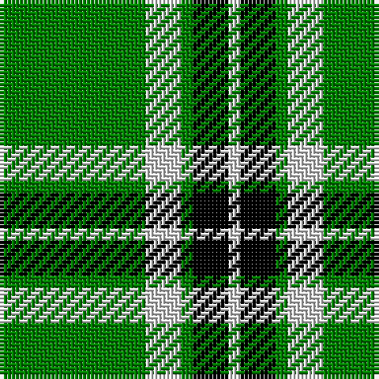

In pattern [GWGKW](/stripes/gwgkw/).

This was sourced from weddslist.  It is a [5 stripe tartan](/stripes/stripes5/).

Original link http://www.weddslist.com/cgi-bin/tartans/pg.pl?source=sts

## Also known as

This cloth is also recorded under:

- Loch Rannoch Fancy

## Attestations

This cloth appears in 2 source records; the oldest owns this page.

- undated — Loch Rannoch (weddslist, [record](http://www.weddslist.com/cgi-bin/tartans/pg.pl?source=sts))
- undated — Loch Rannoch Fancy Tartan Tartan Number: 943. Earliest known date: 1975 Nothing See products available Copyright © Blair Urquhart, Comrie, 2015 (house-of-tartan, [record](http://www.house-of-tartan.scotland.net/house/TartanViewjs.asp?colr=Def&tnam=943))

## Thread count
G/37 LN9 G3 K9 LN/3

## Palette
Each colour and the base-6 reference it is a variant of.

| Colour | Shade | Base |
|---|---|---|
| G | <code style="background-color:#008000;">#008000</code> `oklch(52.0% 0.177 142.5)` <small>#008000</small> | G <code style="background-color:#006100;">#006100</code> |
| K | <code style="background-color:#000000;">#000000</code> `oklch(0.0% 0.000 0.0)` <small>#000000</small> | K <code style="background-color:#000000;">#000000</code> |
| LN | <code style="background-color:#E0E0E0;">#E0E0E0</code> `oklch(90.7% 0.000 89.9)` <small>#E0E0E0</small> | W <code style="background-color:#F7F7F7;">#F7F7F7</code> |

# Sample pattern

## Nearest tartans

The nearest existing variants by ΔTartan distance, with this tartan at the top so the swatches line up against it.

ΔTartan

Tartan

Sett

—

<a href="/ttd/edit/#slug=g37w9g3k9w3">Loch Rannoch</a> <a class="nn-out" href="/setts/s5/g37w9g3k9w3/" title="open its dictionary page">↗</a>

0.75

<a href="/ttd/edit/#slug=g19w5g2k5w2~x2">Loch Rannoch</a> <a class="nn-out" href="/setts/s5/g19w5g2k5w2~x2/" title="open its dictionary page">↗</a>

1.21

<a href="/ttd/edit/#slug=g8w4g50k12g4k15lo5~x2">Instakilt, Green (Fashion)</a> <a class="nn-out" href="/setts/s7/g8w4g50k12g4k15lo5~x2/" title="open its dictionary page">↗</a>

1.39

<a href="/ttd/edit/#slug=k3lb1g15g6k2dr3lb2~x2">Leach Hunting</a> <a class="nn-out" href="/setts/s7/k3lb1g15g6k2dr3lb2~x2/" title="open its dictionary page">↗</a>

1.39

<a href="/ttd/edit/#slug=dg11ly1dg1ly6k1ly1~x8">Big Spruce Brewing</a> <a class="nn-out" href="/setts/s6/dg11ly1dg1ly6k1ly1~x8/" title="open its dictionary page">↗</a>

1.61

<a href="/ttd/edit/#slug=k3lb1g21k2dr3lb2~x2">Leach Htg (Name)</a> <a class="nn-out" href="/setts/s6/k3lb1g21k2dr3lb2~x2/" title="open its dictionary page">↗</a>

1.63

<a href="/ttd/edit/#slug=r8g12w5k11g42k3~x2">Sir Billi (Corporate)</a> <a class="nn-out" href="/setts/s6/r8g12w5k11g42k3~x2/" title="open its dictionary page">↗</a>

1.63

<a href="/ttd/edit/#slug=dg11lo1dg1lo6k1lo1~x4">Big Spruce Brewing</a> <a class="nn-out" href="/setts/s6/dg11lo1dg1lo6k1lo1~x4/" title="open its dictionary page">↗</a>

1.64

<a href="/ttd/edit/#slug=dg20w2dg9w2ly5w7dg10~x2">Heritage #2</a> <a class="nn-out" href="/setts/s7/dg20w2dg9w2ly5w7dg10~x2/" title="open its dictionary page">↗</a>

1.70

<a href="/ttd/edit/#slug=w12k3g50w3k13lo6~x2">Limerick County Crest (Fashion)</a> <a class="nn-out" href="/setts/s6/w12k3g50w3k13lo6~x2/" title="open its dictionary page">↗</a>

1.71

<a href="/ttd/edit/#slug=dg21ly43dg86t10">Special Saffron Tartan Tartan Number: 201. Earliest known date: pre 2003 Y = Saffron See products available Copyright © Blair Urquhart, Comrie, 2015</a> <a class="nn-out" href="/setts/s4/dg21ly43dg86t10/" title="open its dictionary page">↗</a>

## Neighbour map

Every grey dot is one of 14299 variants placed by the first two principal components of the ΔTartan feature space (44% of its variance). Red is this tartan; blue dots are its nearest — click one to open its page.

<svg viewBox="0 0 640 380" role="img" style="max-width:100%;height:auto;border:1px solid #e0e0e0;border-radius:4px;display:block" xmlns="http://www.w3.org/2000/svg"><image href="/nn/cloud.v1.png" width="640" height="380"/><a href="/setts/s5/g19w5g2k5w2~x2/"><circle cx="333.1" cy="216.4" r="4" fill="#3465a4"><title>Loch Rannoch</title></circle></a><a href="/setts/s7/g8w4g50k12g4k15lo5~x2/"><circle cx="338.6" cy="176.7" r="4" fill="#3465a4"><title>Instakilt, Green (Fashion)</title></circle></a><a href="/setts/s7/k3lb1g15g6k2dr3lb2~x2/"><circle cx="351.9" cy="179.7" r="4" fill="#3465a4"><title>Leach Hunting</title></circle></a><a href="/setts/s6/dg11ly1dg1ly6k1ly1~x8/"><circle cx="330.1" cy="192.0" r="4" fill="#3465a4"><title>Big Spruce Brewing</title></circle></a><a href="/setts/s6/k3lb1g21k2dr3lb2~x2/"><circle cx="387.5" cy="153.9" r="4" fill="#3465a4"><title>Leach Htg (Name)</title></circle></a><a href="/setts/s6/r8g12w5k11g42k3~x2/"><circle cx="373.7" cy="191.9" r="4" fill="#3465a4"><title>Sir Billi (Corporate)</title></circle></a><a href="/setts/s6/dg11lo1dg1lo6k1lo1~x4/"><circle cx="351.6" cy="201.1" r="4" fill="#3465a4"><title>Big Spruce Brewing</title></circle></a><a href="/setts/s7/dg20w2dg9w2ly5w7dg10~x2/"><circle cx="372.6" cy="225.6" r="4" fill="#3465a4"><title>Heritage #2</title></circle></a><a href="/setts/s6/w12k3g50w3k13lo6~x2/"><circle cx="309.7" cy="166.2" r="4" fill="#3465a4"><title>Limerick County Crest (Fashion)</title></circle></a><a href="/setts/s4/dg21ly43dg86t10/"><circle cx="357.6" cy="254.7" r="4" fill="#3465a4"><title>Special Saffron Tartan Tartan Number: 201. Earliest known date: pre 2003 Y = Saffron See products available Copyright © Blair Urquhart, Comrie, 2015</title></circle></a><circle cx="357.5" cy="203.3" r="5" fill="#c00000"/></svg>

ID: /setts/s5/g37w9g3k9w3/
