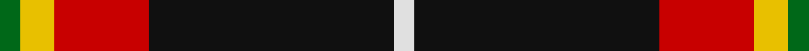

In pattern [GYRKW](/stripes/gyrkw/).

This was sourced from register-of-tartans.  It is a [5 stripe tartan](/stripes/stripes5/).

Original link https://www.tartanregister.gov.uk/tartanDetails.aspx?ref=5406

## Attestations

This cloth appears in 2 source records; the oldest owns this page.

- 01/06/2007 — Papua New Guinea (register-of-tartans, [record](https://www.tartanregister.gov.uk/tartanDetails.aspx?ref=5406))
- June 2007 — Papua New Guinea (Corporate) (tartans-authority, [record](http://www.tartansauthority.com/tartan-ferret/display/7235/))

## Register references

External register numbers recorded for this tartan.

- Scottish Register of Tartans: [5406](https://www.tartanregister.gov.uk/tartanDetails.aspx?ref=5406)
- Scottish Tartans Authority (ITI): 7235

## Thread count
G/6 Y10 R28 K72 LN/6

## Palette
Each colour and its ΔE from the base-6 reference it is a variant of.

| Colour | Shade | Base | ΔE (OKLab) |
|---|---|---|---|
| G | <code style="background-color:#006818;">#006818</code> `#006818` | G <code style="background-color:#006100;">#006100</code> | 0.02 |
| K | <code style="background-color:#101010;">#101010</code> `#101010` | K <code style="background-color:#000000;">#000000</code> | 0.17 |
| LN | <code style="background-color:#E0E0E0;">#E0E0E0</code> `#E0E0E0` | W <code style="background-color:#F7F7F7;">#F7F7F7</code> | 0.07 |
| R | <code style="background-color:#C80000;">#C80000</code> `#C80000` | R <code style="background-color:#CC0000;">#CC0000</code> | 0.01 |
| Y | <code style="background-color:#E8C000;">#E8C000</code> `#E8C000` | Y <code style="background-color:#F2BF00;">#F2BF00</code> | 0.02 |

# Sample pattern

## Nearest tartans

The nearest existing variants by ΔTartan distance.

1. [Papua New Guinea Pipes and Drums](/setts/s5/g3ly5r13k33w2~x2/) — ΔT 0.52
1. [Drambuie](/setts/s6/w6r36k48lo4k5ly6/) — ΔT 0.93
1. [MacShimsi](/setts/s5/r11r5g5k40ly3~x2/) — ΔT 1.06
1. [Drambuie Dress](/setts/s6/w6dy36k48r4k5ly6/) — ΔT 1.11
1. [Drambuie dress](/setts/s6/w6o36k48r4k5ly6/) — ΔT 1.16
1. [Drambuie](/setts/s6/w6r36k48o4k5ly6/) — ΔT 1.28
1. [Bro-Wened](/setts/s6/k43r10w3k3w15db3~x2/) — ΔT 1.30
1. [Billy Apple](/setts/s4/g1r8k13ly1~x6/) — ΔT 1.31
1. [Calgary Firefighters (Corporate)](/setts/s5/o4k48o16r12db3~x2/) — ΔT 1.31
1. [Cunard o' the Clyde](/setts/s8/r10k3w1k15ly1w3k3ly1~x4/) — ΔT 1.39

## Neighbour map

Every grey dot is one of 14299 variants placed by the first two principal components of the ΔTartan feature space (44% of its variance). Red is this tartan; blue dots are its nearest — click one to open its page.

<svg viewBox="0 0 640 380" role="img" style="max-width:100%;height:auto;border:1px solid #e0e0e0;border-radius:4px;display:block" xmlns="http://www.w3.org/2000/svg"><image href="/nn/cloud.v1.png" width="640" height="380"/><a href="/setts/s5/g3ly5r13k33w2~x2/"><circle cx="307.5" cy="155.4" r="4" fill="#3465a4"><title>Papua New Guinea Pipes and Drums</title></circle></a><a href="/setts/s6/w6r36k48lo4k5ly6/"><circle cx="266.4" cy="166.6" r="4" fill="#3465a4"><title>Drambuie</title></circle></a><a href="/setts/s5/r11r5g5k40ly3~x2/"><circle cx="349.7" cy="179.4" r="4" fill="#3465a4"><title>MacShimsi</title></circle></a><a href="/setts/s6/w6dy36k48r4k5ly6/"><circle cx="266.9" cy="173.8" r="4" fill="#3465a4"><title>Drambuie Dress</title></circle></a><a href="/setts/s6/w6o36k48r4k5ly6/"><circle cx="242.8" cy="163.4" r="4" fill="#3465a4"><title>Drambuie dress</title></circle></a><a href="/setts/s6/w6r36k48o4k5ly6/"><circle cx="252.9" cy="164.1" r="4" fill="#3465a4"><title>Drambuie</title></circle></a><a href="/setts/s6/k43r10w3k3w15db3~x2/"><circle cx="317.2" cy="162.1" r="4" fill="#3465a4"><title>Bro-Wened</title></circle></a><a href="/setts/s4/g1r8k13ly1~x6/"><circle cx="332.4" cy="206.9" r="4" fill="#3465a4"><title>Billy Apple</title></circle></a><a href="/setts/s5/o4k48o16r12db3~x2/"><circle cx="336.1" cy="188.8" r="4" fill="#3465a4"><title>Calgary Firefighters (Corporate)</title></circle></a><a href="/setts/s8/r10k3w1k15ly1w3k3ly1~x4/"><circle cx="303.3" cy="152.0" r="4" fill="#3465a4"><title>Cunard o' the Clyde</title></circle></a><circle cx="299.0" cy="169.4" r="5" fill="#c00000"/></svg>

ID: /setts/s5/g3ly5r14k36w3~x2/
