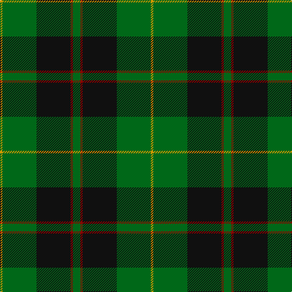

In pattern [GRKGY](/patterns/grkgy/).

This was sourced from register-of-tartans.  It is a [5 stripes tartan](/stripes/stripes5/).

Original link https://www.tartanregister.gov.uk/tartanDetails.aspx?ref=4516

## Thread count
DY/4 G56 K56 DR4 G/12

## Palette
Each colour and its ΔE from the base-6 reference it is a variant of.

| Colour | Shade | Base | ΔE (OKLab) |
|---|---|---|---|
| DR | <code style="background-color:#880000;">#880000</code> `#880000` | R <code style="background-color:#CC0000;">#CC0000</code> | 0.15 |
| DY | <code style="background-color:#D09800;">#D09800</code> `#D09800` | Y <code style="background-color:#F2BF00;">#F2BF00</code> | 0.12 |
| G | <code style="background-color:#006818;">#006818</code> `#006818` | G <code style="background-color:#006100;">#006100</code> | 0.02 |
| K | <code style="background-color:#101010;">#101010</code> `#101010` | K <code style="background-color:#000000;">#000000</code> | 0.17 |

# Sample pattern

## Nearest tartans

The nearest existing variants by ΔTartan distance.

1. [MacArthur (Variant)](/setts/s6/r3g30k12g6k16y2~g006818-k101010-rc80000-ye8c000~x2/) — ΔT 0.60
1. [Raeside](/setts/s5/k6g4ga44k41w4~g289c18-ga006818-k101010-we0e0e0~x2/) — ΔT 0.85
1. [Brooks Brothers (Corporate)](/setts/s4/r1g11k11y1~g006818-k101010-r880000-yd09800~x4/) — ΔT 0.85
1. [Douglas (alternative threadcount)](/setts/s5/k6b4g44k41w4~b1c0070-g006818-k101010-we0e0e0~x2/) — ΔT 0.87
1. [MacKinross](/setts/s7/k6b1k6g4k10g20r2~b2c2c80-g006818-k101010-rc80000~x2/) — ΔT 0.95
1. [Robert Byers Family - Dooballagh, Ireland](/setts/s4/k5g40b20y3~b1c1c50-g006818-k101010-ye8c000~x2/) — ΔT 1.00
1. [Forbes #6](/setts/s6/r1g16k8g4k4y1~g005020-k101010-rdc0000-ye8c000~x2/) — ΔT 1.00
1. [Page](/setts/s7/g46k18g6k13r4k4w4~g004810-k101010-rc80000-we0e0e0~x2/) — ΔT 1.02
1. [Byers (Name)](/setts/s4/k5g40b20y3~b202060-g006818-k101010-yfccc00~x2/) — ΔT 1.08
1. [O'Donoghue](/setts/s5/g62k40y3k3w3~g006818-k101010-wf8f8f8-ye8c000~x2/) — ΔT 1.13

## Neighbour map

Every grey dot is one of 15726 variants placed by the first two principal components of the ΔTartan feature space (44% of its variance). Red is this tartan; blue dots are its nearest — click one to open its page.

<svg viewBox="0 0 640 380" role="img" style="max-width:100%;height:auto;border:1px solid #e0e0e0;border-radius:4px;display:block" xmlns="http://www.w3.org/2000/svg"><image href="/nn/cloud.v1.png" width="640" height="380"/><a href="/setts/s6/r3g30k12g6k16y2~g006818-k101010-rc80000-ye8c000~x2/"><circle cx="316.8" cy="213.2" r="4" fill="#3465a4"><title>MacArthur (Variant)</title></circle></a><a href="/setts/s5/k6g4ga44k41w4~g289c18-ga006818-k101010-we0e0e0~x2/"><circle cx="286.5" cy="220.7" r="4" fill="#3465a4"><title>Raeside</title></circle></a><a href="/setts/s4/r1g11k11y1~g006818-k101010-r880000-yd09800~x4/"><circle cx="293.8" cy="243.5" r="4" fill="#3465a4"><title>Brooks Brothers (Corporate)</title></circle></a><a href="/setts/s5/k6b4g44k41w4~b1c0070-g006818-k101010-we0e0e0~x2/"><circle cx="290.1" cy="222.1" r="4" fill="#3465a4"><title>Douglas (alternative threadcount)</title></circle></a><a href="/setts/s7/k6b1k6g4k10g20r2~b2c2c80-g006818-k101010-rc80000~x2/"><circle cx="330.4" cy="201.2" r="4" fill="#3465a4"><title>MacKinross</title></circle></a><a href="/setts/s4/k5g40b20y3~b1c1c50-g006818-k101010-ye8c000~x2/"><circle cx="350.9" cy="236.0" r="4" fill="#3465a4"><title>Robert Byers Family - Dooballagh, Ireland</title></circle></a><a href="/setts/s6/r1g16k8g4k4y1~g005020-k101010-rdc0000-ye8c000~x2/"><circle cx="386.4" cy="218.6" r="4" fill="#3465a4"><title>Forbes #6</title></circle></a><a href="/setts/s7/g46k18g6k13r4k4w4~g004810-k101010-rc80000-we0e0e0~x2/"><circle cx="341.5" cy="207.2" r="4" fill="#3465a4"><title>Page</title></circle></a><a href="/setts/s4/k5g40b20y3~b202060-g006818-k101010-yfccc00~x2/"><circle cx="347.4" cy="234.3" r="4" fill="#3465a4"><title>Byers (Name)</title></circle></a><a href="/setts/s5/g62k40y3k3w3~g006818-k101010-wf8f8f8-ye8c000~x2/"><circle cx="360.0" cy="188.2" r="4" fill="#3465a4"><title>O'Donoghue</title></circle></a><circle cx="335.1" cy="221.7" r="5" fill="#c00000"/></svg>

ID: /setts/s5/g3r1k14g14y1~g006818-k101010-r880000-yd09800~x4/
