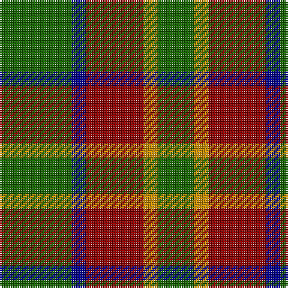

In pattern [GBRYG](/patterns/gbryg/).

This was sourced from tartans-authority.  It is a [5 stripes tartan](/stripes/stripes5/).

Original link http://www.tartansauthority.com/tartan-ferret/display/4119/

## Thread count
G/40 DB8 DR32 DY8 G/20

## Palette
Each colour and its ΔE from the base-6 reference it is a variant of.

| Colour | Shade | Base | ΔE (OKLab) |
|---|---|---|---|
| DB | <code style="background-color:#00008C;">#00008C</code> `#00008C` | B <code style="background-color:#2C4084;">#2C4084</code> | 0.13 |
| DR | <code style="background-color:#8C0000;">#8C0000</code> `#8C0000` | R <code style="background-color:#C80000;">#C80000</code> | 0.13 |
| DY | <code style="background-color:#C88C00;">#C88C00</code> `#C88C00` | Y <code style="background-color:#E8C000;">#E8C000</code> | 0.15 |
| G | <code style="background-color:#146400;">#146400</code> `#146400` | G <code style="background-color:#006400;">#006400</code> | 0.01 |

# Sample pattern

ID: /setts/s5/g40b8r32y8g20-b00008c-g146400-r8c0000-yc88c00/
