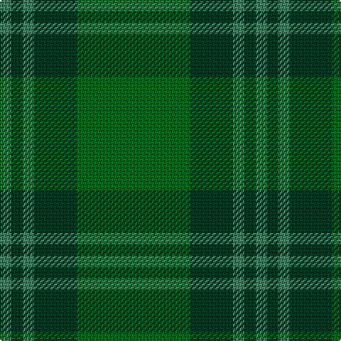

In pattern [GGGGG](/patterns/ggggg/).

This was sourced from tartans-authority.  It is a [5 stripes tartan](/stripes/stripes5/).

Original link http://www.tartansauthority.com/tartan-ferret/display/7990/

## Thread count
G/8 DG8 G8 DG30 Ga/80

## Palette
Each colour and its ΔE from the base-6 reference it is a variant of.

| Colour | Shade | Base | ΔE (OKLab) |
|---|---|---|---|
| DG | <code style="background-color:#003820;">#003820</code> `#003820` | G <code style="background-color:#006100;">#006100</code> | 0.15 |
| G | <code style="background-color:#408060;">#408060</code> `#408060` | G <code style="background-color:#006100;">#006100</code> | 0.14 |
| Ga | <code style="background-color:#006818;">#006818</code> `#006818` | G <code style="background-color:#006100;">#006100</code> | 0.02 |

# Sample pattern

## Nearest tartans

The nearest existing variants by ΔTartan distance.

1. [Emerald, The](/setts/s6/g2ga2gb7g10gb1ga1~g005448-ga289c18-gb006818~x4/) — ΔT 1.30
1. [Glen Boig](/setts/s5/g13ga3g1b3ga1~b4c3428-g006818-ga604000~x6/) — ΔT 1.38
1. [Erskine Hunting](/setts/s6/g5ga3g24ga24g3ga5~g003820-ga006818~x2/) — ΔT 1.48
1. [Park (Estate Check)](/setts/s6/g4ga18gb6ga6gb24y3~g5c6428-ga003820-gb285800-yb8a040~x2/) — ΔT 1.81
1. [Spring Morning (Fashion)](/setts/s4/g1ga9g9y1~g006818-ga74846c-yd09800~x4/) — ΔT 1.93
1. [Park Estate](/setts/s6/g4ga18gb6ga6gb24k3~g5c6428-ga003820-gb285800-k000000~x2/) — ΔT 1.97
1. [Gayre Bodyguard](/setts/s8/g18r6g75b6g13ga35g12b6~b2c4084-g005020-ga503c14-rdc0000/) — ΔT 1.98
1. [Glen Boig Trade Tartan Tartan Number: 915. Earliest known date: Modern Many new designs have been given district names to promote their Scottish connections. However, these names should not be confused with the District tartans which have earned their title through 'use and wont' and not a little history. See products available Copyright © Blair Urquhart, Comrie, 2015](/setts/s5/g37ga9g3b9ga3~b441800-g5c6428-ga604000~x2/) — ΔT 2.05
1. [Gates, Hunting](/setts/s9/g24ga3g4ga12g8ga3g8ga30b3~b1474b4-g006818-ga289c18~x2/) — ΔT 2.07
1. [Glen Boig](/setts/s5/g37r9g3b9r3~b401000-g006020-r806050~x2/) — ΔT 2.10

## Neighbour map

Every grey dot is one of 15726 variants placed by the first two principal components of the ΔTartan feature space (44% of its variance). Red is this tartan; blue dots are its nearest — click one to open its page.

<svg viewBox="0 0 640 380" role="img" style="max-width:100%;height:auto;border:1px solid #e0e0e0;border-radius:4px;display:block" xmlns="http://www.w3.org/2000/svg"><image href="/nn/cloud.v1.png" width="640" height="380"/><a href="/setts/s6/g2ga2gb7g10gb1ga1~g005448-ga289c18-gb006818~x4/"><circle cx="445.7" cy="298.4" r="4" fill="#3465a4"><title>Emerald, The</title></circle></a><a href="/setts/s5/g13ga3g1b3ga1~b4c3428-g006818-ga604000~x6/"><circle cx="568.5" cy="290.1" r="4" fill="#3465a4"><title>Glen Boig</title></circle></a><a href="/setts/s6/g5ga3g24ga24g3ga5~g003820-ga006818~x2/"><circle cx="476.0" cy="324.0" r="4" fill="#3465a4"><title>Erskine Hunting</title></circle></a><a href="/setts/s6/g4ga18gb6ga6gb24y3~g5c6428-ga003820-gb285800-yb8a040~x2/"><circle cx="376.0" cy="287.4" r="4" fill="#3465a4"><title>Park (Estate Check)</title></circle></a><a href="/setts/s4/g1ga9g9y1~g006818-ga74846c-yd09800~x4/"><circle cx="412.6" cy="301.9" r="4" fill="#3465a4"><title>Spring Morning (Fashion)</title></circle></a><a href="/setts/s6/g4ga18gb6ga6gb24k3~g5c6428-ga003820-gb285800-k000000~x2/"><circle cx="368.4" cy="286.0" r="4" fill="#3465a4"><title>Park Estate</title></circle></a><a href="/setts/s8/g18r6g75b6g13ga35g12b6~b2c4084-g005020-ga503c14-rdc0000/"><circle cx="540.9" cy="253.8" r="4" fill="#3465a4"><title>Gayre Bodyguard</title></circle></a><a href="/setts/s5/g37ga9g3b9ga3~b441800-g5c6428-ga604000~x2/"><circle cx="555.4" cy="283.3" r="4" fill="#3465a4"><title>Glen Boig Trade Tartan Tartan Number: 915. Earliest known date: Modern Many new designs have been given district names to promote their Scottish connections. However, these names should not be confused with the District tartans which have earned their title through 'use and wont' and not a little history. See products available Copyright © Blair Urquhart, Comrie, 2015</title></circle></a><a href="/setts/s9/g24ga3g4ga12g8ga3g8ga30b3~b1474b4-g006818-ga289c18~x2/"><circle cx="425.7" cy="270.1" r="4" fill="#3465a4"><title>Gates, Hunting</title></circle></a><a href="/setts/s5/g37r9g3b9r3~b401000-g006020-r806050~x2/"><circle cx="491.8" cy="263.1" r="4" fill="#3465a4"><title>Glen Boig</title></circle></a><circle cx="486.7" cy="291.5" r="5" fill="#c00000"/></svg>

ID: /setts/s5/g40ga15gb4ga4gb4~g006818-ga003820-gb408060~x2/
