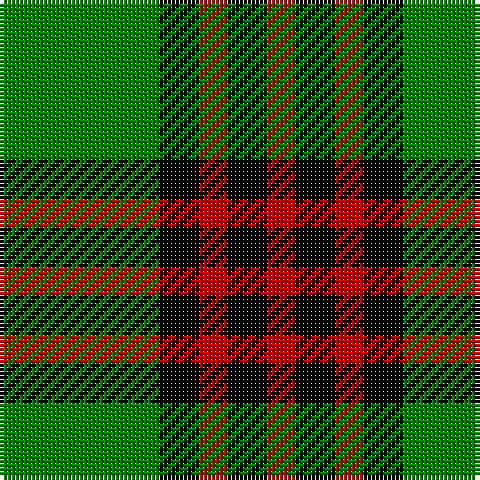

This page is one **sett** — a single exact thread-count. It belongs to the [tartan](/tartans/g40k10r7k10r7/)
(the same proportion at any scale), whose colour order is pattern [GKRKR](/stripes/gkrkr/).

Sourced from weddslist.  It is a [5 stripe tartan](/stripes/stripes5/).

Original link http://www.weddslist.com/cgi-bin/tartans/pg.pl?source=sts

2 attestations — the source records this cloth was collapsed from (oldest owns this page)

<ul>
<li>undated — Romsdal (weddslist, <a href="http://www.weddslist.com/cgi-bin/tartans/pg.pl?source=sts">record</a>)</li>
<li>undated — Romsdal District Tartan Tartan Number: 2087. Earliest known date: 1850-1900 Romsdal is where the Scottish army landed in 1612 under the command of Captain Sinclair and in the pay of the Swedes. They marched through half of Norway until defeated at Kringen. Sinclair was killed by a silver button used as a 'bullitt' (sic). Many Scots settled in Norway after the battle leaving place names such as Skottlia and Skotte. Romsdal is the only place on the west coast of Norway where there is a tradition of tartans. See products available Copyright © Blair Urquhart, Comrie, 2015 (house-of-tartan, <a href="http://www.house-of-tartan.scotland.net/house/TartanViewjs.asp?colr=Def&tnam=2087">record</a>)</li>
</ul>

## Thread count
G/40 K10 R7 K10 R/7

## Palette

Palette: <strong>Ingles Buchan</strong> <small style="color:#888">(1 of 3 colours)</small>
<table><thead><tr><th>Colour</th><th>Threads</th><th>Shade</th><th>Base</th><th>OKLCh</th></tr></thead><tbody><tr><td>G/</td><td style="text-align:right;font-variant-numeric:tabular-nums">40</td><td><code style="background-color:#008000;">#008000</code> <small style="color:#888">#008000</small></td><td>G <code style="background-color:#006100;">#006100</code></td><td><small style="color:#888">oklch(52.0% 0.177 142.5)</small></td></tr><tr><td>K</td><td style="text-align:right;font-variant-numeric:tabular-nums">10</td><td><code style="background-color:#000000;">#000000</code> <small style="color:#888">#000000</small></td><td>K <code style="background-color:#000000;">#000000</code></td><td><small style="color:#888">oklch(0.0% 0.000 0.0)</small></td></tr><tr><td>R</td><td style="text-align:right;font-variant-numeric:tabular-nums">7</td><td><code style="background-color:#C00000;">#C00000</code> <small style="color:#888">#C00000</small></td><td>R <code style="background-color:#CC0000;">#CC0000</code></td><td><small style="color:#888">oklch(50.7% 0.208 29.2)</small></td></tr><tr><td>K</td><td style="text-align:right;font-variant-numeric:tabular-nums">10</td><td><code style="background-color:#000000;">#000000</code> <small style="color:#888">#000000</small></td><td>K <code style="background-color:#000000;">#000000</code></td><td><small style="color:#888">oklch(0.0% 0.000 0.0)</small></td></tr><tr><td>R/</td><td style="text-align:right;font-variant-numeric:tabular-nums">7</td><td><code style="background-color:#C00000;">#C00000</code> <small style="color:#888">#C00000</small></td><td>R <code style="background-color:#CC0000;">#CC0000</code></td><td><small style="color:#888">oklch(50.7% 0.208 29.2)</small></td></tr></tbody></table>

# Sample pattern

## Nearest tartans

The nearest existing variants by ΔTartan distance, with this tartan at the top so the swatches line up against it.

ΔTartan

Tartan

Sett

—

<a href="/ttd/edit/#slug=g40k10r7k10r7">Romsdal</a> <a class="nn-out" href="/setts/s5/g40k10r7k10r7/" title="open its dictionary page">↗</a>

1.10

<a href="/ttd/edit/#slug=lr1ly6k6ly1~x2">Barclay Dress</a> <a class="nn-out" href="/setts/s4/lr1ly6k6ly1~x2/" title="open its dictionary page">↗</a>

1.10

<a href="/ttd/edit/#slug=lr1ly6k6ly1">Barclay Dress</a> <a class="nn-out" href="/setts/s4/lr1ly6k6ly1/" title="open its dictionary page">↗</a>

1.26

<a href="/setts/s4/k6ly1g6~x4/">Wilson's No.197</a>

1.37

<a href="/ttd/edit/#slug=r1k6g6ly1g6ly1~x6">Moore Caledonian (Personal)</a> <a class="nn-out" href="/setts/s6/r1k6g6ly1g6ly1~x6/" title="open its dictionary page">↗</a>

1.38

<a href="/ttd/edit/#slug=k9g3k3g12ly2~x4">MacArthur</a> <a class="nn-out" href="/setts/s5/k9g3k3g12ly2~x4/" title="open its dictionary page">↗</a>

1.40

<a href="/ttd/edit/#slug=w1ly6k6ly1~x2">Barclay Dress</a> <a class="nn-out" href="/setts/s4/w1ly6k6ly1~x2/" title="open its dictionary page">↗</a>

1.44

<a href="/ttd/edit/#slug=k4g33k33ly4~x2">Wallace, hunting</a> <a class="nn-out" href="/setts/s4/k4g33k33ly4~x2/" title="open its dictionary page">↗</a>

1.44

<a href="/ttd/edit/#slug=k7r3k24g28ly3~x2">Robert Gordon University</a> <a class="nn-out" href="/setts/s5/k7r3k24g28ly3~x2/" title="open its dictionary page">↗</a>

1.45

<a href="/ttd/edit/#slug=k3g15k20ly3~x2">Scotch Tape 2 (Corporate)</a> <a class="nn-out" href="/setts/s4/k3g15k20ly3~x2/" title="open its dictionary page">↗</a>

1.50

<a href="/ttd/edit/#slug=g7k1g7t1k6t1~x2">Innes</a> <a class="nn-out" href="/setts/s6/g7k1g7t1k6t1~x2/" title="open its dictionary page">↗</a>

## Neighbour map

Every grey dot is one of 14359 variants placed by the first two principal components of the ΔTartan feature space (44% of its variance). Red is this tartan; blue dots are its nearest — click one to open its page.

<svg viewBox="0 0 640 380" role="img" style="max-width:100%;height:auto;border:1px solid #e0e0e0;border-radius:4px;display:block" xmlns="http://www.w3.org/2000/svg"><image href="/nn/cloud.v1.png" width="640" height="380"/><a href="/setts/s4/lr1ly6k6ly1~x2/"><circle cx="241.0" cy="256.6" r="4" fill="#3465a4"><title>Barclay Dress</title></circle></a><a href="/setts/s4/lr1ly6k6ly1/"><circle cx="241.0" cy="256.6" r="4" fill="#3465a4"><title>Barclay Dress</title></circle></a><a href="/setts/s4/k6ly1g6~x4/"><circle cx="224.2" cy="273.3" r="4" fill="#3465a4"><title>Wilson's No.197</title></circle></a><a href="/setts/s6/r1k6g6ly1g6ly1~x6/"><circle cx="262.1" cy="244.3" r="4" fill="#3465a4"><title>Moore Caledonian (Personal)</title></circle></a><a href="/setts/s5/k9g3k3g12ly2~x4/"><circle cx="282.2" cy="279.7" r="4" fill="#3465a4"><title>MacArthur</title></circle></a><a href="/setts/s4/w1ly6k6ly1~x2/"><circle cx="233.8" cy="250.6" r="4" fill="#3465a4"><title>Barclay Dress</title></circle></a><a href="/setts/s4/k4g33k33ly4~x2/"><circle cx="273.1" cy="257.0" r="4" fill="#3465a4"><title>Wallace, hunting</title></circle></a><a href="/setts/s5/k7r3k24g28ly3~x2/"><circle cx="232.8" cy="215.9" r="4" fill="#3465a4"><title>Robert Gordon University</title></circle></a><a href="/setts/s4/k3g15k20ly3~x2/"><circle cx="311.5" cy="279.9" r="4" fill="#3465a4"><title>Scotch Tape 2 (Corporate)</title></circle></a><a href="/setts/s6/g7k1g7t1k6t1~x2/"><circle cx="297.9" cy="251.0" r="4" fill="#3465a4"><title>Innes</title></circle></a><circle cx="261.3" cy="246.2" r="5" fill="#c00000"/></svg>

ID: /setts/s5/g40k10r7k10r7/
