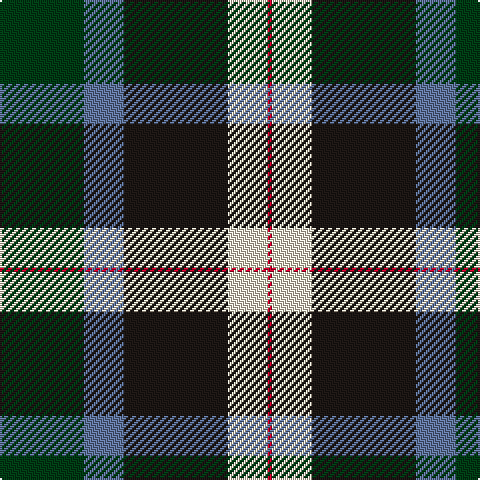

In pattern [GBKWR](/patterns/gbkwr/).

This was sourced from register-of-tartans.  It is a [5 stripes tartan](/stripes/stripes5/).

Original link https://www.tartanregister.gov.uk/tartanDetails.aspx?ref=10960

## Thread count
DG/42 B20 K52 W20 R/2

## Palette
Each colour and its ΔE from the base-6 reference it is a variant of.

| Colour | Shade | Base | ΔE (OKLab) |
|---|---|---|---|
| B | <code style="background-color:#5F749C;">#5F749C</code> `#5F749C` | B <code style="background-color:#2C4084;">#2C4084</code> | 0.17 |
| DG | <code style="background-color:#003C14;">#003C14</code> `#003C14` | G <code style="background-color:#006400;">#006400</code> | 0.14 |
| K | <code style="background-color:#1C1714;">#1C1714</code> `#1C1714` | K <code style="background-color:#000000;">#000000</code> | 0.21 |
| R | <code style="background-color:#C8002C;">#C8002C</code> `#C8002C` | R <code style="background-color:#C80000;">#C80000</code> | 0.03 |
| W | <code style="background-color:#F0E0C8;">#F0E0C8</code> `#F0E0C8` | W <code style="background-color:#F4F4F0;">#F4F4F0</code> | 0.06 |

# Sample pattern

## Nearest tartans

The nearest existing variants by ΔTartan distance.

1. [Charles-Carberry (Personal)](/setts/s5/g42b20k52y20r2-b2c2c80-g003820-k101010-rc80000-yc4bc68/) — ΔT 0.81
1. [Ferguson, Jerrfey S (Personal)](/setts/s6/g54b24k24r18k2y4-b2c2c80-g006818-k101010-rc80000-yfccc00/) — ΔT 1.14
1. [MacWilliam](/setts/s6/r4g24k20ra2b32ra4-b304080-g008000-k000000-r806050-rac00000/) — ΔT 1.16
1. [Ferguson, Jeffrey S (Personal)](/setts/s6/g54b24k24r18k2y4-b2c2c80-g285800-k101010-rdc0000-yffd700/) — ΔT 1.19
1. [Smith](/setts/s6/b6ba36k40g40k2y6-b5480b0-ba304080-g008000-k000000-yf0c000/) — ΔT 1.25
1. [Big Sur MacLaren (Personal)](/setts/s7/y62k36g26r6g26k2ya6-g005030-k101010-rc80000-y88acb8-yae8c000/) — ΔT 1.29
1. [Smith, Sir William (?)](/setts/s6/b6ba36k40g40k2y6-b5c8ca8-ba2c2c80-g006818-k101010-yfccc00/) — ΔT 1.32
1. [Ferguson - 1830 of Atholl (Clan)](/setts/s7/b36k20g12r8g12k2w4-b202060-g006818-k101010-rc80000-wfcfcfc/) — ΔT 1.39
1. [Gunn 2011, Robert (Personal)](/setts/s4/b40k40g40r2-b5f749c-g649848-k010512-rca2625/) — ΔT 1.39
1. [Colquhoun](/setts/s7/b8k4b32w2k16g48r8-b304080-g008000-k000000-rc00000-we0e0e0/) — ΔT 1.41

## Neighbour map

Every grey dot is one of 15726 variants placed by the first two principal components of the ΔTartan feature space (44% of its variance). Red is this tartan; blue dots are its nearest — click one to open its page.

<svg viewBox="0 0 640 380" role="img" style="max-width:100%;height:auto;border:1px solid #e0e0e0;border-radius:4px;display:block" xmlns="http://www.w3.org/2000/svg"><image href="/nn/cloud.v1.png" width="640" height="380"/><a href="/setts/s5/g42b20k52y20r2-b2c2c80-g003820-k101010-rc80000-yc4bc68/"><circle cx="194.5" cy="189.9" r="4" fill="#3465a4"><title>Charles-Carberry (Personal)</title></circle></a><a href="/setts/s6/g54b24k24r18k2y4-b2c2c80-g006818-k101010-rc80000-yfccc00/"><circle cx="225.1" cy="162.7" r="4" fill="#3465a4"><title>Ferguson, Jerrfey S (Personal)</title></circle></a><a href="/setts/s6/r4g24k20ra2b32ra4-b304080-g008000-k000000-r806050-rac00000/"><circle cx="166.0" cy="177.6" r="4" fill="#3465a4"><title>MacWilliam</title></circle></a><a href="/setts/s6/g54b24k24r18k2y4-b2c2c80-g285800-k101010-rdc0000-yffd700/"><circle cx="228.1" cy="162.1" r="4" fill="#3465a4"><title>Ferguson, Jeffrey S (Personal)</title></circle></a><a href="/setts/s6/b6ba36k40g40k2y6-b5480b0-ba304080-g008000-k000000-yf0c000/"><circle cx="143.9" cy="169.0" r="4" fill="#3465a4"><title>Smith</title></circle></a><a href="/setts/s7/y62k36g26r6g26k2ya6-g005030-k101010-rc80000-y88acb8-yae8c000/"><circle cx="193.9" cy="138.4" r="4" fill="#3465a4"><title>Big Sur MacLaren (Personal)</title></circle></a><a href="/setts/s6/b6ba36k40g40k2y6-b5c8ca8-ba2c2c80-g006818-k101010-yfccc00/"><circle cx="174.8" cy="180.5" r="4" fill="#3465a4"><title>Smith, Sir William (?)</title></circle></a><a href="/setts/s7/b36k20g12r8g12k2w4-b202060-g006818-k101010-rc80000-wfcfcfc/"><circle cx="185.1" cy="172.7" r="4" fill="#3465a4"><title>Ferguson - 1830 of Atholl (Clan)</title></circle></a><a href="/setts/s4/b40k40g40r2-b5f749c-g649848-k010512-rca2625/"><circle cx="172.7" cy="226.9" r="4" fill="#3465a4"><title>Gunn 2011, Robert (Personal)</title></circle></a><a href="/setts/s7/b8k4b32w2k16g48r8-b304080-g008000-k000000-rc00000-we0e0e0/"><circle cx="208.1" cy="146.8" r="4" fill="#3465a4"><title>Colquhoun</title></circle></a><circle cx="176.8" cy="178.6" r="5" fill="#c00000"/></svg>

ID: /setts/s5/g42b20k52w20r2-b5f749c-g003c14-k1c1714-rc8002c-wf0e0c8/
