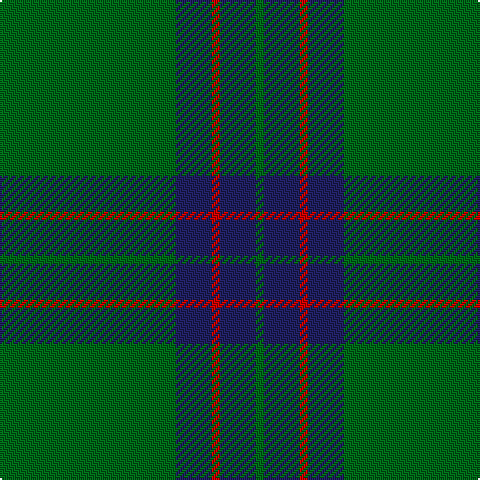

In pattern [GBRBG](/stripes/gbrbg/).

This was sourced from register-of-tartans.  It is a [5 stripe tartan](/stripes/stripes5/).

Original link https://www.tartanregister.gov.uk/tartanDetails.aspx?ref=4177

## Attestations

This cloth appears in 3 source records; the oldest owns this page.

- 01/01/1998 — Tyrconnell (Personal) (register-of-tartans, [record](https://www.tartanregister.gov.uk/tartanDetails.aspx?ref=4177))
- 1998 — Tyrconnell (Personal) (tartans-authority, [record](http://www.tartansauthority.com/tartan-ferret/display/2580/))
- undated — Tyrconnell (weddslist, [record](http://www.weddslist.com/cgi-bin/tartans/pg.pl?source=sts))

## Register references

External register numbers recorded for this tartan.

- Scottish Register of Tartans: [4177](https://www.tartanregister.gov.uk/tartanDetails.aspx?ref=4177)
- Scottish Tartans Authority (ITI): 2580
- Scottish Tartans World Register: 2580

## Thread count
G/88 DB18 R4 DB18 G/4

## Palette
Each colour and the base-6 reference it is a variant of.

| Colour | Shade | Base |
|---|---|---|
| DB | <code style="background-color:#202060;">#202060</code> `oklch(28.9% 0.111 276.9)` <small>#202060</small> | B <code style="background-color:#2A418A;">#2A418A</code> |
| G | <code style="background-color:#006818;">#006818</code> `oklch(45.0% 0.142 145.0)` <small>#006818</small> | G <code style="background-color:#006100;">#006100</code> |
| R | <code style="background-color:#C80000;">#C80000</code> `oklch(52.3% 0.215 29.2)` <small>#C80000</small> | R <code style="background-color:#CC0000;">#CC0000</code> |

# Sample pattern

## Nearest tartans

The nearest existing variants by ΔTartan distance.

1. [Fife, Duke Of](/setts/s6/dg32k6dg4k8r1k2~x4/) — ΔT 1.11
1. [Royal and Ancient, The](/setts/s6/g49db16dy3db2dy2db6~x2/) — ΔT 1.20
1. [Royal and Ancient, The](/setts/s6/g49db16o3db2o2db6~x2/) — ΔT 1.23
1. [Skene or Tribe of Mar](/setts/s5/r1k2dg16k2ly1~x2/) — ΔT 1.36
1. [St Andrews Old Course Hotel Corporate Tartan Tartan Number: 2332. Earliest known date: 1994 St Andrews Old Course Hotel, Golf Resort, and SPA See products available Copyright © Blair Urquhart, Comrie, 2015](/setts/s6/g50db20k3db2dy2db5~x2/) — ΔT 1.51
1. [Glen Trool (Fashion)](/setts/s5/dg42o10dg3r10o3~x2/) — ΔT 1.53
1. [Annapolis Valley](/setts/s6/g30t8g5lb4g5r2~x4/) — ΔT 1.53
1. [Duchess of Fife #2](/setts/s6/g70k26g12k14db3k16~x2/) — ΔT 1.62
1. [Annapolis Valley](/setts/s6/g30b8g5lb4g5r1~x4/) — ΔT 1.66
1. [Welsh National (District)](/setts/s5/r8g3r4g44w4~x2/) — ΔT 1.68

## Neighbour map

Every grey dot is one of 14299 variants placed by the first two principal components of the ΔTartan feature space (44% of its variance). Red is this tartan; blue dots are its nearest — click one to open its page.

<svg viewBox="0 0 640 380" role="img" style="max-width:100%;height:auto;border:1px solid #e0e0e0;border-radius:4px;display:block" xmlns="http://www.w3.org/2000/svg"><image href="/nn/cloud.v1.png" width="640" height="380"/><a href="/setts/s6/dg32k6dg4k8r1k2~x4/"><circle cx="530.4" cy="208.9" r="4" fill="#3465a4"><title>Fife, Duke Of</title></circle></a><a href="/setts/s6/g49db16dy3db2dy2db6~x2/"><circle cx="485.2" cy="209.5" r="4" fill="#3465a4"><title>Royal and Ancient, The</title></circle></a><a href="/setts/s6/g49db16o3db2o2db6~x2/"><circle cx="470.7" cy="201.6" r="4" fill="#3465a4"><title>Royal and Ancient, The</title></circle></a><a href="/setts/s5/r1k2dg16k2ly1~x2/"><circle cx="489.5" cy="201.3" r="4" fill="#3465a4"><title>Skene or Tribe of Mar</title></circle></a><a href="/setts/s6/g50db20k3db2dy2db5~x2/"><circle cx="447.4" cy="189.0" r="4" fill="#3465a4"><title>St Andrews Old Course Hotel Corporate Tartan Tartan Number: 2332. Earliest known date: 1994 St Andrews Old Course Hotel, Golf Resort, and SPA See products available Copyright © Blair Urquhart, Comrie, 2015</title></circle></a><a href="/setts/s5/dg42o10dg3r10o3~x2/"><circle cx="467.3" cy="240.5" r="4" fill="#3465a4"><title>Glen Trool (Fashion)</title></circle></a><a href="/setts/s6/g30t8g5lb4g5r2~x4/"><circle cx="478.3" cy="213.0" r="4" fill="#3465a4"><title>Annapolis Valley</title></circle></a><a href="/setts/s6/g70k26g12k14db3k16~x2/"><circle cx="420.0" cy="221.6" r="4" fill="#3465a4"><title>Duchess of Fife #2</title></circle></a><a href="/setts/s6/g30b8g5lb4g5r1~x4/"><circle cx="511.2" cy="183.6" r="4" fill="#3465a4"><title>Annapolis Valley</title></circle></a><a href="/setts/s5/r8g3r4g44w4~x2/"><circle cx="504.5" cy="208.0" r="4" fill="#3465a4"><title>Welsh National (District)</title></circle></a><circle cx="512.9" cy="221.1" r="5" fill="#c00000"/></svg>

ID: /setts/s5/g44db9r2db9g2~x2/
