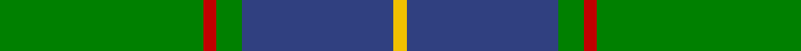
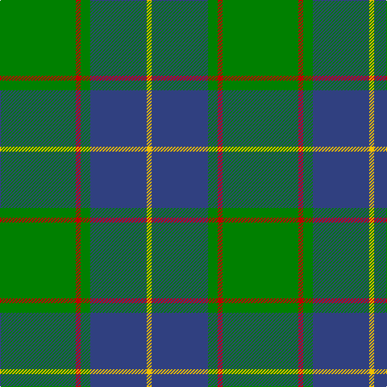

In pattern [GRGBY](/stripes/grgby/).

This was sourced from weddslist.  It is a [5 stripe tartan](/stripes/stripes5/).

Original link http://www.weddslist.com/cgi-bin/tartans/pg.pl?source=sts

## Thread count
G/94 R6 G12 B70 Y/6

## Palette
Each colour and the base-6 reference it is a variant of.

| Colour | Shade | Base |
|---|---|---|
| B | <code style="background-color:#304080;">#304080</code> `oklch(39.4% 0.109 270.2)` <small>#304080</small> | B <code style="background-color:#2A418A;">#2A418A</code> |
| G | <code style="background-color:#008000;">#008000</code> `oklch(52.0% 0.177 142.5)` <small>#008000</small> | G <code style="background-color:#006100;">#006100</code> |
| R | <code style="background-color:#C00000;">#C00000</code> `oklch(50.7% 0.208 29.2)` <small>#C00000</small> | R <code style="background-color:#CC0000;">#CC0000</code> |
| Y | <code style="background-color:#F0C000;">#F0C000</code> `oklch(82.7% 0.169 90.5)` <small>#F0C000</small> | Y <code style="background-color:#F2BF00;">#F2BF00</code> |

# Sample pattern

## Nearest tartans

The nearest existing variants by ΔTartan distance.

1. [Irving of Bonshaw](/setts/s5/g27db14k2db2ly2~x4/) — ΔT 0.49
1. [Irvine](/setts/s5/g18db9k1db1w1~x4/) — ΔT 0.78
1. [Wilson's No.174](/setts/s4/t1db4g10ly1~x2/) — ΔT 1.05
1. [Robert Byers Family - Dooballagh, Ireland](/setts/s4/k5g40db20ly3~x2/) — ΔT 1.07
1. [Wilson's, No 205](/setts/s4/t1db4g10w1~x2/) — ΔT 1.08
1. [Herbage Family Tartan Tartan Number: 811. Earliest known date: 1983 Designed by the Scottish Tartans Society for Mr Herbage, Laggan. See products available Copyright © Blair Urquhart, Comrie, 2015](/setts/s5/g25k8o10r1o3~x4/) — ΔT 1.18
1. [Rowan (Personal)](/setts/s5/g12lo1db8k1db1~x4/) — ΔT 1.19
1. [Shaw (Clan 1)](/setts/s6/g24k2db3k2db8r2~x2/) — ΔT 1.20
1. [St Andrews Hotel, Golf Resort, and SPA](/setts/s6/g50db20k3db2o2db5~x2/) — ΔT 1.20
1. [Leatherneck, U.S.Marine Corps](/setts/s8/g28r2g2r2g8db24y3r2~x2/) — ΔT 1.24

## Neighbour map

Every grey dot is one of 14299 variants placed by the first two principal components of the ΔTartan feature space (44% of its variance). Red is this tartan; blue dots are its nearest — click one to open its page.

<svg viewBox="0 0 640 380" role="img" style="max-width:100%;height:auto;border:1px solid #e0e0e0;border-radius:4px;display:block" xmlns="http://www.w3.org/2000/svg"><image href="/nn/cloud.v1.png" width="640" height="380"/><a href="/setts/s5/g27db14k2db2ly2~x4/"><circle cx="353.5" cy="209.1" r="4" fill="#3465a4"><title>Irving of Bonshaw</title></circle></a><a href="/setts/s5/g18db9k1db1w1~x4/"><circle cx="379.9" cy="193.3" r="4" fill="#3465a4"><title>Irvine</title></circle></a><a href="/setts/s4/t1db4g10ly1~x2/"><circle cx="362.6" cy="241.7" r="4" fill="#3465a4"><title>Wilson's No.174</title></circle></a><a href="/setts/s4/k5g40db20ly3~x2/"><circle cx="353.5" cy="237.3" r="4" fill="#3465a4"><title>Robert Byers Family - Dooballagh, Ireland</title></circle></a><a href="/setts/s4/t1db4g10w1~x2/"><circle cx="360.2" cy="240.0" r="4" fill="#3465a4"><title>Wilson's, No 205</title></circle></a><a href="/setts/s5/g25k8o10r1o3~x4/"><circle cx="339.6" cy="198.8" r="4" fill="#3465a4"><title>Herbage Family Tartan Tartan Number: 811. Earliest known date: 1983 Designed by the Scottish Tartans Society for Mr Herbage, Laggan. See products available Copyright © Blair Urquhart, Comrie, 2015</title></circle></a><a href="/setts/s5/g12lo1db8k1db1~x4/"><circle cx="340.2" cy="226.0" r="4" fill="#3465a4"><title>Rowan (Personal)</title></circle></a><a href="/setts/s6/g24k2db3k2db8r2~x2/"><circle cx="369.8" cy="208.6" r="4" fill="#3465a4"><title>Shaw (Clan 1)</title></circle></a><a href="/setts/s6/g50db20k3db2o2db5~x2/"><circle cx="416.7" cy="173.4" r="4" fill="#3465a4"><title>St Andrews Hotel, Golf Resort, and SPA</title></circle></a><a href="/setts/s8/g28r2g2r2g8db24y3r2~x2/"><circle cx="341.3" cy="187.0" r="4" fill="#3465a4"><title>Leatherneck, U.S.Marine Corps</title></circle></a><circle cx="364.4" cy="212.4" r="5" fill="#c00000"/></svg>

ID: /setts/s5/g47r3g6db35ly3~x2/
