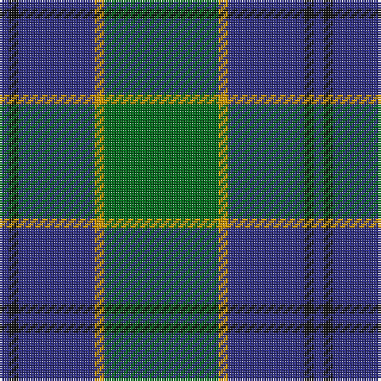

In pattern [BKBYG](/patterns/bkbyg/).

This was sourced from register-of-tartans.  It is a [5 stripes tartan](/stripes/stripes5/).

Original link https://www.tartanregister.gov.uk/tartanDetails.aspx?ref=3580

## Thread count
DB/4 K4 DB32 DY4 G/48

## Palette
Each colour and its ΔE from the base-6 reference it is a variant of.

| Colour | Shade | Base | ΔE (OKLab) |
|---|---|---|---|
| DB | <code style="background-color:#2C2C80;">#2C2C80</code> `#2C2C80` | B <code style="background-color:#2C4084;">#2C4084</code> | 0.05 |
| DY | <code style="background-color:#D09800;">#D09800</code> `#D09800` | Y <code style="background-color:#E8C000;">#E8C000</code> | 0.11 |
| G | <code style="background-color:#006818;">#006818</code> `#006818` | G <code style="background-color:#006400;">#006400</code> | 0.02 |
| K | <code style="background-color:#101010;">#101010</code> `#101010` | K <code style="background-color:#000000;">#000000</code> | 0.17 |

# Sample pattern

## Nearest tartans

The nearest existing variants by ΔTartan distance.

1. [MacIntyre](/setts/s6/g8b24r6b24g64w8-b304080-g004010-rc00000-we0e0e0/) — ΔT 0.74
1. [Hector James](/setts/s5/r4g22b54g10ra4-b304080-g008000-r806050-rac00000/) — ΔT 0.81
1. [St. Andrews Old Course Hotel (Corp)](/setts/s6/g104b40k12b8ga8b40-b1c0070-g006818-ga604000-k101010/) — ΔT 0.85
1. [Shaw (Clan 1)](/setts/s6/g48k4b6k4b16r4-b2c2c80-g006818-k101010-rc80000/) — ΔT 0.88
1. [Gracie (Name)](/setts/s5/g94r6g12b70y6-b1c0070-g006818-r880000-yd09800/) — ΔT 0.89
1. [MacIntyre Hunting Clan Tartan Tartan Number: 743. Earliest known date: 1800 There is a doublet in Kingussie Museum dated 1800 in this tartan. It also appeared in the Vestiarium Scoticum (1842). See products available Copyright © Blair Urquhart, Comrie, 2015](/setts/s6/g8b24r6b24g64w8-b2c2c80-g006818-rc80000-we0e0e0/) — ΔT 0.93
1. [MacIntyre LC](/setts/s6/g8b24r6b24g64y8-b000052-g11450d-raa0000-yaaaaaa/) — ΔT 1.04
1. [MacIntyre LC](/setts/s6/g4b12r3b12g32y4-b000052-g11450d-raa0000-yaaaaaa/) — ΔT 1.04
1. [Davidson, Half](/setts/s6/k6g44b6g6b38r6-b2c2c80-g006818-k101010-rc80000/) — ΔT 1.05
1. [St. Andrew Society, Sao Paulo (Corp)](/setts/s6/b10w6b72g76y10g10-b2c2c80-g006818-we0e0e0-ye8c000/) — ΔT 1.05

## Neighbour map

Every grey dot is one of 15726 variants placed by the first two principal components of the ΔTartan feature space (44% of its variance). Red is this tartan; blue dots are its nearest — click one to open its page.

<svg viewBox="0 0 640 380" role="img" style="max-width:100%;height:auto;border:1px solid #e0e0e0;border-radius:4px;display:block" xmlns="http://www.w3.org/2000/svg"><image href="/nn/cloud.v1.png" width="640" height="380"/><a href="/setts/s6/g8b24r6b24g64w8-b304080-g004010-rc00000-we0e0e0/"><circle cx="320.6" cy="221.8" r="4" fill="#3465a4"><title>MacIntyre</title></circle></a><a href="/setts/s5/r4g22b54g10ra4-b304080-g008000-r806050-rac00000/"><circle cx="376.5" cy="218.9" r="4" fill="#3465a4"><title>Hector James</title></circle></a><a href="/setts/s6/g104b40k12b8ga8b40-b1c0070-g006818-ga604000-k101010/"><circle cx="311.9" cy="212.9" r="4" fill="#3465a4"><title>St. Andrews Old Course Hotel (Corp)</title></circle></a><a href="/setts/s6/g48k4b6k4b16r4-b2c2c80-g006818-k101010-rc80000/"><circle cx="366.7" cy="203.8" r="4" fill="#3465a4"><title>Shaw (Clan 1)</title></circle></a><a href="/setts/s5/g94r6g12b70y6-b1c0070-g006818-r880000-yd09800/"><circle cx="354.0" cy="207.1" r="4" fill="#3465a4"><title>Gracie (Name)</title></circle></a><a href="/setts/s6/g8b24r6b24g64w8-b2c2c80-g006818-rc80000-we0e0e0/"><circle cx="303.6" cy="213.4" r="4" fill="#3465a4"><title>MacIntyre Hunting Clan Tartan Tartan Number: 743. Earliest known date: 1800 There is a doublet in Kingussie Museum dated 1800 in this tartan. It also appeared in the Vestiarium Scoticum (1842). See products available Copyright © Blair Urquhart, Comrie, 2015</title></circle></a><a href="/setts/s6/g8b24r6b24g64y8-b000052-g11450d-raa0000-yaaaaaa/"><circle cx="319.1" cy="224.4" r="4" fill="#3465a4"><title>MacIntyre LC</title></circle></a><a href="/setts/s6/g4b12r3b12g32y4-b000052-g11450d-raa0000-yaaaaaa/"><circle cx="319.1" cy="224.4" r="4" fill="#3465a4"><title>MacIntyre LC</title></circle></a><a href="/setts/s6/k6g44b6g6b38r6-b2c2c80-g006818-k101010-rc80000/"><circle cx="288.8" cy="234.4" r="4" fill="#3465a4"><title>Davidson, Half</title></circle></a><a href="/setts/s6/b10w6b72g76y10g10-b2c2c80-g006818-we0e0e0-ye8c000/"><circle cx="290.6" cy="198.9" r="4" fill="#3465a4"><title>St. Andrew Society, Sao Paulo (Corp)</title></circle></a><circle cx="337.2" cy="221.4" r="5" fill="#c00000"/></svg>

ID: /setts/s5/g48y4b32k4b4-b2c2c80-g006818-k101010-yd09800/
