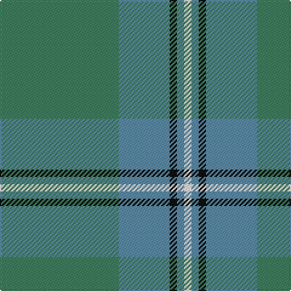

**Bands:** [GBKBW](/stripes/gbkbw/) · **Stripes:** [G T K T W](/stripes/stripes5/) G T K T W

This was sourced from tartans-authority.  It is a [5 band tartan](/bands/bands5/).

Original link http://www.tartansauthority.com/tartan-ferret/display/733/

## Thread count
G/98 B42 K6 B6 W/6

## Palette
Each colour and its ΔE from the base-6 reference it is a variant of.

| Colour | Shade | Base | ΔE (OKLab) |
|---|---|---|---|
| B | <code style="background-color:#5C8CA8;">#5C8CA8</code> `#5C8CA8` | B <code style="background-color:#2A418A;">#2A418A</code> | 0.23 |
| G | <code style="background-color:#408060;">#408060</code> `#408060` | G <code style="background-color:#006100;">#006100</code> | 0.14 |
| K | <code style="background-color:#101010;">#101010</code> `#101010` | K <code style="background-color:#000000;">#000000</code> | 0.17 |
| W | <code style="background-color:#FCFCFC;">#FCFCFC</code> `#FCFCFC` | W <code style="background-color:#F7F7F7;">#F7F7F7</code> | 0.01 |

# Sample pattern

## Nearest tartans

The nearest existing variants by ΔTartan distance.

1. [Farooq (Personal)](/setts/s4/n8g20w4r1~x5/) — ΔT 1.38
1. [Castle Bay (Fashion)](/setts/s5/g40w2y5g5y15~x2/) — ΔT 1.49
1. [Irving of Bonshaw](/setts/s5/g27g14dt2g2ly2~x4/) — ΔT 1.54
1. [Johore (District)](/setts/s5/o57w5g20o5lo10~x2/) — ΔT 1.59
1. [Irvine of Drum](/setts/s8/t3k3t21g49t21k3t3w3~x2/) — ΔT 1.69
1. [Jahore](/setts/s5/y57w5g20y5ly10/) — ΔT 1.81
1. [Exabyte](/setts/s5/r3n34db4g47lb3~x2/) — ΔT 1.84
1. [Gordon Cumming (Artefact)](/setts/s6/ly10g30g25g30k2g3~x2/) — ΔT 1.85
1. [Palm Beach Gardens Police](/setts/s6/g32t6g12t28r2db1~x2/) — ΔT 1.89
1. [Lockhart](/setts/s9/g13k2g34k6b16r2b16k2g13~x2/) — ΔT 1.90

## Neighbour map

Every grey dot is one of 14299 variants placed by the first two principal components of the ΔTartan feature space (44% of its variance). Red is this tartan; blue dots are its nearest — click one to open its page.

<svg viewBox="0 0 640 380" role="img" style="max-width:100%;height:auto;border:1px solid #e0e0e0;border-radius:4px;display:block" xmlns="http://www.w3.org/2000/svg"><image href="/nn/cloud.v1.png" width="640" height="380"/><a href="/setts/s4/n8g20w4r1~x5/"><circle cx="415.3" cy="231.4" r="4" fill="#3465a4"><title>Farooq (Personal)</title></circle></a><a href="/setts/s5/g40w2y5g5y15~x2/"><circle cx="463.6" cy="238.2" r="4" fill="#3465a4"><title>Castle Bay (Fashion)</title></circle></a><a href="/setts/s5/g27g14dt2g2ly2~x4/"><circle cx="424.7" cy="250.5" r="4" fill="#3465a4"><title>Irving of Bonshaw</title></circle></a><a href="/setts/s5/o57w5g20o5lo10~x2/"><circle cx="421.5" cy="228.8" r="4" fill="#3465a4"><title>Johore (District)</title></circle></a><a href="/setts/s8/t3k3t21g49t21k3t3w3~x2/"><circle cx="367.5" cy="200.7" r="4" fill="#3465a4"><title>Irvine of Drum</title></circle></a><a href="/setts/s5/y57w5g20y5ly10/"><circle cx="410.0" cy="223.1" r="4" fill="#3465a4"><title>Jahore</title></circle></a><a href="/setts/s5/r3n34db4g47lb3~x2/"><circle cx="380.6" cy="226.0" r="4" fill="#3465a4"><title>Exabyte</title></circle></a><a href="/setts/s6/ly10g30g25g30k2g3~x2/"><circle cx="418.4" cy="261.6" r="4" fill="#3465a4"><title>Gordon Cumming (Artefact)</title></circle></a><a href="/setts/s6/g32t6g12t28r2db1~x2/"><circle cx="456.0" cy="226.0" r="4" fill="#3465a4"><title>Palm Beach Gardens Police</title></circle></a><a href="/setts/s9/g13k2g34k6b16r2b16k2g13~x2/"><circle cx="373.9" cy="213.3" r="4" fill="#3465a4"><title>Lockhart</title></circle></a><circle cx="452.0" cy="226.8" r="5" fill="#c00000"/></svg>

ID: /setts/s5/g49t21k3t3w3~x2/
