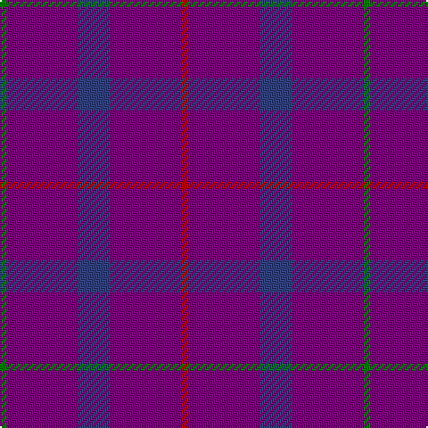

In pattern [GBBBR](/patterns/gbbbr/).

This was sourced from weddslist.  It is a [5 stripes tartan](/stripes/stripes5/).

Original link http://www.weddslist.com/cgi-bin/tartans/pg.pl?source=sts

## Thread count
G/4 P40 B18 P40 R/4

## Palette
Each colour and its ΔE from the base-6 reference it is a variant of.

| Colour | Shade | Base | ΔE (OKLab) |
|---|---|---|---|
| B | <code style="background-color:#304080;">#304080</code> `#304080` | B <code style="background-color:#2C4084;">#2C4084</code> | 0.01 |
| G | <code style="background-color:#008000;">#008000</code> `#008000` | G <code style="background-color:#006400;">#006400</code> | 0.09 |
| P | <code style="background-color:#800080;">#800080</code> `#800080` | B <code style="background-color:#2C4084;">#2C4084</code> | 0.17 |
| R | <code style="background-color:#C00000;">#C00000</code> `#C00000` | R <code style="background-color:#C80000;">#C80000</code> | 0.02 |

# Sample pattern

## Nearest tartans

The nearest existing variants by ΔTartan distance.

1. [Scottish Netball (1987) (Corporate)](/setts/s5/g4b40ba18b40r4-b780078-ba2c2c80-g006818-rc80000/) — ΔT 0.47
1. [Highland Spring Corporate Tartan Tartan Number: 130. Earliest known date: 1987 Highland Spring manufacture bottled drinking water at Blackford in Perthshire, Scotland. See products available Copyright © Blair Urquhart, Comrie, 2015](/setts/s4/b10g4b38r10-b780078-g006818-rc80000/) — ΔT 1.78
1. [Scottish Netball Association (1987)](/setts/s8/b40ba18b40r4b40ba18b40g4-b780078-ba2c2c80-g006818-rc80000/) — ΔT 1.88
1. [Highland Spring](/setts/s4/b10g6b38r10-b800080-g008000-rc00000/) — ΔT 2.26
1. [Meanwood McMain (Personal)](/setts/s9/b60ba20r10ba20b60ba6bb10ba6b60-b440044-ba2c2c80-bb780078-rb468ac/) — ΔT 2.29
1. [Elliot (Clan)](/setts/s4/b88g24b18r6-b2c2c80-g604000-r901c38/) — ΔT 2.67
1. [McIntosh, Stuart (Personal)](/setts/s6/b40ba16g16bb16b66r6-b780078-ba2888c4-bb1c1c50-g006818-rc80000/) — ΔT 2.68
1. [Elliot](/setts/s6/b18g24b88g24b18r6-b2c2c80-g604000-r901c38/) — ΔT 2.68
1. [Elliot](/setts/s4/b32r8b6ra2-b304080-r802040-rac00000/) — ΔT 2.71
1. [Highland Spring (1988)](/setts/s6/b12g4b36r12b36g4-b440044-g006818-rc80000/) — ΔT 2.75

## Neighbour map

Every grey dot is one of 15726 variants placed by the first two principal components of the ΔTartan feature space (44% of its variance). Red is this tartan; blue dots are its nearest — click one to open its page.

<svg viewBox="0 0 640 380" role="img" style="max-width:100%;height:auto;border:1px solid #e0e0e0;border-radius:4px;display:block" xmlns="http://www.w3.org/2000/svg"><image href="/nn/cloud.v1.png" width="640" height="380"/><a href="/setts/s5/g4b40ba18b40r4-b780078-ba2c2c80-g006818-rc80000/"><circle cx="557.0" cy="273.3" r="4" fill="#3465a4"><title>Scottish Netball (1987) (Corporate)</title></circle></a><a href="/setts/s4/b10g4b38r10-b780078-g006818-rc80000/"><circle cx="564.7" cy="268.7" r="4" fill="#3465a4"><title>Highland Spring Corporate Tartan Tartan Number: 130. Earliest known date: 1987 Highland Spring manufacture bottled drinking water at Blackford in Perthshire, Scotland. See products available Copyright © Blair Urquhart, Comrie, 2015</title></circle></a><a href="/setts/s8/b40ba18b40r4b40ba18b40g4-b780078-ba2c2c80-g006818-rc80000/"><circle cx="586.5" cy="284.1" r="4" fill="#3465a4"><title>Scottish Netball Association (1987)</title></circle></a><a href="/setts/s4/b10g6b38r10-b800080-g008000-rc00000/"><circle cx="504.6" cy="277.6" r="4" fill="#3465a4"><title>Highland Spring</title></circle></a><a href="/setts/s9/b60ba20r10ba20b60ba6bb10ba6b60-b440044-ba2c2c80-bb780078-rb468ac/"><circle cx="538.3" cy="260.9" r="4" fill="#3465a4"><title>Meanwood McMain (Personal)</title></circle></a><a href="/setts/s4/b88g24b18r6-b2c2c80-g604000-r901c38/"><circle cx="611.6" cy="281.4" r="4" fill="#3465a4"><title>Elliot (Clan)</title></circle></a><a href="/setts/s6/b40ba16g16bb16b66r6-b780078-ba2888c4-bb1c1c50-g006818-rc80000/"><circle cx="386.6" cy="212.3" r="4" fill="#3465a4"><title>McIntosh, Stuart (Personal)</title></circle></a><a href="/setts/s6/b18g24b88g24b18r6-b2c2c80-g604000-r901c38/"><circle cx="531.0" cy="258.7" r="4" fill="#3465a4"><title>Elliot</title></circle></a><a href="/setts/s4/b32r8b6ra2-b304080-r802040-rac00000/"><circle cx="626.0" cy="281.1" r="4" fill="#3465a4"><title>Elliot</title></circle></a><a href="/setts/s6/b12g4b36r12b36g4-b440044-g006818-rc80000/"><circle cx="554.0" cy="262.5" r="4" fill="#3465a4"><title>Highland Spring (1988)</title></circle></a><circle cx="544.8" cy="266.3" r="5" fill="#c00000"/></svg>

ID: /setts/s5/g4b40ba18b40r4-b800080-ba304080-g008000-rc00000/
