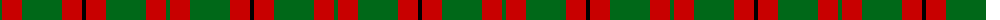

In pattern [GRGRK](/patterns/grgrk/).

This was sourced from register-of-tartans.  It is a [5 stripes tartan](/stripes/stripes5/).

Original link https://www.tartanregister.gov.uk/tartanDetails.aspx?ref=3076

## Attestations

This cloth appears in 2 source records; the oldest owns this page.

- 01/01/1745 — Murray, Lord George (Hose) (register-of-tartans, [record](https://www.tartanregister.gov.uk/tartanDetails.aspx?ref=3076))
- 1745 — Murray, Lord George (Hose) (tartans-authority, [record](http://www.tartansauthority.com/tartan-ferret/display/5644/))

## Thread count
G/4 R20 G40 R20 K/4

## Palette
Each colour and its ΔE from the base-6 reference it is a variant of.

| Colour | Shade | Base | ΔE (OKLab) |
|---|---|---|---|
| G | <code style="background-color:#006818;">#006818</code> `#006818` | G <code style="background-color:#006100;">#006100</code> | 0.02 |
| K | <code style="background-color:#000000;">#000000</code> `#000000` | K <code style="background-color:#000000;">#000000</code> | 0.00 |
| R | <code style="background-color:#C80000;">#C80000</code> `#C80000` | R <code style="background-color:#CC0000;">#CC0000</code> | 0.01 |

# Sample pattern

## Nearest tartans

The nearest existing variants by ΔTartan distance.

1. [MacDonald, Lord of the Isles](/setts/s5/g32r10g4r36k4-g008000-k000000-rc00000/) — ΔT 0.57
1. [MacDonald, Lord of The Isles (Artef)](/setts/s5/g32r10g4r36k4-g006818-k101010-rc80000/) — ΔT 0.77
1. [Lugo (2013)](/setts/s4/r80g32y8g32-g003820-rb03000-ye0a126/) — ΔT 0.99
1. [MacKinnon 11](/setts/s4/r12g80r100w12-g008000-rc00000-we0e0e0/) — ΔT 1.00
1. [MacDonald Lord of the Isles #2](/setts/s5/g32r10g4r36k4-g005020-k101010-rdc0000/) — ΔT 1.00
1. [MacGregor of Balquhidder](/setts/s5/g16r4g18r32w2-g005020-rdc0000-we0e0e0/) — ΔT 1.01
1. [MacDonald of Glenaladale (symmetrical)](/setts/s6/g10w4r54g54r10w4-g006818-rc80000-we0e0e0/) — ΔT 1.07
1. [Bryce](/setts/s4/r4g28r36y4-g008000-rc00000-yf0c000/) — ΔT 1.08
1. [Prince of Orange](/setts/s4/b12ba56y40b6-b5c8ca8-ba441800-yd87c00/) — ΔT 1.09
1. [Bryce Family Tartan Tartan Number: 1537. Earliest known date: c.1953 The threadcount for the Bryce tartan was supplied by J. Dalgety Esq., of Forfar who in turn obtained it from the late James Cant of Dundee. There is a marked similarity with the Bruce tartan, but there is no historical link between the names. Bruce derives from Robert de Bruis (or Brus), whereas Bryce derives from St Bricius, a Gaulish saint from the 5th century. An old Lennox family of Bryce is known to have fought along side the MacFarlanes in 1619, and although the Lennoxes are acknowledged as a name within the clan, only descendants of this particular Bryce family could claim protection from Clan MacFarlane. However, no such distinction prevents all of the name Bryce from wearing the Bryce tartan. See products available Copyright © Blair Urquhart, Comrie, 2015](/setts/s4/r4g28r36y4-g006818-rc80000-ye8c000/) — ΔT 1.11

## Neighbour map

Every grey dot is one of 15726 variants placed by the first two principal components of the ΔTartan feature space (44% of its variance). Red is this tartan; blue dots are its nearest — click one to open its page.

<svg viewBox="0 0 640 380" role="img" style="max-width:100%;height:auto;border:1px solid #e0e0e0;border-radius:4px;display:block" xmlns="http://www.w3.org/2000/svg"><image href="/nn/cloud.v1.png" width="640" height="380"/><a href="/setts/s5/g32r10g4r36k4-g008000-k000000-rc00000/"><circle cx="335.1" cy="233.6" r="4" fill="#3465a4"><title>MacDonald, Lord of the Isles</title></circle></a><a href="/setts/s5/g32r10g4r36k4-g006818-k101010-rc80000/"><circle cx="353.9" cy="240.3" r="4" fill="#3465a4"><title>MacDonald, Lord of The Isles (Artef)</title></circle></a><a href="/setts/s4/r80g32y8g32-g003820-rb03000-ye0a126/"><circle cx="351.0" cy="262.8" r="4" fill="#3465a4"><title>Lugo (2013)</title></circle></a><a href="/setts/s4/r12g80r100w12-g008000-rc00000-we0e0e0/"><circle cx="341.8" cy="247.6" r="4" fill="#3465a4"><title>MacKinnon 11</title></circle></a><a href="/setts/s5/g32r10g4r36k4-g005020-k101010-rdc0000/"><circle cx="344.8" cy="234.0" r="4" fill="#3465a4"><title>MacDonald Lord of the Isles #2</title></circle></a><a href="/setts/s5/g16r4g18r32w2-g005020-rdc0000-we0e0e0/"><circle cx="347.8" cy="218.3" r="4" fill="#3465a4"><title>MacGregor of Balquhidder</title></circle></a><a href="/setts/s6/g10w4r54g54r10w4-g006818-rc80000-we0e0e0/"><circle cx="335.3" cy="199.4" r="4" fill="#3465a4"><title>MacDonald of Glenaladale (symmetrical)</title></circle></a><a href="/setts/s4/r4g28r36y4-g008000-rc00000-yf0c000/"><circle cx="358.1" cy="246.8" r="4" fill="#3465a4"><title>Bryce</title></circle></a><a href="/setts/s4/b12ba56y40b6-b5c8ca8-ba441800-yd87c00/"><circle cx="284.0" cy="245.8" r="4" fill="#3465a4"><title>Prince of Orange</title></circle></a><a href="/setts/s4/r4g28r36y4-g006818-rc80000-ye8c000/"><circle cx="362.3" cy="247.7" r="4" fill="#3465a4"><title>Bryce Family Tartan Tartan Number: 1537. Earliest known date: c.1953 The threadcount for the Bryce tartan was supplied by J. Dalgety Esq., of Forfar who in turn obtained it from the late James Cant of Dundee. There is a marked similarity with the Bruce tartan, but there is no historical link between the names. Bruce derives from Robert de Bruis (or Brus), whereas Bryce derives from St Bricius, a Gaulish saint from the 5th century. An old Lennox family of Bryce is known to have fought along side the MacFarlanes in 1619, and although the Lennoxes are acknowledged as a name within the clan, only descendants of this particular Bryce family could claim protection from Clan MacFarlane. However, no such distinction prevents all of the name Bryce from wearing the Bryce tartan. See products available Copyright © Blair Urquhart, Comrie, 2015</title></circle></a><circle cx="324.9" cy="239.8" r="5" fill="#c00000"/></svg>

ID: /setts/s5/g4r20g40r20k4-g006818-k000000-rc80000/
