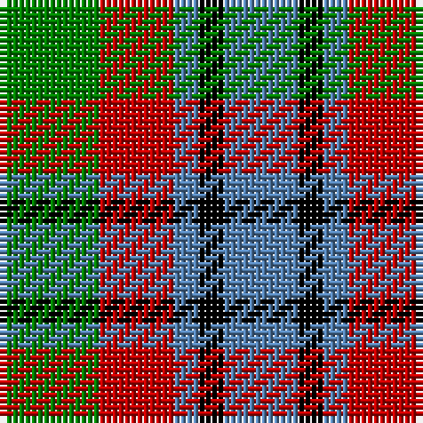

This page is one **sett** — a single exact thread-count. It belongs to the [tartan](/tartans/g4r3t1k1t3/)
(the same proportion at any scale), whose colour order is pattern [BKBRG](/stripes/bkbrg/).

Sourced from weddslist.  It is a [5 stripe tartan](/stripes/stripes5/).

Original link http://www.weddslist.com/cgi-bin/tartans/pg.pl?source=sts

## Also known as

This cloth is also recorded under:

- Wilson's, No 214

## Thread count
G/16 R12 B4 K4 B/12

## Palette

Palette: <strong>Ingles Buchan</strong> <small style="color:#888">(1 of 4 colours)</small>
<table><thead><tr><th>Colour</th><th>Threads</th><th>Shade</th><th>Base</th><th>OKLCh</th></tr></thead><tbody><tr><td>G/</td><td style="text-align:right;font-variant-numeric:tabular-nums">16</td><td><code style="background-color:#008000;">#008000</code> <small style="color:#888">#008000</small></td><td>G <code style="background-color:#006100;">#006100</code></td><td><small style="color:#888">oklch(52.0% 0.177 142.5)</small></td></tr><tr><td>R</td><td style="text-align:right;font-variant-numeric:tabular-nums">12</td><td><code style="background-color:#C00000;">#C00000</code> <small style="color:#888">#C00000</small></td><td>R <code style="background-color:#CC0000;">#CC0000</code></td><td><small style="color:#888">oklch(50.7% 0.208 29.2)</small></td></tr><tr><td>B</td><td style="text-align:right;font-variant-numeric:tabular-nums">4</td><td><code style="background-color:#5480B0;">#5480B0</code> <small style="color:#888">#5480B0</small></td><td>B <code style="background-color:#2A418A;">#2A418A</code></td><td><small style="color:#888">oklch(58.8% 0.089 251.5)</small></td></tr><tr><td>K</td><td style="text-align:right;font-variant-numeric:tabular-nums">4</td><td><code style="background-color:#000000;">#000000</code> <small style="color:#888">#000000</small></td><td>K <code style="background-color:#000000;">#000000</code></td><td><small style="color:#888">oklch(0.0% 0.000 0.0)</small></td></tr><tr><td>B/</td><td style="text-align:right;font-variant-numeric:tabular-nums">12</td><td><code style="background-color:#5480B0;">#5480B0</code> <small style="color:#888">#5480B0</small></td><td>B <code style="background-color:#2A418A;">#2A418A</code></td><td><small style="color:#888">oklch(58.8% 0.089 251.5)</small></td></tr></tbody></table>

# Sample pattern

## Nearest tartans

The nearest existing variants by ΔTartan distance, with this tartan at the top so the swatches line up against it.

ΔTartan

Tartan

Sett

—

<a href="/ttd/edit/#slug=g4r3t1k1t3~x4">Wilson's, No 214</a> <a class="nn-out" href="/setts/s5/g4r3t1k1t3~x4/" title="open its dictionary page">↗</a>

0.65

<a href="/ttd/edit/#slug=db2g4ly1db1r2~x12">Creek Indian Nation</a> <a class="nn-out" href="/setts/s5/db2g4ly1db1r2~x12/" title="open its dictionary page">↗</a>

1.06

<a href="/ttd/edit/#slug=o6r1k6r1g6~x6">Timespan</a> <a class="nn-out" href="/setts/s5/o6r1k6r1g6~x6/" title="open its dictionary page">↗</a>

1.17

<a href="/ttd/edit/#slug=k4lo9k13g6lo3g9w4~x2">Ramsay (Orange)</a> <a class="nn-out" href="/setts/s7/k4lo9k13g6lo3g9w4~x2/" title="open its dictionary page">↗</a>

1.20

<a href="/ttd/edit/#slug=r2g4db8r9g9k2r2~x2">Stewart, Plaid</a> <a class="nn-out" href="/setts/s7/r2g4db8r9g9k2r2~x2/" title="open its dictionary page">↗</a>

1.23

<a href="/ttd/edit/#slug=r5t12ly11dt21lo5~x2">Inspiration</a> <a class="nn-out" href="/setts/s5/r5t12ly11dt21lo5~x2/" title="open its dictionary page">↗</a>

1.23

<a href="/ttd/edit/#slug=k19t10dp19g40ly10">Gallowater Old District Tartan Tartan Number: 1025. Earliest known date: 1819 Both 'Old' and 'New' appear in Wilson's 1819 pattern book. See products available Copyright © Blair Urquhart, Comrie, 2015</a> <a class="nn-out" href="/setts/s5/k19t10dp19g40ly10/" title="open its dictionary page">↗</a>

1.25

<a href="/setts/s8/g4r3t1k1t3~x4/">Wilson's No.214</a>

1.28

<a href="/ttd/edit/#slug=t2r4g5ly1~x4">Wilson's No.203</a> <a class="nn-out" href="/setts/s4/t2r4g5ly1~x4/" title="open its dictionary page">↗</a>

1.29

<a href="/ttd/edit/#slug=db21g34r14w6~x2">Harbison (2015)</a> <a class="nn-out" href="/setts/s4/db21g34r14w6~x2/" title="open its dictionary page">↗</a>

1.29

<a href="/ttd/edit/#slug=y3dg6k6y4r1y1~x2">Waterloo</a> <a class="nn-out" href="/setts/s6/y3dg6k6y4r1y1~x2/" title="open its dictionary page">↗</a>

## Neighbour map

Every grey dot is one of 14359 variants placed by the first two principal components of the ΔTartan feature space (44% of its variance). Red is this tartan; blue dots are its nearest — click one to open its page.

<svg viewBox="0 0 640 380" role="img" style="max-width:100%;height:auto;border:1px solid #e0e0e0;border-radius:4px;display:block" xmlns="http://www.w3.org/2000/svg"><image href="/nn/cloud.v1.png" width="640" height="380"/><a href="/setts/s5/db2g4ly1db1r2~x12/"><circle cx="144.2" cy="274.8" r="4" fill="#3465a4"><title>Creek Indian Nation</title></circle></a><a href="/setts/s5/o6r1k6r1g6~x6/"><circle cx="129.4" cy="257.6" r="4" fill="#3465a4"><title>Timespan</title></circle></a><a href="/setts/s7/k4lo9k13g6lo3g9w4~x2/"><circle cx="94.8" cy="256.3" r="4" fill="#3465a4"><title>Ramsay (Orange)</title></circle></a><a href="/setts/s7/r2g4db8r9g9k2r2~x2/"><circle cx="145.6" cy="247.9" r="4" fill="#3465a4"><title>Stewart, Plaid</title></circle></a><a href="/setts/s5/r5t12ly11dt21lo5~x2/"><circle cx="97.7" cy="247.9" r="4" fill="#3465a4"><title>Inspiration</title></circle></a><a href="/setts/s5/k19t10dp19g40ly10/"><circle cx="108.6" cy="257.3" r="4" fill="#3465a4"><title>Gallowater Old District Tartan Tartan Number: 1025. Earliest known date: 1819 Both 'Old' and 'New' appear in Wilson's 1819 pattern book. See products available Copyright © Blair Urquhart, Comrie, 2015</title></circle></a><a href="/setts/s8/g4r3t1k1t3~x4/"><circle cx="117.0" cy="251.3" r="4" fill="#3465a4"><title>Wilson's No.214</title></circle></a><a href="/setts/s4/t2r4g5ly1~x4/"><circle cx="177.0" cy="278.4" r="4" fill="#3465a4"><title>Wilson's No.203</title></circle></a><a href="/setts/s4/db21g34r14w6~x2/"><circle cx="178.1" cy="269.5" r="4" fill="#3465a4"><title>Harbison (2015)</title></circle></a><a href="/setts/s6/y3dg6k6y4r1y1~x2/"><circle cx="157.3" cy="255.5" r="4" fill="#3465a4"><title>Waterloo</title></circle></a><circle cx="108.6" cy="277.6" r="5" fill="#c00000"/></svg>

ID: /setts/s5/g4r3t1k1t3~x4/
