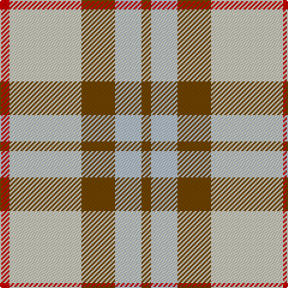

In pattern [GWGWR](/patterns/gwgwr/).

This was sourced from tartans-authority.  It is a [5 stripes tartan](/stripes/stripes5/).

Original link http://www.tartansauthority.com/tartan-ferret/display/10177/

## Thread count
R/8 N60 T28 Na22 T/8

## Palette
Each colour and its ΔE from the base-6 reference it is a variant of.

| Colour | Shade | Base | ΔE (OKLab) |
|---|---|---|---|
| N | <code style="background-color:#C8C8BC;">#C8C8BC</code> `#C8C8BC` | W <code style="background-color:#F7F7F7;">#F7F7F7</code> | 0.15 |
| Na | <code style="background-color:#B4C0C8;">#B4C0C8</code> `#B4C0C8` | W <code style="background-color:#F7F7F7;">#F7F7F7</code> | 0.18 |
| R | <code style="background-color:#C80000;">#C80000</code> `#C80000` | R <code style="background-color:#CC0000;">#CC0000</code> | 0.01 |
| T | <code style="background-color:#704400;">#704400</code> `#704400` | G <code style="background-color:#006100;">#006100</code> | 0.15 |

# Sample pattern

## Nearest tartans

The nearest existing variants by ΔTartan distance.

1. [Cairngorm](/setts/s6/b2w2y7r14b2w2~b5c5c5c-r888888-wfcfcfc-yd4d07c~x2/) — ΔT 1.10
1. [S.I.D.E. (Corporate)](/setts/s5/y15r9b30w3ba4~b5c8ca8-ba2c2c80-rc80000-we0e0e0-ye8c000~x2/) — ΔT 1.14
1. [Winnipeg Embroiders' Guild (Corp.)](/setts/s6/r12b2y2w2b4w3~b003c64-re87878-we8ccb8-ye8c000~x2/) — ΔT 1.23
1. [O'Connor Dress](/setts/s5/g5r5w11r1g1~g604000-re87878-w98c8e8~x4/) — ΔT 1.27
1. [Thompson, D.C. (Personal)](/setts/s6/k4b28r6w12r12w3~b5c8ca8-k101010-rc80000-we0e0e0~x2/) — ΔT 1.31
1. [Louisburg](/setts/s4/r22y10w3b8~b1c0070-r888888-wf8f8f8-ye8c000~x2/) — ΔT 1.42
1. [Bagpipe Shop (Switzerland)](/setts/s5/b10w3y3g1r1~b646464-g4ca412-rff0000-wf8f4d0-ya4a8a8~x10/) — ΔT 1.47
1. [Tombow 140th Anniversary, The](/setts/s7/g4y7r9y9b20w2b2~b1870a4-g006400-rfa4b00-wffffff-ye0a126~x2/) — ΔT 1.48
1. [Buckeye](/setts/s4/r25k4w8ra16~k101010-r888888-rac80000-wfcfcfc~x4/) — ΔT 1.51
1. [Buchele Check (Fashion?)](/setts/s6/r4y1r3ya1y8ya2~r901c38-ydcc08c-yad0c830~x4/) — ΔT 1.53

## Neighbour map

Every grey dot is one of 15726 variants placed by the first two principal components of the ΔTartan feature space (44% of its variance). Red is this tartan; blue dots are its nearest — click one to open its page.

<svg viewBox="0 0 640 380" role="img" style="max-width:100%;height:auto;border:1px solid #e0e0e0;border-radius:4px;display:block" xmlns="http://www.w3.org/2000/svg"><image href="/nn/cloud.v1.png" width="640" height="380"/><a href="/setts/s6/b2w2y7r14b2w2~b5c5c5c-r888888-wfcfcfc-yd4d07c~x2/"><circle cx="250.3" cy="209.9" r="4" fill="#3465a4"><title>Cairngorm</title></circle></a><a href="/setts/s5/y15r9b30w3ba4~b5c8ca8-ba2c2c80-rc80000-we0e0e0-ye8c000~x2/"><circle cx="229.4" cy="193.2" r="4" fill="#3465a4"><title>S.I.D.E. (Corporate)</title></circle></a><a href="/setts/s6/r12b2y2w2b4w3~b003c64-re87878-we8ccb8-ye8c000~x2/"><circle cx="220.8" cy="204.8" r="4" fill="#3465a4"><title>Winnipeg Embroiders' Guild (Corp.)</title></circle></a><a href="/setts/s5/g5r5w11r1g1~g604000-re87878-w98c8e8~x4/"><circle cx="271.8" cy="220.2" r="4" fill="#3465a4"><title>O'Connor Dress</title></circle></a><a href="/setts/s6/k4b28r6w12r12w3~b5c8ca8-k101010-rc80000-we0e0e0~x2/"><circle cx="202.3" cy="197.7" r="4" fill="#3465a4"><title>Thompson, D.C. (Personal)</title></circle></a><a href="/setts/s4/r22y10w3b8~b1c0070-r888888-wf8f8f8-ye8c000~x2/"><circle cx="217.8" cy="239.3" r="4" fill="#3465a4"><title>Louisburg</title></circle></a><a href="/setts/s5/b10w3y3g1r1~b646464-g4ca412-rff0000-wf8f4d0-ya4a8a8~x10/"><circle cx="276.6" cy="188.7" r="4" fill="#3465a4"><title>Bagpipe Shop (Switzerland)</title></circle></a><a href="/setts/s7/g4y7r9y9b20w2b2~b1870a4-g006400-rfa4b00-wffffff-ye0a126~x2/"><circle cx="180.8" cy="181.0" r="4" fill="#3465a4"><title>Tombow 140th Anniversary, The</title></circle></a><a href="/setts/s4/r25k4w8ra16~k101010-r888888-rac80000-wfcfcfc~x4/"><circle cx="204.5" cy="245.1" r="4" fill="#3465a4"><title>Buckeye</title></circle></a><a href="/setts/s6/r4y1r3ya1y8ya2~r901c38-ydcc08c-yad0c830~x4/"><circle cx="260.2" cy="220.5" r="4" fill="#3465a4"><title>Buchele Check (Fashion?)</title></circle></a><circle cx="233.7" cy="221.8" r="5" fill="#c00000"/></svg>

ID: /setts/s5/g4w11g14wa30r4~g704400-rc80000-wb4c0c8-wac8c8bc~x2/
