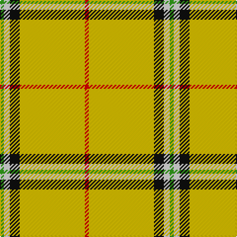

In pattern [GWKYR](/patterns/gwkyr/).

This was sourced from register-of-tartans.  It is a [5 stripes tartan](/stripes/stripes5/).

Original link https://www.tartanregister.gov.uk/tartanDetails.aspx?ref=5893

## Thread count
G/4 LN6 K10 Y66 R/4

## Palette
Each colour and its ΔE from the base-6 reference it is a variant of.

| Colour | Shade | Base | ΔE (OKLab) |
|---|---|---|---|
| G | <code style="background-color:#309C18;">#309C18</code> `#309C18` | G <code style="background-color:#006100;">#006100</code> | 0.19 |
| K | <code style="background-color:#101010;">#101010</code> `#101010` | K <code style="background-color:#000000;">#000000</code> | 0.17 |
| LN | <code style="background-color:#E0E0E0;">#E0E0E0</code> `#E0E0E0` | W <code style="background-color:#F7F7F7;">#F7F7F7</code> | 0.07 |
| R | <code style="background-color:#DC0000;">#DC0000</code> `#DC0000` | R <code style="background-color:#CC0000;">#CC0000</code> | 0.03 |
| Y | <code style="background-color:#E8C000;">#E8C000</code> `#E8C000` | Y <code style="background-color:#F2BF00;">#F2BF00</code> | 0.02 |

# Sample pattern

## Nearest tartans

The nearest existing variants by ΔTartan distance.

1. [Port Moresby City Pipes & Drums](/setts/s5/g4w6k24y72r4-g006818-k101010-rc80000-we0e0e0-ye8c000/) — ΔT 1.37
1. [Bro-Dreger](/setts/s7/w6k10y6r6y64k4y6-k101010-r880000-we0e0e0-yb0840c/) — ΔT 1.98
1. [Shawn Jones Afghan Memorial, The](/setts/s6/r24g8k16b6y124ra16-b501400-g006818-k101010-rc80000-raa00000-yc4bc68/) — ΔT 2.07
1. [Shawn Jones Afghan Memorial, The](/setts/s6/r24g8k16ga6y124ra16-g649848-ga5d321f-k1c1714-rca2625-rab62531-yf5d38b/) — ΔT 2.16
1. [Wilbers](/setts/s8/y10k18y4k14ya70r8ya70k8-k101010-rc80000-ye8c000-yab49440/) — ΔT 2.19
1. [Norton (Corporate)](/setts/s9/y75k6w3r2k6r2k6w3r2-k101010-r888888-we0e0e0-ye8c000/) — ΔT 2.22
1. [Perry Ancient (Personal)](/setts/s5/y150k52k6y8k12-k101010-ye8c000/) — ΔT 2.23
1. [Guzzo Check (Personal)](/setts/s8/y20w2y20k4w3y3k3w2-k101010-we0e0e0-ye8c000/) — ΔT 2.24
1. [Morris (Welsh Name)](/setts/s8/b6b3y3b2y3b4y48b4-b202060-ye8c000/) — ΔT 2.32
1. [Ulster Irish District Tartan Tartan Number: 1196. Earliest known date: c.1590-1650 The Dungiven costume was discovered in 1956 by Mr William Dixon, a farmer at 'The Hill', Flanders Townland, Dungiven, County Derry, Northern Ireland. The tartan cloth was probably green but had been stained brown and tan by the peat. See products available Copyright © Blair Urquhart, Comrie, 2015](/setts/s10/y56k4y56k4y4k4ya58k4r4k4-k101010-rc80000-ye8c000-yaa08858/) — ΔT 2.41

## Neighbour map

Every grey dot is one of 15726 variants placed by the first two principal components of the ΔTartan feature space (44% of its variance). Red is this tartan; blue dots are its nearest — click one to open its page.

<svg viewBox="0 0 640 380" role="img" style="max-width:100%;height:auto;border:1px solid #e0e0e0;border-radius:4px;display:block" xmlns="http://www.w3.org/2000/svg"><image href="/nn/cloud.v1.png" width="640" height="380"/><a href="/setts/s5/g4w6k24y72r4-g006818-k101010-rc80000-we0e0e0-ye8c000/"><circle cx="348.6" cy="131.9" r="4" fill="#3465a4"><title>Port Moresby City Pipes &amp; Drums</title></circle></a><a href="/setts/s7/w6k10y6r6y64k4y6-k101010-r880000-we0e0e0-yb0840c/"><circle cx="470.1" cy="145.9" r="4" fill="#3465a4"><title>Bro-Dreger</title></circle></a><a href="/setts/s6/r24g8k16b6y124ra16-b501400-g006818-k101010-rc80000-raa00000-yc4bc68/"><circle cx="339.2" cy="104.4" r="4" fill="#3465a4"><title>Shawn Jones Afghan Memorial, The</title></circle></a><a href="/setts/s6/r24g8k16ga6y124ra16-g649848-ga5d321f-k1c1714-rca2625-rab62531-yf5d38b/"><circle cx="334.0" cy="95.5" r="4" fill="#3465a4"><title>Shawn Jones Afghan Memorial, The</title></circle></a><a href="/setts/s8/y10k18y4k14ya70r8ya70k8-k101010-rc80000-ye8c000-yab49440/"><circle cx="400.2" cy="152.2" r="4" fill="#3465a4"><title>Wilbers</title></circle></a><a href="/setts/s9/y75k6w3r2k6r2k6w3r2-k101010-r888888-we0e0e0-ye8c000/"><circle cx="459.4" cy="66.9" r="4" fill="#3465a4"><title>Norton (Corporate)</title></circle></a><a href="/setts/s5/y150k52k6y8k12-k101010-ye8c000/"><circle cx="430.3" cy="153.4" r="4" fill="#3465a4"><title>Perry Ancient (Personal)</title></circle></a><a href="/setts/s8/y20w2y20k4w3y3k3w2-k101010-we0e0e0-ye8c000/"><circle cx="432.9" cy="178.3" r="4" fill="#3465a4"><title>Guzzo Check (Personal)</title></circle></a><a href="/setts/s8/b6b3y3b2y3b4y48b4-b202060-ye8c000/"><circle cx="473.9" cy="116.6" r="4" fill="#3465a4"><title>Morris (Welsh Name)</title></circle></a><a href="/setts/s10/y56k4y56k4y4k4ya58k4r4k4-k101010-rc80000-ye8c000-yaa08858/"><circle cx="336.8" cy="132.8" r="4" fill="#3465a4"><title>Ulster Irish District Tartan Tartan Number: 1196. Earliest known date: c.1590-1650 The Dungiven costume was discovered in 1956 by Mr William Dixon, a farmer at 'The Hill', Flanders Townland, Dungiven, County Derry, Northern Ireland. The tartan cloth was probably green but had been stained brown and tan by the peat. See products available Copyright © Blair Urquhart, Comrie, 2015</title></circle></a><circle cx="423.3" cy="132.2" r="5" fill="#c00000"/></svg>

ID: /setts/s5/g4w6k10y66r4-g309c18-k101010-rdc0000-we0e0e0-ye8c000/
