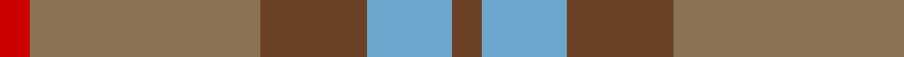
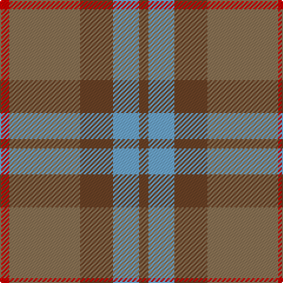

In pattern [GYGRR](/patterns/gygrr/).

This was sourced from register-of-tartans.  It is a [5 stripes tartan](/stripes/stripes5/).

Original link https://www.tartanregister.gov.uk/tartanDetails.aspx?ref=10177

## Register references

External register numbers recorded for this tartan.

- Scottish Register of Tartans: [10177](https://www.tartanregister.gov.uk/tartanDetails.aspx?ref=10177)

## Thread count
R/8 LT60 T28 B22 T/8

## Palette
Each colour and its ΔE from the base-6 reference it is a variant of.

| Colour | Shade | Base | ΔE (OKLab) |
|---|---|---|---|
| B | <code style="background-color:#6CA6CD;">#6CA6CD</code> `#6CA6CD` | Y <code style="background-color:#F2BF00;">#F2BF00</code> | 0.28 |
| LT | <code style="background-color:#8B7355;">#8B7355</code> `#8B7355` | R <code style="background-color:#CC0000;">#CC0000</code> | 0.19 |
| R | <code style="background-color:#CD0000;">#CD0000</code> `#CD0000` | R <code style="background-color:#CC0000;">#CC0000</code> | 0.00 |
| T | <code style="background-color:#6B4226;">#6B4226</code> `#6B4226` | G <code style="background-color:#006100;">#006100</code> | 0.16 |

# Sample pattern

## Nearest tartans

The nearest existing variants by ΔTartan distance.

1. [Porcelanosa](/setts/s4/y24r9b23ya3~b5c5c5c-r888888-ya0a0a0-yae8c000~x2/) — ΔT 1.30
1. [Bagpipe Shop, The (Corporate)](/setts/s5/b10y3r3ra1g1~b5c5c5c-g289c18-r888888-rac80000-ya0a0a0~x10/) — ΔT 1.47
1. [MacNab WI 2](/setts/s4/g15r3b11ba2~b6e5058-ba4367ae-g11450d-raa0000~x2/) — ΔT 1.49
1. [MacNab WI2](/setts/s4/g15r3b11ba2~b6e5058-ba4367ae-g11450d-raa0000/) — ΔT 1.49
1. [Unamed, Riding cloak 1745](/setts/s5/b1ba8r2ra8r1~b5480b0-ba304080-rc00000-ra806050~x2/) — ΔT 1.49
1. [Dewar (WCWM)](/setts/s6/b1g1b7g5ga7y1~b084848-g604000-ga8c7038-yb8b8b8~x4/) — ΔT 1.52
1. [Fraser Hunting](/setts/s6/r1b3r1g3r4ra1~b304080-g008000-r806050-rac00000~x2/) — ΔT 1.66
1. [Dorward](/setts/s7/r7ra3r9g15b19r14ra4~b304080-g008000-r806050-rac00000~x2/) — ΔT 1.68
1. [Callum (Buchan) (Name)](/setts/s5/b7r1ba6r8y1~b5c5c5c-ba344054-rc80000-ya0a0a0~x8/) — ΔT 1.70
1. [Dohmen Family (Zuid-Nederland)](/setts/s4/g30y3b8r25~b5f749c-g649848-ra32d18-ye0a126~x2/) — ΔT 1.70

## Neighbour map

Every grey dot is one of 15726 variants placed by the first two principal components of the ΔTartan feature space (44% of its variance). Red is this tartan; blue dots are its nearest — click one to open its page.

<svg viewBox="0 0 640 380" role="img" style="max-width:100%;height:auto;border:1px solid #e0e0e0;border-radius:4px;display:block" xmlns="http://www.w3.org/2000/svg"><image href="/nn/cloud.v1.png" width="640" height="380"/><a href="/setts/s4/y24r9b23ya3~b5c5c5c-r888888-ya0a0a0-yae8c000~x2/"><circle cx="280.6" cy="282.8" r="4" fill="#3465a4"><title>Porcelanosa</title></circle></a><a href="/setts/s5/b10y3r3ra1g1~b5c5c5c-g289c18-r888888-rac80000-ya0a0a0~x10/"><circle cx="363.5" cy="229.2" r="4" fill="#3465a4"><title>Bagpipe Shop, The (Corporate)</title></circle></a><a href="/setts/s4/g15r3b11ba2~b6e5058-ba4367ae-g11450d-raa0000~x2/"><circle cx="334.6" cy="290.1" r="4" fill="#3465a4"><title>MacNab WI 2</title></circle></a><a href="/setts/s4/g15r3b11ba2~b6e5058-ba4367ae-g11450d-raa0000/"><circle cx="334.6" cy="290.1" r="4" fill="#3465a4"><title>MacNab WI2</title></circle></a><a href="/setts/s5/b1ba8r2ra8r1~b5480b0-ba304080-rc00000-ra806050~x2/"><circle cx="298.5" cy="254.8" r="4" fill="#3465a4"><title>Unamed, Riding cloak 1745</title></circle></a><a href="/setts/s6/b1g1b7g5ga7y1~b084848-g604000-ga8c7038-yb8b8b8~x4/"><circle cx="254.8" cy="261.8" r="4" fill="#3465a4"><title>Dewar (WCWM)</title></circle></a><a href="/setts/s6/r1b3r1g3r4ra1~b304080-g008000-r806050-rac00000~x2/"><circle cx="241.3" cy="294.7" r="4" fill="#3465a4"><title>Fraser Hunting</title></circle></a><a href="/setts/s7/r7ra3r9g15b19r14ra4~b304080-g008000-r806050-rac00000~x2/"><circle cx="229.0" cy="270.0" r="4" fill="#3465a4"><title>Dorward</title></circle></a><a href="/setts/s5/b7r1ba6r8y1~b5c5c5c-ba344054-rc80000-ya0a0a0~x8/"><circle cx="258.3" cy="257.1" r="4" fill="#3465a4"><title>Callum (Buchan) (Name)</title></circle></a><a href="/setts/s4/g30y3b8r25~b5f749c-g649848-ra32d18-ye0a126~x2/"><circle cx="294.4" cy="254.3" r="4" fill="#3465a4"><title>Dohmen Family (Zuid-Nederland)</title></circle></a><circle cx="317.1" cy="261.5" r="5" fill="#c00000"/></svg>

ID: /setts/s5/g4y11g14r30ra4~g6b4226-r8b7355-racd0000-y6ca6cd~x2/
