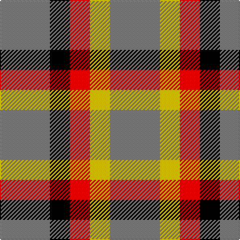

In pattern [GKRYG](/patterns/gkryg/).

This was sourced from weddslist.  It is a [5 stripes tartan](/stripes/stripes5/).

Original link http://www.weddslist.com/cgi-bin/tartans/pg.pl?source=sts

## Thread count
N/50 K20 R20 Y20 N/50

## Palette
Each colour and its ΔE from the base-6 reference it is a variant of.

| Colour | Shade | Base | ΔE (OKLab) |
|---|---|---|---|
| K | <code style="background-color:#000000;">#000000</code> `#000000` | K <code style="background-color:#000000;">#000000</code> | 0.00 |
| N | <code style="background-color:#808080;">#808080</code> `#808080` | G <code style="background-color:#006100;">#006100</code> | 0.23 |
| R | <code style="background-color:#C00000;">#C00000</code> `#C00000` | R <code style="background-color:#CC0000;">#CC0000</code> | 0.03 |
| Y | <code style="background-color:#F0C000;">#F0C000</code> `#F0C000` | Y <code style="background-color:#F2BF00;">#F2BF00</code> | 0.00 |

# Sample pattern

## Nearest tartans

The nearest existing variants by ΔTartan distance.

1. [MacLeod, of Argentina](/setts/s5/b20w6b24y28r8-b304080-rc00000-we0e0e0-yf0c000/) — ΔT 1.56
1. [Daks - House Check, C.6700.03](/setts/s5/k6w14k8w12r6-k000000-r806050-we0e0e0/) — ΔT 1.71
1. [Unidentified #33](/setts/s9/g4r6g8w2g2y2g8r6g4-g005020-rdc0000-we0e0e0-ye8c000/) — ΔT 1.86
1. [Unidentified, Sample](/setts/s6/b22r8y18b8y4b22-b304080-rc00000-yf0c000/) — ΔT 1.90
1. [Unidentified Sample](/setts/s6/b22r8y18b8y4b22-b2c4084-rdc0000-ye8c000/) — ΔT 1.94
1. [Ardalansish Tweed (Fashion)](/setts/s6/b8y8b16w32ba8w8-b441800-ba5c5c5c-wf0d8bc-ya08858/) — ΔT 1.98
1. [Longford County, Crest Range](/setts/s6/w14k12y30k32k16w6-k101010-we0e0e0-ybc8c00/) — ΔT 2.00
1. [Canyon County Idaho Sheriff](/setts/s6/k50y50w10y50k50r10-k101010-rc80000-wf8f8f8-ya08858/) — ΔT 2.00
1. [MacLeod of Argentina](/setts/s5/b20w6b24y28r8-b1474b4-rc80000-wfcfcfc-yd8b000/) — ΔT 2.01
1. [Norwich No.077](/setts/s9/g10r18g20w4g4y4g20r18g10-g044028-rc80000-wfcfcfc-ydcbc00/) — ΔT 2.02

## Neighbour map

Every grey dot is one of 15726 variants placed by the first two principal components of the ΔTartan feature space (44% of its variance). Red is this tartan; blue dots are its nearest — click one to open its page.

<svg viewBox="0 0 640 380" role="img" style="max-width:100%;height:auto;border:1px solid #e0e0e0;border-radius:4px;display:block" xmlns="http://www.w3.org/2000/svg"><image href="/nn/cloud.v1.png" width="640" height="380"/><a href="/setts/s5/b20w6b24y28r8-b304080-rc00000-we0e0e0-yf0c000/"><circle cx="187.7" cy="257.7" r="4" fill="#3465a4"><title>MacLeod, of Argentina</title></circle></a><a href="/setts/s5/k6w14k8w12r6-k000000-r806050-we0e0e0/"><circle cx="170.6" cy="313.3" r="4" fill="#3465a4"><title>Daks - House Check, C.6700.03</title></circle></a><a href="/setts/s9/g4r6g8w2g2y2g8r6g4-g005020-rdc0000-we0e0e0-ye8c000/"><circle cx="261.3" cy="258.0" r="4" fill="#3465a4"><title>Unidentified #33</title></circle></a><a href="/setts/s6/b22r8y18b8y4b22-b304080-rc00000-yf0c000/"><circle cx="296.2" cy="267.2" r="4" fill="#3465a4"><title>Unidentified, Sample</title></circle></a><a href="/setts/s6/b22r8y18b8y4b22-b2c4084-rdc0000-ye8c000/"><circle cx="294.8" cy="267.2" r="4" fill="#3465a4"><title>Unidentified Sample</title></circle></a><a href="/setts/s6/b8y8b16w32ba8w8-b441800-ba5c5c5c-wf0d8bc-ya08858/"><circle cx="177.6" cy="229.6" r="4" fill="#3465a4"><title>Ardalansish Tweed (Fashion)</title></circle></a><a href="/setts/s6/w14k12y30k32k16w6-k101010-we0e0e0-ybc8c00/"><circle cx="218.7" cy="263.8" r="4" fill="#3465a4"><title>Longford County, Crest Range</title></circle></a><a href="/setts/s6/k50y50w10y50k50r10-k101010-rc80000-wf8f8f8-ya08858/"><circle cx="187.4" cy="255.8" r="4" fill="#3465a4"><title>Canyon County Idaho Sheriff</title></circle></a><a href="/setts/s5/b20w6b24y28r8-b1474b4-rc80000-wfcfcfc-yd8b000/"><circle cx="201.7" cy="266.3" r="4" fill="#3465a4"><title>MacLeod of Argentina</title></circle></a><a href="/setts/s9/g10r18g20w4g4y4g20r18g10-g044028-rc80000-wfcfcfc-ydcbc00/"><circle cx="269.7" cy="243.1" r="4" fill="#3465a4"><title>Norwich No.077</title></circle></a><circle cx="227.0" cy="292.0" r="5" fill="#c00000"/></svg>

ID: /setts/s5/g50k20r20y20g50-g808080-k000000-rc00000-yf0c000/
