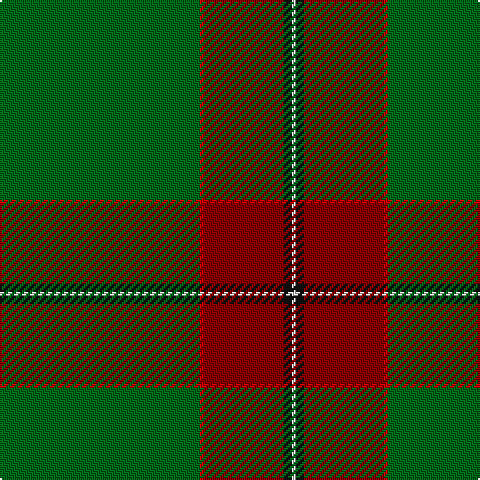

**Bands:** [GRRKW](/stripes/grrkw/) · **Stripes:** [G R R K W](/stripes/stripes5/) G R R K W

This was sourced from register-of-tartans.  It is a [5 band tartan](/bands/bands5/).

Original link https://www.tartanregister.gov.uk/tartanDetails.aspx?ref=1949

## Attestations

This cloth appears in 2 source records; the oldest owns this page.

- 01/07/2006 — Kenspeckle (register-of-tartans, [record](https://www.tartanregister.gov.uk/tartanDetails.aspx?ref=1949))
- 2006 July — Kenspeckle (Corporate) (tartans-authority, [record](http://www.tartansauthority.com/tartan-ferret/display/6969/))

## Register references

External register numbers recorded for this tartan.

- Scottish Register of Tartans: [1949](https://www.tartanregister.gov.uk/tartanDetails.aspx?ref=1949)
- Scottish Tartans Authority (ITI): 6969

## Thread count
G/100 R2 DR40 K4 LN/2

## Palette
Each colour and its ΔE from the base-6 reference it is a variant of.

| Colour | Shade | Base | ΔE (OKLab) |
|---|---|---|---|
| DB | <code style="background-color:#202060;">#202060</code> `#202060` | B <code style="background-color:#2A418A;">#2A418A</code> | 0.11 |
| DR | <code style="background-color:#880000;">#880000</code> `#880000` | R <code style="background-color:#CC0000;">#CC0000</code> | 0.15 |
| G | <code style="background-color:#006818;">#006818</code> `#006818` | G <code style="background-color:#006100;">#006100</code> | 0.02 |
| Ga | <code style="background-color:#289C18;">#289C18</code> `#289C18` | G <code style="background-color:#006100;">#006100</code> | 0.19 |
| K | <code style="background-color:#101010;">#101010</code> `#101010` | K <code style="background-color:#000000;">#000000</code> | 0.17 |
| LN | <code style="background-color:#E0E0E0;">#E0E0E0</code> `#E0E0E0` | W <code style="background-color:#F7F7F7;">#F7F7F7</code> | 0.07 |
| R | <code style="background-color:#C80000;">#C80000</code> `#C80000` | R <code style="background-color:#CC0000;">#CC0000</code> | 0.01 |
| T | <code style="background-color:#604000;">#604000</code> `#604000` | G <code style="background-color:#006100;">#006100</code> | 0.14 |

# Sample pattern

## Nearest tartans

The nearest existing variants by ΔTartan distance.

1. [Kinfauns Castle (Corporate)](/setts/s6/r4dp12g2dp2g46w1~x2/) — ΔT 1.48
1. [Masai Shuka 10 (Artefact)](/setts/s6/g53w1r20k1w2r7~x2/) — ΔT 1.60
1. [Isle of Raasay](/setts/s5/dg60ly16m8t2o3~x2/) — ΔT 1.61
1. [Green Rover (Personal)](/setts/s7/lo10k2g5k2dg46lo2k2~x2/) — ΔT 1.68
1. [Aviemore Highland (Corporate)](/setts/s7/dg40k3w1k5r1k2r10~x2/) — ΔT 1.73
1. [McGuinness, Tam (Personal)](/setts/s5/lo2db4g60dp30w1~x2/) — ΔT 1.78
1. [Puxty-Dunne (Personal)](/setts/s7/n18w2k1w4g13n40r2~x2/) — ΔT 1.80
1. [Puxty-Dunne](/setts/s7/dt18w2k1w4dg13dt40r2~x2/) — ΔT 1.80
1. [Tough (Personal)](/setts/s6/n4ly1k4dg32k4r2~x2/) — ΔT 1.82
1. [MacWilliam Hunting](/setts/s6/dy2dg44k10r1db16r1~x2/) — ΔT 1.83

## Neighbour map

Every grey dot is one of 14299 variants placed by the first two principal components of the ΔTartan feature space (44% of its variance). Red is this tartan; blue dots are its nearest — click one to open its page.

<svg viewBox="0 0 640 380" role="img" style="max-width:100%;height:auto;border:1px solid #e0e0e0;border-radius:4px;display:block" xmlns="http://www.w3.org/2000/svg"><image href="/nn/cloud.v1.png" width="640" height="380"/><a href="/setts/s6/r4dp12g2dp2g46w1~x2/"><circle cx="518.5" cy="140.9" r="4" fill="#3465a4"><title>Kinfauns Castle (Corporate)</title></circle></a><a href="/setts/s6/g53w1r20k1w2r7~x2/"><circle cx="462.1" cy="130.0" r="4" fill="#3465a4"><title>Masai Shuka 10 (Artefact)</title></circle></a><a href="/setts/s5/dg60ly16m8t2o3~x2/"><circle cx="425.1" cy="151.6" r="4" fill="#3465a4"><title>Isle of Raasay</title></circle></a><a href="/setts/s7/lo10k2g5k2dg46lo2k2~x2/"><circle cx="453.3" cy="153.7" r="4" fill="#3465a4"><title>Green Rover (Personal)</title></circle></a><a href="/setts/s7/dg40k3w1k5r1k2r10~x2/"><circle cx="421.2" cy="110.2" r="4" fill="#3465a4"><title>Aviemore Highland (Corporate)</title></circle></a><a href="/setts/s5/lo2db4g60dp30w1~x2/"><circle cx="426.9" cy="136.1" r="4" fill="#3465a4"><title>McGuinness, Tam (Personal)</title></circle></a><a href="/setts/s7/n18w2k1w4g13n40r2~x2/"><circle cx="508.2" cy="150.2" r="4" fill="#3465a4"><title>Puxty-Dunne (Personal)</title></circle></a><a href="/setts/s7/dt18w2k1w4dg13dt40r2~x2/"><circle cx="504.1" cy="152.9" r="4" fill="#3465a4"><title>Puxty-Dunne</title></circle></a><a href="/setts/s6/n4ly1k4dg32k4r2~x2/"><circle cx="442.3" cy="143.0" r="4" fill="#3465a4"><title>Tough (Personal)</title></circle></a><a href="/setts/s6/dy2dg44k10r1db16r1~x2/"><circle cx="428.1" cy="155.3" r="4" fill="#3465a4"><title>MacWilliam Hunting</title></circle></a><circle cx="498.8" cy="147.5" r="5" fill="#c00000"/></svg>

ID: /setts/s5/g50r1r20k2w1~x2/
