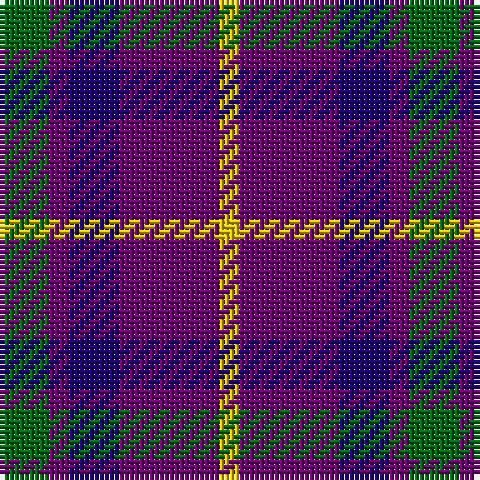

In pattern [GBBBY](/patterns/gbbby/).

This was sourced from register-of-tartans.  It is a [5 stripes tartan](/stripes/stripes5/).

Original link https://www.tartanregister.gov.uk/tartanDetails.aspx?ref=410

## Attestations

This cloth appears in 2 source records; the oldest owns this page.

- 01/01/2000 — Bryson (2000) (register-of-tartans, [record](https://www.tartanregister.gov.uk/tartanDetails.aspx?ref=410))
- 2000 — Bryson Check (Name) (tartans-authority, [record](http://www.tartansauthority.com/tartan-ferret/display/4156/))

## Register references

External register numbers recorded for this tartan.

- Scottish Register of Tartans: [410](https://www.tartanregister.gov.uk/tartanDetails.aspx?ref=410)
- Scottish Tartans Authority (ITI): 4156

## Thread count
G/10 P4 DB10 P20 Y/4

## Palette
Each colour and its ΔE from the base-6 reference it is a variant of.

| Colour | Shade | Base | ΔE (OKLab) |
|---|---|---|---|
| DB | <code style="background-color:#1C0070;">#1C0070</code> `#1C0070` | B <code style="background-color:#2A418A;">#2A418A</code> | 0.14 |
| G | <code style="background-color:#006818;">#006818</code> `#006818` | G <code style="background-color:#006100;">#006100</code> | 0.02 |
| P | <code style="background-color:#6C0070;">#6C0070</code> `#6C0070` | B <code style="background-color:#2A418A;">#2A418A</code> | 0.16 |
| Y | <code style="background-color:#E8C000;">#E8C000</code> `#E8C000` | Y <code style="background-color:#F2BF00;">#F2BF00</code> | 0.02 |

# Sample pattern

## Nearest tartans

The nearest existing variants by ΔTartan distance.

1. [Unidentified #17](/setts/s4/b8k3r4y1~b2c4084-k101010-rdc0000-ye8c000~x2/) — ΔT 1.12
1. [International Highland Games Fed.](/setts/s4/b13r5g5w3~b2c2c80-g006818-rc80000-we0e0e0~x8/) — ΔT 1.14
1. [Laval, Tartan de](/setts/s5/b1w1ba4b4w1~b1c0070-ba680028-wc0c0c0~x4/) — ΔT 1.19
1. [University of Notre Dame](/setts/s6/r5b35k25b8y10r5~b2c2c80-k101010-rc80000-yfccc00~x2/) — ΔT 1.27
1. [Clerk Family Tartan Tartan Number: 326. Earliest known date: 1847 Also referred to as Clark. See products available Copyright © Blair Urquhart, Comrie, 2015](/setts/s6/b5k1g1k1r3k1~b2c2c80-g006818-k101010-rc80000~x4/) — ΔT 1.30
1. [Clerk](/setts/s6/b5k1g1k1r3k1~b2c4084-g005020-k101010-rdc0000~x4/) — ΔT 1.32
1. [Trinity College, Toronto Uni. (Corp](/setts/s5/k1r2b1ba5y1~b5c8ca8-ba1c1c50-k101010-rc80000-ybc8c00~x16/) — ΔT 1.33
1. [Unidentified 27](/setts/s4/b8k3r4y1~b304080-k000000-rc00000-yf0c000~x2/) — ΔT 1.33
1. [Edinburgh Bus Company (Corporate)](/setts/s6/b3r2g5r8b12w3~b202060-g006818-rc80000-wfcfcfc~x2/) — ΔT 1.38
1. [Highland Pub Company](/setts/s5/b13k13b13r29y4~b304080-k000000-r900030-yf0c000~x2/) — ΔT 1.38

## Neighbour map

Every grey dot is one of 15726 variants placed by the first two principal components of the ΔTartan feature space (44% of its variance). Red is this tartan; blue dots are its nearest — click one to open its page.

<svg viewBox="0 0 640 380" role="img" style="max-width:100%;height:auto;border:1px solid #e0e0e0;border-radius:4px;display:block" xmlns="http://www.w3.org/2000/svg"><image href="/nn/cloud.v1.png" width="640" height="380"/><a href="/setts/s4/b8k3r4y1~b2c4084-k101010-rdc0000-ye8c000~x2/"><circle cx="236.1" cy="248.2" r="4" fill="#3465a4"><title>Unidentified #17</title></circle></a><a href="/setts/s4/b13r5g5w3~b2c2c80-g006818-rc80000-we0e0e0~x8/"><circle cx="192.0" cy="272.4" r="4" fill="#3465a4"><title>International Highland Games Fed.</title></circle></a><a href="/setts/s5/b1w1ba4b4w1~b1c0070-ba680028-wc0c0c0~x4/"><circle cx="215.5" cy="276.9" r="4" fill="#3465a4"><title>Laval, Tartan de</title></circle></a><a href="/setts/s6/r5b35k25b8y10r5~b2c2c80-k101010-rc80000-yfccc00~x2/"><circle cx="218.2" cy="223.1" r="4" fill="#3465a4"><title>University of Notre Dame</title></circle></a><a href="/setts/s6/b5k1g1k1r3k1~b2c2c80-g006818-k101010-rc80000~x4/"><circle cx="198.0" cy="243.9" r="4" fill="#3465a4"><title>Clerk Family Tartan Tartan Number: 326. Earliest known date: 1847 Also referred to as Clark. See products available Copyright © Blair Urquhart, Comrie, 2015</title></circle></a><a href="/setts/s6/b5k1g1k1r3k1~b2c4084-g005020-k101010-rdc0000~x4/"><circle cx="193.3" cy="241.2" r="4" fill="#3465a4"><title>Clerk</title></circle></a><a href="/setts/s5/k1r2b1ba5y1~b5c8ca8-ba1c1c50-k101010-rc80000-ybc8c00~x16/"><circle cx="203.6" cy="229.4" r="4" fill="#3465a4"><title>Trinity College, Toronto Uni. (Corp</title></circle></a><a href="/setts/s4/b8k3r4y1~b304080-k000000-rc00000-yf0c000~x2/"><circle cx="224.5" cy="246.1" r="4" fill="#3465a4"><title>Unidentified 27</title></circle></a><a href="/setts/s6/b3r2g5r8b12w3~b202060-g006818-rc80000-wfcfcfc~x2/"><circle cx="180.2" cy="233.0" r="4" fill="#3465a4"><title>Edinburgh Bus Company (Corporate)</title></circle></a><a href="/setts/s5/b13k13b13r29y4~b304080-k000000-r900030-yf0c000~x2/"><circle cx="182.5" cy="250.0" r="4" fill="#3465a4"><title>Highland Pub Company</title></circle></a><circle cx="216.2" cy="262.5" r="5" fill="#c00000"/></svg>

ID: /setts/s5/g5b2ba5b10y2~b6c0070-ba1c0070-g006818-ye8c000~x2/
