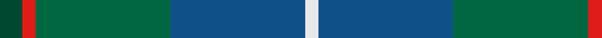

In pattern [GRGBW](/patterns/grgbw/).

This was sourced from register-of-tartans.  It is a [5 stripes tartan](/stripes/stripes5/).

Original link https://www.tartanregister.gov.uk/tartanDetails.aspx?ref=10664

## Attestations

This cloth appears in 2 source records; the oldest owns this page.

- 02/08/2012 — Gamba Tuscany Fife (register-of-tartans, [record](https://www.tartanregister.gov.uk/tartanDetails.aspx?ref=10664))
- undated — Gamba Tuscany Fife Name Tartan Tartan Number: 10664. Earliest known date: 02/08/2012 Designed by Catherine Gamba to commemorate the golden wedding of Joseph and Catherine Gamba, whose roots are in Tuscany and Fife. The colours are taken from the Scottish and Italian flags. See products available Copyright © Blair Urquhart, Comrie, 2015 (house-of-tartan, [record](http://www.house-of-tartan.scotland.net/house/TartanViewjs.asp?colr=Def&tnam=10664))

## Thread count
DG/10 R6 G60 B60 LN/6

## Palette
Each colour and its ΔE from the base-6 reference it is a variant of.

| Colour | Shade | Base | ΔE (OKLab) |
|---|---|---|---|
| B | <code style="background-color:#105088;">#105088</code> `#105088` | B <code style="background-color:#2A418A;">#2A418A</code> | 0.04 |
| DG | <code style="background-color:#004830;">#004830</code> `#004830` | G <code style="background-color:#006100;">#006100</code> | 0.11 |
| G | <code style="background-color:#006840;">#006840</code> `#006840` | G <code style="background-color:#006100;">#006100</code> | 0.06 |
| LN | <code style="background-color:#E8E8E8;">#E8E8E8</code> `#E8E8E8` | W <code style="background-color:#F7F7F7;">#F7F7F7</code> | 0.05 |
| R | <code style="background-color:#E01C18;">#E01C18</code> `#E01C18` | R <code style="background-color:#CC0000;">#CC0000</code> | 0.05 |

# Sample pattern

## Nearest tartans

The nearest existing variants by ΔTartan distance.

1. [Dallard Personal Tartan Tartan Number: 7424. Earliest known date: 2007 The material was going towards a kilt for my wedding in June 2008. See products available Copyright © Blair Urquhart, Comrie, 2015](/setts/s5/b37g37r8k3ba5x2~b003c64-ba780078-g285800-k101010-r888888/) — ΔT 0.91
1. [Boroughmuir](/setts/s7/b6ba47b22g47bb4g4w4~b141e46-ba1870a4-bb5a008c-g00643c-wc8c8c8/) — ΔT 1.11
1. [Montrose (1983)](/setts/s6/g6y3g26k10b30w3x2~b5c5c5c-g004c2c-k101010-wc0c0c0-ybca010/) — ΔT 1.19
1. [Boroughmuir](/setts/s7/b6ba47b22g47bb4g4r4~b202060-ba1474b4-bb780078-g006818-r888888/) — ΔT 1.22
1. [Corey (Name)](/setts/s5/b32g16ga3y4gb28x2~b1474b4-g604000-ga006818-gb003820-yd87c00/) — ΔT 1.24
1. [Graeme Heckenberg Hunting](/setts/s7/b3g13y1r3y1b10ya1x2~b1f3d7a-g4d7326-r761a1a-y8397a7-yafaa706/) — ΔT 1.41
1. [Wellington (Lochcarron)](/setts/s5/k9y6b22g28ya2x2~b0c585c-g408060-k101010-y9ca8b0-yae8c000/) — ΔT 1.43
1. [Alvis of Lee (Personal)](/setts/s5/b9w4g36ba36r4x2~b1c0070-ba5c8ca8-g00643c-rc80000-we0e0e0/) — ΔT 1.48
1. [Rhode Island, The State of](/setts/s6/g15b2w2b11ba28b4x2~b102040-ba606080-g407050-we0e0e0/) — ΔT 1.49
1. [Scottish Power (Corporate)](/setts/s8/g5ga32b5k10g8r3g8b3x2~b6c0070-g005448-ga408060-k101010-r880000/) — ΔT 1.52

## Neighbour map

Every grey dot is one of 15726 variants placed by the first two principal components of the ΔTartan feature space (44% of its variance). Red is this tartan; blue dots are its nearest — click one to open its page.

<svg viewBox="0 0 640 380" role="img" style="max-width:100%;height:auto;border:1px solid #e0e0e0;border-radius:4px;display:block" xmlns="http://www.w3.org/2000/svg"><image href="/nn/cloud.v1.png" width="640" height="380"/><a href="/setts/s5/b37g37r8k3ba5x2~b003c64-ba780078-g285800-k101010-r888888/"><circle cx="285.1" cy="227.1" r="4" fill="#3465a4"><title>Dallard Personal Tartan Tartan Number: 7424. Earliest known date: 2007 The material was going towards a kilt for my wedding in June 2008. See products available Copyright © Blair Urquhart, Comrie, 2015</title></circle></a><a href="/setts/s7/b6ba47b22g47bb4g4w4~b141e46-ba1870a4-bb5a008c-g00643c-wc8c8c8/"><circle cx="239.8" cy="197.4" r="4" fill="#3465a4"><title>Boroughmuir</title></circle></a><a href="/setts/s6/g6y3g26k10b30w3x2~b5c5c5c-g004c2c-k101010-wc0c0c0-ybca010/"><circle cx="252.0" cy="219.9" r="4" fill="#3465a4"><title>Montrose (1983)</title></circle></a><a href="/setts/s7/b6ba47b22g47bb4g4r4~b202060-ba1474b4-bb780078-g006818-r888888/"><circle cx="232.6" cy="193.8" r="4" fill="#3465a4"><title>Boroughmuir</title></circle></a><a href="/setts/s5/b32g16ga3y4gb28x2~b1474b4-g604000-ga006818-gb003820-yd87c00/"><circle cx="215.1" cy="230.5" r="4" fill="#3465a4"><title>Corey (Name)</title></circle></a><a href="/setts/s7/b3g13y1r3y1b10ya1x2~b1f3d7a-g4d7326-r761a1a-y8397a7-yafaa706/"><circle cx="259.2" cy="184.4" r="4" fill="#3465a4"><title>Graeme Heckenberg Hunting</title></circle></a><a href="/setts/s5/k9y6b22g28ya2x2~b0c585c-g408060-k101010-y9ca8b0-yae8c000/"><circle cx="227.8" cy="214.7" r="4" fill="#3465a4"><title>Wellington (Lochcarron)</title></circle></a><a href="/setts/s5/b9w4g36ba36r4x2~b1c0070-ba5c8ca8-g00643c-rc80000-we0e0e0/"><circle cx="218.4" cy="215.6" r="4" fill="#3465a4"><title>Alvis of Lee (Personal)</title></circle></a><a href="/setts/s6/g15b2w2b11ba28b4x2~b102040-ba606080-g407050-we0e0e0/"><circle cx="297.2" cy="215.9" r="4" fill="#3465a4"><title>Rhode Island, The State of</title></circle></a><a href="/setts/s8/g5ga32b5k10g8r3g8b3x2~b6c0070-g005448-ga408060-k101010-r880000/"><circle cx="240.8" cy="189.3" r="4" fill="#3465a4"><title>Scottish Power (Corporate)</title></circle></a><circle cx="276.0" cy="226.8" r="5" fill="#c00000"/></svg>

ID: /setts/s5/g5r3ga30b30w3x2~b105088-g004830-ga006840-re01c18-we8e8e8/
